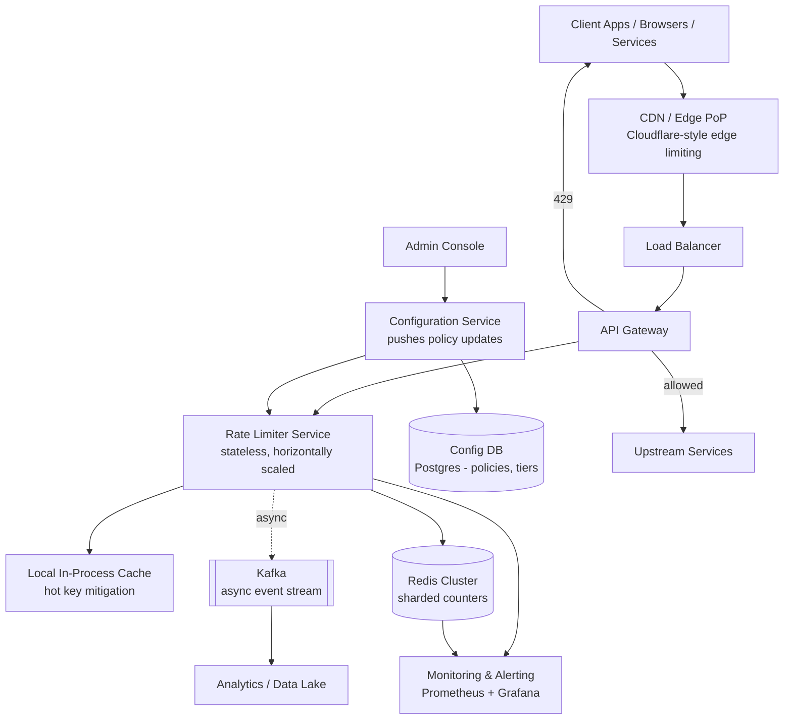
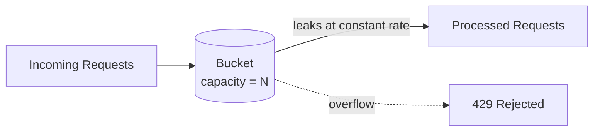
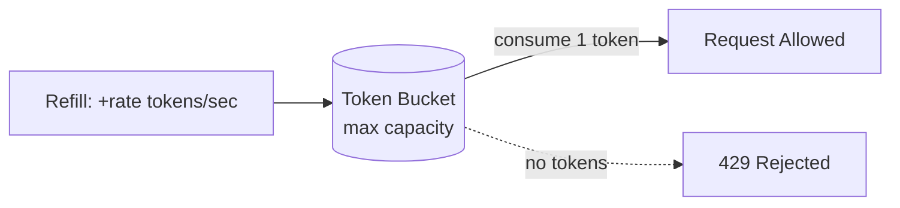
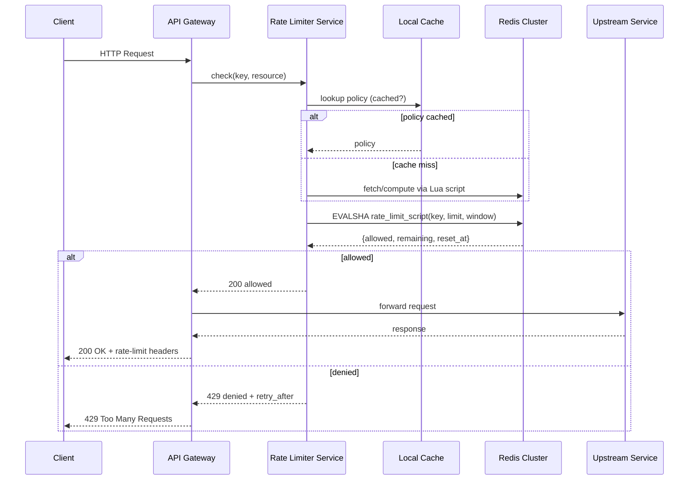
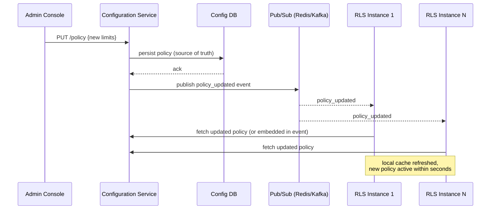
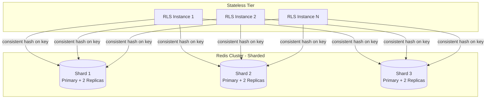
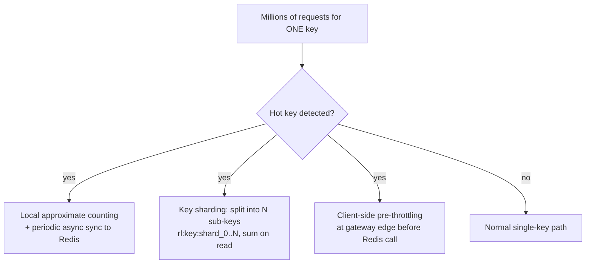
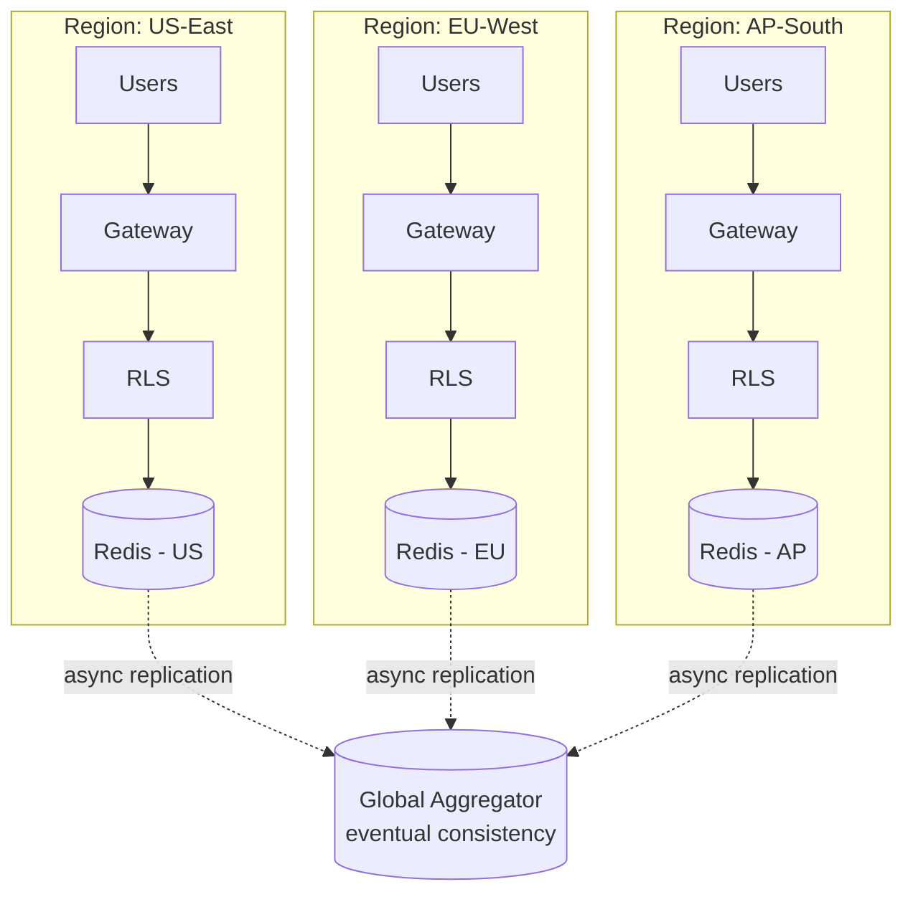
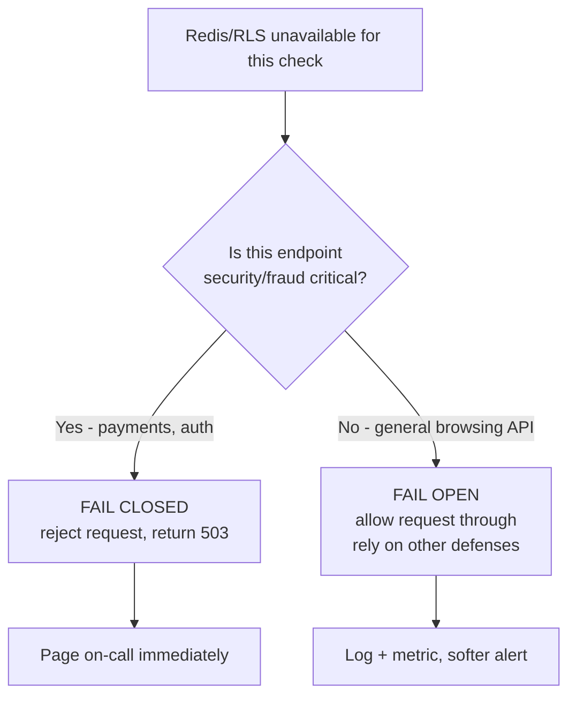

# Designing a Distributed Rate Limiter
### Staff-Level System Design Deep Dive (Senior SDE / SDE-2 / Staff Interview Prep)

> **How to use this document:** Read it top to bottom once, then use Section 29 (Cheat Sheet) for rapid pre-interview revision. Every design decision is justified with a "why," and every major section ends with likely interviewer follow-ups so you're never caught flat-footed.

---

## 1. Problem Statement

### 1.1 What is a Distributed Rate Limiter?

A **rate limiter** is a system component that controls the rate at which clients (users, IPs, API keys, services) can consume a resource — typically API requests — over a defined time window. A **distributed** rate limiter enforces these limits consistently across many stateless service instances, data centers, and regions, rather than within a single process.

The core challenge is not "how do I count requests" — that's trivial on one machine. The core challenge is: **how do multiple machines agree on a single, consistent count for the same client, under concurrency, with low latency, and without becoming a single point of failure?**

### 1.2 Why Do Companies Need Rate Limiting?

| Reason | Explanation |
|---|---|
| **Protect backend resources** | Prevent a single noisy client from exhausting DB connections, CPU, or thread pools. |
| **Fairness / multi-tenancy** | Ensure no single tenant starves others of shared capacity. |
| **Abuse & security prevention** | Stop brute-force login attempts, credential stuffing, scraping, and OTP-bombing. |
| **Cost control** | Prevent runaway usage that inflates cloud/infra bills (especially for pay-per-call downstream APIs). |
| **SLA enforcement** | Enforce contractual tiers — free vs. pro vs. enterprise quotas. |
| **System stability** | Act as a safety valve to prevent cascading failure during traffic spikes. |

### 1.3 Real-World Examples

- **API Gateway** (Kong, AWS API Gateway, Apigee) — throttles per API key/client before hitting upstream services.
- **Login endpoint** — limits login attempts per IP/username to block brute-force attacks.
- **Payment APIs** — Stripe rate-limits per API key to protect the payment processing pipeline and prevent fraud loops.
- **OTP service** — limits OTP requests per phone number/IP to prevent SMS-bombing and cost abuse.
- **Public APIs** — GitHub's REST API enforces per-token hourly quotas (e.g., 5,000 requests/hour authenticated).
- **Cloudflare** — rate-limits at the edge (CDN/WAF layer) before traffic ever reaches origin servers, across hundreds of global PoPs.
- **AWS API Gateway** — token-bucket-based throttling per API key / usage plan.

> **Interviewer's Expectation:** At this stage, interviewers want to see you connect rate limiting to *business* reasons (cost, abuse, fairness, SLA), not just "so servers don't crash." This signals product thinking, not just infra thinking.

### Common Follow-up
- *"Where would you place the rate limiter — client, gateway, or service level?"*
  Answer: Ideally at the edge/gateway (fail fast, save downstream capacity), but often replicated at the service level for defense-in-depth, since gateway-level limiting alone can't do fine-grained, service-specific business logic (e.g., "this endpoint costs 5x normal quota").

---

## 2. Functional Requirements

### 2.1 Must-Have

| Requirement | Description |
|---|---|
| Per-user limits | e.g., 100 requests/min per user ID |
| Per-IP limits | e.g., 20 requests/sec per IP (useful pre-auth) |
| Per-API limits | Different limits per endpoint (e.g., `/search` vs `/checkout`) |
| Per-token / API-key limits | Common for public APIs (GitHub, Stripe style) |
| Per-tenant limits | Multi-tenant SaaS — org-level quotas |
| Global limits | System-wide cap regardless of client (protect a fragile downstream dependency) |
| Burst traffic support | Allow short bursts above steady-state rate (token bucket semantics) |
| Multiple limit windows | e.g., 10/sec AND 1000/day simultaneously |
| Configurable quotas | Limits defined via config, not hardcoded |
| Dynamic configuration | Update limits without redeploying services |
| Tiered limits (premium vs free) | Higher quota for paying customers |
| Admin APIs | CRUD for rate limit policies |
| `Retry-After` header | Tell client when it's safe to retry |
| Whitelisting | Bypass limits for trusted clients (internal services, health checks) |
| Blacklisting | Hard-block abusive clients regardless of quota |

### 2.2 Nice-to-Have (Optional / Extended Scope)

- **Geo-based limits** — different quotas per country/region (e.g., regulatory or capacity reasons).
- **Regional limits** — cap traffic a specific data center can absorb.
- **Organization-level quotas** — aggregate limits across all users/tokens under one org.

> **Interviewer's Expectation:** Don't just list these — explicitly ask the interviewer *which* of these are in scope for the 45-minute session. This is a signal of strong requirement-gathering discipline. Staff-level candidates scope aggressively; junior candidates try to build everything.

---

## 3. Non-Functional Requirements

| NFR | Target / Reasoning |
|---|---|
| **Availability** | Rate limiter must not become the reason legitimate traffic fails. Prefer "fail open" for non-critical paths, "fail closed" for security-critical paths (discussed in §19). |
| **Scalability** | Must handle horizontal growth from 10K to 500K+ QPS without redesign. |
| **Fault tolerance** | Redis node/cluster failure should degrade gracefully, not outage the whole system. |
| **Consistency** | Approximate/eventual consistency is acceptable for counters (a few % overcounting tolerated); strong consistency required for configuration data. |
| **Low latency** | Rate-limit decision should add < 1-5ms p99 to the request path — this is on the hot path of *every* request. |
| **High throughput** | Must sustain sustained peak QPS without becoming the bottleneck. |
| **Horizontal scalability** | Stateless rate limiter service instances; state lives in a shared, shardable store (Redis Cluster). |
| **Multi-region support** | Global users need regional enforcement without a single global bottleneck. |
| **Reliability** | Decisions must be correct enough that neither over-throttling (false positives hurt UX/revenue) nor under-throttling (false negatives risk abuse) happens often. |
| **Observability** | Every decision should be traceable/metriable — who got throttled, when, why. |
| **Cost efficiency** | Redis memory is the dominant cost driver — must be estimated and bounded (see §4). |

> **Key Interview Insight:** The single most important NFR tradeoff in this entire problem is **latency vs. consistency**. Because rate limiting sits on the hot path of every request, you cannot afford strongly consistent, cross-region, synchronous checks. This tradeoff drives almost every architectural decision downstream (Redis over DB, Lua scripts over distributed locks, per-region enforcement over global synchronous counting).

### Common Follow-up
- *"Would you rather over-throttle or under-throttle in a failure scenario?"*
  Depends on endpoint class: for a login/auth endpoint, briefly under-throttling (fail open) is usually safer for availability; for a payment/fraud endpoint, fail closed (reject) is safer because abuse cost > availability cost.

---

## 4. Capacity Estimation

> Interviewers care less about exact numbers and more about **your ability to reason through the math out loud**. Always state assumptions explicitly.

### 4.1 Assumptions

- Total daily active API traffic: **1 billion requests/day**
- Peak-to-average ratio: **3x** (typical diurnal + traffic-spike pattern)
- Average request size (headers + body relevant to rate limiting decision): small, ~500 bytes
- Number of distinct rate-limited keys (users + API keys + IPs combined): **~50 million**
- Each counter entry: key (~50 bytes) + count (8 bytes) + TTL metadata (~16 bytes) ≈ **~100 bytes**

### 4.2 QPS Calculation

```
Average QPS = 1,000,000,000 requests / 86,400 sec/day
            ≈ 11,574 QPS

Peak QPS = Average QPS × 3 (peak factor)
         ≈ 34,722 QPS  →  round to ~35K QPS
```

For a large-scale system (Cloudflare/Stripe-tier), peak QPS can realistically be **300K–500K QPS**; we'll design for **500K QPS at peak** as the "scale to billions" target (see §23), and use **35K QPS** as our concrete walkthrough baseline.

### 4.3 Redis Memory Estimation

```
Active keys at any moment ≈ 50,000,000 (one entry per user/token/IP being tracked)
Bytes per key ≈ 100 bytes (key name + counter + TTL overhead in Redis object)

Total memory = 50,000,000 × 100 bytes
             = 5,000,000,000 bytes
             ≈ 4.65 GB
```

Add Redis overhead (object headers, hash table buckets, replication buffers) — realistically **2–3x** the raw data size:

```
Effective Redis memory ≈ 4.65 GB × 2.5 ≈ 11.6 GB
```

This comfortably fits in a **modest Redis Cluster** (e.g., 6 nodes × 4GB = 24GB with headroom), even before considering sharding for QPS reasons (which we still need — see §15).

### 4.4 Concurrent Requests / Connections

```
If average request processing time (rate-limit check only) = 2ms
Concurrent in-flight rate-limit checks ≈ Peak QPS × latency
                                       = 35,000 × 0.002s
                                       ≈ 70 concurrent operations
```

This is tiny for Redis (which handles 100K+ ops/sec per node) — confirming Redis is not the bottleneck at this scale; **network hops and connection pooling** are the real latency drivers.

### 4.5 Bandwidth Estimation

```
Each rate-limit check: ~200 bytes request + ~100 bytes response (Redis round trip)
Total bandwidth at peak = 35,000 QPS × 300 bytes ≈ 10.5 MB/s ≈ 84 Mbps
```

Trivial compared to typical data-center network capacity (10-100 Gbps links).

### 4.6 Storage (Persistent Config / Audit)

- Rate limit policies (per API/tenant/tier): a few thousand rows, negligible (<10MB in Postgres/MySQL).
- Audit/analytics logs of throttling events (for abuse detection & billing): if streamed via Kafka to a data lake, estimate **~50 bytes/event × 1B events/day = 50GB/day** raw — typically compacted/aggregated before long-term storage.

### 4.7 CPU Estimation

Rate-limiting logic itself (increment + compare) is O(1) and CPU-cheap. At 35K QPS with each check taking ~0.1ms of CPU time on the rate-limiter service:

```
CPU-seconds needed/sec = 35,000 × 0.0001s = 3.5 core-seconds/sec ≈ 4 cores fully utilized
```

Add headroom (2-3x) for GC pauses, serialization, and burst absorption → **~10-12 cores** worth of rate-limiter service compute at peak, easily horizontally scaled across a small fleet of stateless pods.

### Common Follow-up
- *"What dominates cost here — compute or Redis memory?"*
  At this scale, **Redis memory and node count** dominate; compute for the stateless rate-limiter service is cheap and trivially scaled.

---

## 5. API Design

### 5.1 Rate Limit Check (Internal, called by gateway/service per request)

```
POST /internal/v1/ratelimit/check
```

**Request:**
```json
{
  "key": "user:12345",
  "resource": "api:/v1/payments",
  "cost": 1,
  "limits": ["per_second", "per_day"]
}
```

**Response (Allowed):**
```json
{
  "allowed": true,
  "remaining": 42,
  "limit": 100,
  "reset_at": "2026-08-02T10:15:30Z"
}
```

**Response (Denied):**
```json
{
  "allowed": false,
  "remaining": 0,
  "limit": 100,
  "retry_after_seconds": 7
}
```

**HTTP status codes:**

| Code | Meaning |
|---|---|
| `200 OK` | Request allowed, decision returned |
| `429 Too Many Requests` | Denied — client should back off |
| `503 Service Unavailable` | Rate limiter itself is degraded (see fail-open/closed policy §19) |

When denying at the edge (public-facing), the actual client-facing response includes:

```
HTTP/1.1 429 Too Many Requests
Retry-After: 7
X-RateLimit-Limit: 100
X-RateLimit-Remaining: 0
X-RateLimit-Reset: 1735812930
```

### 5.2 Configuration API (Admin)

```
PUT /admin/v1/ratelimit/policy
```
```json
{
  "policy_id": "premium-tier-payments",
  "target": "tenant:acme-corp",
  "resource": "api:/v1/payments",
  "algorithm": "token_bucket",
  "limit": 1000,
  "window_seconds": 60,
  "burst": 200
}
```

```
GET /admin/v1/ratelimit/policy/{policy_id}
DELETE /admin/v1/ratelimit/policy/{policy_id}
GET /admin/v1/ratelimit/policies?tenant=acme-corp
```

### 5.3 Quota Update (Runtime Adjustment)

```
PATCH /admin/v1/ratelimit/quota
```
```json
{
  "target": "user:12345",
  "temporary_override": {
    "limit": 500,
    "expires_at": "2026-08-03T00:00:00Z"
  }
}
```
Used for support-driven temporary quota bumps without a full policy redeploy.

### 5.4 Monitoring / Metrics API

```
GET /admin/v1/ratelimit/metrics?resource=api:/v1/payments&window=1h
```
```json
{
  "total_requests": 452000,
  "throttled_requests": 3120,
  "throttle_rate": 0.0069,
  "top_offenders": [
    {"key": "ip:203.0.113.5", "throttled_count": 812}
  ]
}
```

### Common Follow-up
- *"Why is the rate-limit check an internal API and not embedded as a library in every service?"*
  Both are valid; a **sidecar/internal-service call** centralizes logic, config, and observability, and avoids each team reimplementing (and mis-implementing) rate limiting. A **shared library calling Redis directly** removes one network hop and is common at lower scale. Staff-level answer: trade off blast radius/consistency of centralized service vs. the extra ~1ms hop; many real systems (Envoy's `ratelimit` service) use the centralized-service pattern precisely for consistency and shared observability.

---

## 6. Data Model

### 6.1 Rate Limit Configuration (Relational — Postgres/MySQL)

```sql
CREATE TABLE rate_limit_policy (
    policy_id       VARCHAR(64) PRIMARY KEY,
    target_type     ENUM('user','tenant','api_key','ip','global') NOT NULL,
    target_id       VARCHAR(128),         -- nullable for global
    resource        VARCHAR(128) NOT NULL, -- e.g. api path or wildcard
    algorithm       ENUM('fixed_window','sliding_log','sliding_counter','leaky_bucket','token_bucket','gcra') NOT NULL,
    limit_value     INT NOT NULL,
    window_seconds  INT NOT NULL,
    burst_allowance INT DEFAULT 0,
    priority        INT DEFAULT 0,        -- for overlapping-policy resolution
    created_at      TIMESTAMP DEFAULT NOW(),
    updated_at      TIMESTAMP DEFAULT NOW(),
    INDEX idx_target (target_type, target_id, resource)
);
```

### 6.2 Usage Counters (Redis — not relational, but modeled conceptually)

| Key Pattern | Redis Type | TTL | Example |
|---|---|---|---|
| `rl:{key}:{resource}:{window_start}` | STRING (INCR) | window duration | `rl:user:123:/api/search:1735812900` |
| `rl:{key}:{resource}:log` | SORTED SET (sliding log) | window duration | score = timestamp, member = request ID |
| `rl:{key}:{resource}:bucket` | HASH (token bucket state) | window × 2 (grace) | fields: `tokens`, `last_refill_ts` |

### 6.3 Quota Definitions & Tier Metadata

```sql
CREATE TABLE tenant_tier (
    tenant_id   VARCHAR(64) PRIMARY KEY,
    tier        ENUM('free','pro','enterprise'),
    multiplier  DECIMAL(4,2) DEFAULT 1.0   -- applied on top of base policy limits
);
```

### 6.4 User / Tenant Metadata

```sql
CREATE TABLE api_key_metadata (
    api_key_hash  VARCHAR(128) PRIMARY KEY,   -- never store raw key
    tenant_id     VARCHAR(64),
    status        ENUM('active','revoked','blacklisted'),
    whitelisted   BOOLEAN DEFAULT FALSE
);
```

### 6.5 TTL Strategy

- **Fixed/sliding-window counters:** TTL = window duration (auto-expire; no cleanup job needed).
- **Token bucket state:** TTL = window × 2, to survive brief idle periods without losing burst credit unnecessarily, but still self-clean for abandoned keys.
- **Sorted-set logs (sliding log):** TTL matches window; additionally, expired entries are trimmed via `ZREMRANGEBYSCORE` on each access to bound memory between full-key expiries.

> **Interviewer's Expectation:** Emphasize that Redis TTL is doing double duty here — it's both a memory-management mechanism *and* the natural implementation of "window expiry." This is a key reason Redis fits this problem so well (see §12).

### Common Follow-up
- *"How do you handle configuration changes for policies that are already cached in counters?"*
  Counters track *usage*, not policy — policy is looked up fresh (or from a short-TTL local cache) on each check and applied to whatever counter value exists. Changing a policy doesn't require touching existing counters; the new limit simply applies going forward.


## 7. High-Level Architecture



### 7.1 Component Responsibilities

| Component | Responsibility |
|---|---|
| **CDN / Edge** | Coarse-grained, high-volume limiting (per-IP) closest to the client; absorbs DDoS-scale traffic before it reaches origin. |
| **API Gateway** | Routes requests, calls Rate Limiter Service synchronously before forwarding upstream. |
| **Rate Limiter Service** | Stateless compute layer implementing the chosen algorithm; talks to Redis; applies policy from Configuration Service. |
| **Local Cache** | In-process cache of policy + optionally approximate local counters to reduce Redis round-trips for hot keys (§17). |
| **Redis Cluster** | Source of truth for real-time counters; sharded and replicated. |
| **Config DB** | Durable store of rate-limit policies, tenant tiers, whitelist/blacklist. |
| **Configuration Service** | Reads from DB, pushes/streams policy updates to Rate Limiter Service fleet (via pub/sub or polling). |
| **Kafka** | Async pipe for throttling events → analytics, billing, abuse detection ML. |
| **Monitoring/Alerting** | Tracks throttle rates, Redis health, latency percentiles. |
| **Admin Console** | UI for ops/support to manage policies, whitelist, temporary overrides. |

> **Interviewer's Expectation:** Be ready to explain *why* the Rate Limiter Service is a separate component from the API Gateway rather than embedded logic in it — separation of concerns, independent scaling, and reuse across multiple gateways/services (gRPC services, GraphQL, internal microservices) that all need consistent limiting.

### Common Follow-up
- *"What happens if the Configuration Service is down?"*
  Rate Limiter Service instances use their **last known-good policy** from local cache (with a reasonably long TTL, e.g. 5 min) — stale policy is far safer than no policy. Covered in detail in §19.

---

## 8. Rate Limiting Algorithms

### 8.1 Fixed Window Counter

**How it works:** Divide time into fixed windows (e.g., every 60s). Increment a counter per window; reject if counter exceeds limit; counter resets at window boundary.

```mermaid
gantt
    dateFormat X
    axisFormat %s
    section Window 1 (0-60s)
    5 requests allowed then blocked :0, 60
    section Window 2 (60-120s)
    Counter resets to 0 :60, 120
```



- **Time complexity:** O(1) per request (single `INCR`).
- **Space complexity:** O(1) per key.
- **Advantages:** Extremely simple, cheap, easy to reason about.
- **Disadvantages:** **Boundary burst problem** — a client can send `limit` requests at the end of one window and another `limit` requests at the start of the next, achieving `2×limit` requests in a short span straddling the boundary.
- **Production use case:** Simple internal service limits, non-adversarial contexts where minor burst tolerance is fine.
- **Interview tradeoff:** Simplicity vs. accuracy — almost always the first "naive" answer interviewers expect you to propose, then critique.
- **Companies:** Common as a first-pass implementation in early-stage systems; rarely used alone at Cloudflare/Stripe scale for security-sensitive endpoints.

### 8.2 Sliding Window Log

**How it works:** Store a timestamp for every request (e.g., in a Redis sorted set). On each request, remove timestamps older than the window, count remaining, allow if under limit.

- **Time complexity:** O(log N) per request (sorted set insert/trim), N = requests in window.
- **Space complexity:** O(N) — one entry per request in the window. **This is the key weakness.**
- **Advantages:** Perfectly accurate — no boundary burst issue.
- **Disadvantages:** Memory-expensive at high request rates; not viable for high-QPS keys (imagine a hot IP making 10K req/sec — storing every timestamp is prohibitive).
- **Production use case:** Low-to-medium volume, security-critical limits (e.g., login attempts) where accuracy matters more than memory cost.
- **Companies:** Used selectively (e.g., auth services) rather than globally.

### 8.3 Sliding Window Counter (Weighted)

**How it works:** Hybrid of fixed window + sliding log. Keep counters for current and previous fixed windows; estimate the sliding count as a **weighted average** based on how far into the current window you are:

```
estimated_count = previous_window_count × (1 - elapsed_fraction) + current_window_count
```

- **Time complexity:** O(1).
- **Space complexity:** O(1) (two counters per key).
- **Advantages:** Near-accurate approximation of true sliding window, at fixed-window cost.
- **Disadvantages:** Approximation assumes uniform distribution of requests in the previous window — not exact under bursty traffic, but close enough for almost all production use.
- **Production use case:** The **most common production choice** for general-purpose API rate limiting (this is what Cloudflare popularized in their public engineering blog).
- **Companies:** Cloudflare, many API gateways.

### 8.4 Leaky Bucket

**How it works:** Requests enter a FIFO queue (the "bucket") of fixed capacity; the bucket "leaks" (processes) requests at a constant fixed rate. If the bucket is full, new requests are dropped.



- **Time complexity:** O(1).
- **Space complexity:** O(1) counter-based implementation (doesn't need to literally queue).
- **Advantages:** Smooths out bursts into a constant output rate — ideal when the downstream system truly requires a steady processing rate (e.g., a queue consumer).
- **Disadvantages:** Bursty legitimate traffic gets penalized equally with abusive traffic — no burst allowance by design.
- **Production use case:** Traffic shaping in networking (originally a network-QoS algorithm), video/streaming throughput control.
- **Companies:** Common inside networking/QoS layers (routers, Envoy).

### 8.5 Token Bucket

**How it works:** A bucket holds up to `capacity` tokens, refilled at `rate` tokens/sec. Each request consumes one token; if no tokens available, request is denied. Unused tokens accumulate up to capacity — this is what enables **burst support**.



- **Time complexity:** O(1).
- **Space complexity:** O(1) — store `tokens_remaining` and `last_refill_timestamp` per key.
- **Advantages:** Naturally supports **burst traffic** (a key functional requirement in §2) while enforcing a long-term average rate. Simple to implement atomically with Lua.
- **Disadvantages:** Slightly more complex to reason about for newcomers; burst semantics need to be clearly communicated to API consumers.
- **Production use case:** **Most widely used algorithm for public API rate limiting** — AWS API Gateway, Stripe, GitHub all use token-bucket-like semantics.
- **Companies:** AWS, Stripe, GitHub, Google Cloud.

### 8.6 Generic Cell Rate Algorithm (GCRA)

**How it works:** A mathematically elegant reformulation of token/leaky bucket using a single value: the **Theoretical Arrival Time (TAT)** — the time at which the "bucket" will next have capacity. Each request compares "now" to TAT; if `now >= TAT - burst_allowance`, allow and advance TAT by the emission interval; else deny.

- **Time complexity:** O(1), and notably **only requires storing a single timestamp** (TAT) per key — no separate counter and refill-timestamp pair.
- **Space complexity:** O(1), smaller constant than token bucket (1 value vs. 2).
- **Advantages:** Mathematically equivalent to token bucket but computationally cheaper and simpler to implement atomically in a single Redis value; naturally smooth, precise, avoids floating-point drift issues that naive token-bucket refill math can introduce.
- **Disadvantages:** Less intuitive to explain/debug than token bucket; smaller ecosystem of pre-built libraries.
- **Production use case:** High-performance edge rate limiting.
- **Companies:** **Used by Cloudflare, Vimeo, and other high-throughput edge systems** — favored specifically because it's cheaper per-op at massive scale (billions of checks/day) than maintaining two fields per key.

### Algorithm Summary Table

| Algorithm | Time | Space | Burst Support | Accuracy | Complexity to Implement |
|---|---|---|---|---|---|
| Fixed Window | O(1) | O(1) | No (boundary bug) | Low | Trivial |
| Sliding Log | O(log N) | O(N) | Precise | Perfect | Medium |
| Sliding Window Counter | O(1) | O(1) | Approximate | High (~95%+) | Medium |
| Leaky Bucket | O(1) | O(1) | No (smooths only) | High | Medium |
| Token Bucket | O(1) | O(1) (2 fields) | Yes | High | Medium |
| GCRA | O(1) | O(1) (1 field) | Yes | High | Medium-High (conceptually) |

> **Key Interview Insight:** If asked "pick one algorithm for a general-purpose API gateway," the strongest answer is **Token Bucket or GCRA** — both support burst traffic (a stated functional requirement), are O(1) time/space, and are atomically implementable in a single Redis Lua script. GCRA is the "staff-level flex" answer because it shows familiarity with what Cloudflare actually runs in production.

### Common Follow-up
- *"Why not just use sliding window log for everything since it's the most accurate?"*
  Because O(N) space per key is untenable at scale — a single abusive key making 100K requests in a window would store 100K sorted-set entries just to make one rate decision. Accuracy has to be balanced against memory cost.

---

## 9. Which Algorithm Should You Choose?

### 9.1 Decision Matrix

| Use Case | Recommended Algorithm | Why |
|---|---|---|
| **API Gateway (general)** | Token Bucket or GCRA | Needs burst tolerance + O(1) cost at massive scale |
| **Authentication / Login** | Sliding Window Log (small scale) or Sliding Window Counter | Accuracy matters more than throughput here; attack surface is sensitive to boundary bugs |
| **Payments** | Token Bucket with **low burst allowance** + strict fail-closed | Must prevent fraud-loop abuse; slight availability cost is acceptable |
| **Search** | Sliding Window Counter | High volume, some tolerance for approximation, cost-sensitive |
| **Messaging (chat send)** | Leaky Bucket | Want a smooth, steady outbound rate to protect downstream delivery pipelines |
| **Streaming / Media ingestion** | Leaky Bucket or GCRA | Need constant-rate processing to match encoder/transcoder throughput |

### 9.2 Why Not "One Algorithm for Everything"?

> **Interviewer's Expectation:** A common trap is picking a single "best" algorithm. The staff-level answer is: **the rate limiter service should support pluggable algorithms per policy**, because different endpoints have fundamentally different traffic shape requirements (bursty API browsing vs. steady payment flow vs. security-sensitive login). Architecting for pluggability (via the `algorithm` field in the policy schema, §6.1) is itself a design decision worth calling out explicitly.

### Common Follow-up
- *"If you had to pick just ONE default algorithm for a brand-new API gateway with no specific requirements yet, what would you choose and why?"*
  **Token Bucket** — it's the most broadly applicable (burst support + smooth average enforcement), well understood by API consumers (this is what most public APIs document), and simple to reason about for both engineers and external developers reading your docs.

---

## 10. Read Flow (Rate Limit Check)



### 10.1 Step-by-Step

1. Request arrives at API Gateway.
2. Gateway extracts rate-limit key (user ID, API key, IP — based on policy target type) and resource identifier.
3. Gateway calls Rate Limiter Service synchronously (this is on the **critical path**, so it must be fast — target < 2-5ms p99).
4. Rate Limiter Service resolves applicable policy (local cache first, DB/config-service fallback).
5. Executes an **atomic Lua script** against Redis that performs increment + compare + TTL-set in a single round trip.
6. Redis returns allow/deny + remaining quota + reset time.
7. Gateway either forwards the request upstream or immediately returns `429` with `Retry-After`.

> **Interviewer's Expectation:** Notice this is a **single Redis round-trip**, not multiple separate `GET` + `INCR` + `EXPIRE` calls. That's the atomicity requirement discussed in §13 — multiple round trips introduce race conditions under concurrency.

### Common Follow-up
- *"What's your latency budget breakdown for this whole flow?"*
  Network hop to RLS (~0.5ms) + Redis round trip (~0.5-1ms in-region) + Lua script execution (~0.1ms) + response propagation (~0.5ms) ≈ **1.5-2.5ms total**, well within budget for a synchronous check.

---

## 11. Write Flow (Configuration Update)



### 11.1 Propagation Strategy

- **Push model (preferred):** Config Service publishes changes via Redis Pub/Sub or a lightweight Kafka topic; RLS instances subscribe and refresh their local cache within ~1-2 seconds of a change.
- **Pull model (fallback/simplicity):** RLS instances poll the Config Service every N seconds (e.g., 30s) for changes — simpler, slightly higher propagation latency, but resilient to missed pub/sub messages.
- **Hybrid (recommended for production):** Push for fast propagation + periodic pull as a reconciliation safety net (in case an instance missed a pub/sub event, e.g., during a restart or network blip).

### 11.2 Consistency During Propagation

Because policy propagation is **eventually consistent** (a few seconds of lag across the fleet), different RLS instances may briefly enforce old vs. new limits. This is an accepted tradeoff — **policy consistency does not need to be as strict as counter atomicity** (which must be per-key atomic — see §13). A user might get 2 extra requests through during a 2-second propagation window; this is inconsequential compared to the cost of synchronous global config consensus.

### 11.3 Failure Handling

| Failure | Behavior |
|---|---|
| Config DB write fails | Admin API returns error; no partial state, policy unchanged |
| Pub/Sub message lost | Periodic pull reconciliation catches it within poll interval |
| RLS instance can't reach Config Service at all | Uses last cached policy (stale-but-available); alerts fire if staleness exceeds threshold |

### Common Follow-up
- *"How do you avoid a thundering herd of RLS instances all pulling from Config Service simultaneously?"*
  Jitter the poll interval per instance (e.g., 30s ± random 5s), and/or front the Config Service with a CDN/cache layer for policy reads since policies change infrequently relative to read volume.

---

## 12. Redis Design

### 12.1 Why Redis Is Preferred

| Reason | Detail |
|---|---|
| **In-memory speed** | Sub-millisecond operation latency — essential given the hot-path latency budget. |
| **Atomic primitives** | `INCR`, `EXPIRE`, `SETNX` are atomic by default; no additional locking needed for simple counters. |
| **Lua scripting** | `EVAL`/`EVALSHA` runs multi-step logic atomically server-side — critical for token-bucket/GCRA math (read-modify-write in one round trip). |
| **Native TTL support** | Windows map naturally to key expiry — no manual cleanup jobs. |
| **Rich data structures** | Sorted sets (sliding log), hashes (token bucket state) fit the problem's data shapes directly. |
| **Clustering & replication** | Redis Cluster provides sharding + replica failover out of the box (§15). |
| **Massive ecosystem/tooling** | Well-understood operationally at every major tech company. |

### 12.2 Core Commands Used

| Command | Purpose |
|---|---|
| `INCR key` | Atomically increment fixed-window counter |
| `EXPIRE key seconds` | Set/refresh TTL for window expiry |
| `SET key value NX EX seconds` | Atomic "create if not exists with TTL" — used to initialize a window's first entry |
| `EVALSHA sha numkeys key [args]` | Execute precompiled Lua script atomically (the workhorse for token bucket/GCRA) |
| `ZADD` / `ZREMRANGEBYSCORE` / `ZCARD` | Sliding window log implementation |
| `HSET` / `HGET` / `HINCRBY` | Token bucket state (tokens, last_refill) stored as a hash |
| `MULTI` / `EXEC` / `WATCH` | Optimistic transactions when Lua isn't used (less preferred — see §13) |

### 12.3 Pipelining

For batched operations (e.g., checking multiple limit tiers — per-second AND per-day — in one request), pipelining sends multiple commands in a single network round trip, cutting latency roughly in half vs. sequential calls. Still, **the actual read-modify-write logic itself should be inside a single Lua script**, not just pipelined, to remain atomic.

### 12.4 Why Lua Over Client-Side Multi-Step Logic

Without Lua, a naive client would do: `GET` → compute in app code → `SET`. Between the `GET` and the `SET`, another request could interleave and read a stale value — a classic **race condition** (detailed with code in §13). Lua scripts execute atomically on the Redis server (single-threaded execution model), eliminating this window entirely, in exactly one network round trip.

### Common Follow-up
- *"Why not Memcached?"* — See full comparison table in §22; short answer: Memcached lacks atomic increment-with-TTL-in-one-op semantics as cleanly, lacks Lua scripting, and lacks rich data structures (sorted sets/hashes) needed for sliding-log and token-bucket implementations.

---

## 13. Atomic Operations

### 13.1 The Race Condition Problem

**Incorrect (non-atomic) implementation:**

```python
# DANGEROUS — race condition between GET and SET
def is_allowed(key, limit):
    count = redis.get(key)          # Step 1: read
    if count is None:
        count = 0
    if int(count) >= limit:
        return False
    redis.set(key, int(count) + 1)  # Step 2: write (based on stale read!)
    return True
```

**Why this breaks:** If two requests for the same key arrive concurrently:

```
Request A: GET key -> 9
Request B: GET key -> 9        (both read BEFORE either writes)
Request A: SET key -> 10       (allowed)
Request B: SET key -> 10       (also allowed — but limit was 10!)
```

Both requests are allowed even though only one should have been, because the read and write are not atomic together — this is a classic **check-then-act** race condition (also called a TOCTOU bug — Time-Of-Check to Time-Of-Use).

### 13.2 Correct Implementation — Lua Script

```lua
-- rate_limit.lua
local key = KEYS[1]
local limit = tonumber(ARGV[1])
local window = tonumber(ARGV[2])

local current = redis.call("INCR", key)
if current == 1 then
    redis.call("EXPIRE", key, window)
end

if current > limit then
    return 0  -- denied
else
    return 1  -- allowed
end
```

Called atomically via:
```
EVALSHA <sha1> 1 rl:user:123:/api/search 100 60
```

Because Redis executes Lua scripts **single-threaded and atomically**, the `INCR` + conditional `EXPIRE` + limit check happen as one indivisible unit — no other client's command can interleave mid-script. This eliminates the race condition entirely, in a single round trip.

### 13.3 Alternative: WATCH / MULTI / EXEC (Optimistic Locking)

```python
with redis.pipeline() as pipe:
    while True:
        try:
            pipe.watch(key)
            count = int(pipe.get(key) or 0)
            pipe.multi()
            if count >= limit:
                pipe.unwatch()
                return False
            pipe.incr(key)
            pipe.execute()   # fails if key changed since WATCH
            return True
        except redis.WatchError:
            continue  # retry
```

- **Tradeoff vs. Lua:** `WATCH`/`MULTI`/`EXEC` requires potential retries under contention (optimistic concurrency), adding latency variance under high contention on hot keys. **Lua scripts are strictly preferred** for this problem because they guarantee single-round-trip atomicity with no retry loop needed.

### 13.4 SETNX for Idempotency / Distributed Locks

`SET key value NX EX ttl` is used when you need "only the first request wins" semantics — e.g., initializing a token bucket's first entry, or implementing a lightweight distributed lock for coordinating rare cross-instance operations (like a scheduled cleanup job that should run on only one RLS instance).

### Common Follow-up
- *"Why not use a distributed lock (e.g., Redlock) for every rate-limit check instead of Lua?"*
  Locks add latency (acquire/release round trips) and complexity (lock expiry, ownership tokens) for a problem Lua already solves atomically in one call. Distributed locking is reserved for coordination problems Lua scripts *can't* express (e.g., cross-key transactions spanning multiple independent operations), not for simple per-key counters.

---

## 14. Distributed Challenges

| Challenge | Problem | Solution |
|---|---|---|
| **Clock skew** | Different servers' clocks drift, causing inconsistent window boundaries or GCRA TAT calculations | Use **Redis server time** (`TIME` command) as the single source of truth inside Lua scripts rather than each app server's local clock; NTP-sync all hosts as defense-in-depth |
| **Race conditions** | Concurrent check-then-act on shared counters | Atomic Lua scripts (§13) |
| **Duplicate requests** | Client retries (due to timeout) may double-count | Idempotency keys — client supplies a unique request ID; Lua script checks a dedup set before incrementing |
| **Network partitions** | RLS instance can't reach its Redis shard | Circuit breaker + fail-open/closed policy per endpoint class (§19); local approximate fallback |
| **Redis replication lag** | Reads from a stale replica undercount recent writes, allowing slight over-limit traffic | Rate-limit writes/reads should target the **primary** for correctness-critical checks; accept minor staleness only where approximate limiting is acceptable |
| **Split brain** | Two Redis primaries both accept writes after a partition heals incorrectly | Use Redis Sentinel/Cluster's quorum-based failover (majority of nodes must agree) rather than manual failover |
| **Idempotency** | Same logical request processed twice due to gateway retry | Idempotency key + short-TTL dedup set in Redis, checked before applying the rate-limit increment |
| **Consistency vs. availability (CAP)** | Global exact counting requires synchronous cross-region agreement, which kills latency | Choose **availability + eventual consistency** for counters (AP), **consistency** for policy config (CP) — a deliberate, mixed CAP stance (see §18) |

### 14.1 Deduplication Example (Lua)

```lua
local dedup_key = "dedup:" .. ARGV[3]  -- client-supplied idempotency key
if redis.call("EXISTS", dedup_key) == 1 then
    return redis.call("GET", "rl:" .. KEYS[1] .. ":last_result")
end
redis.call("SET", dedup_key, "1", "EX", 60)
-- ... proceed with normal increment logic
```

> **Key Interview Insight:** The reason distributed rate limiting is a genuinely hard problem — despite the core logic being "just increment a counter" — is entirely due to these distributed-systems edge cases. A staff-level answer spends more time here than on the algorithm choice itself, because interviewers are testing distributed-systems maturity, not algorithm trivia.

### Common Follow-up
- *"How would you detect and handle replication lag causing incorrect allows?"*
  Monitor `redis_replica_lag` metrics; if lag exceeds a threshold (e.g., 100ms), route reads for correctness-critical policies (payments) to primary-only, and accept it for lower-stakes policies (general API browsing) where a small overcounting tolerance is fine.

---

## 15. Scaling

### 15.1 Horizontal Scaling Strategy



- **Rate Limiter Service:** Stateless — scale horizontally trivially behind a load balancer; add/remove instances based on CPU/QPS with no coordination needed.
- **Redis Cluster:** Scale by adding shards. Redis Cluster uses **16,384 hash slots**, distributed across primaries; each rate-limit key maps to a slot via `CRC16(key) % 16384`.

### 15.2 Sharding / Partitioning Strategy

- **Key design matters:** Use `{tag}` hash-tags where cross-key atomicity is needed (e.g., `rl:{user:123}:api` ensures related keys land on the same shard for multi-key Lua scripts).
- **Consistent hashing** (which Redis Cluster implements via hash slots) ensures that adding/removing shards only remaps a small fraction of keys, minimizing cache-cold-start impact during rebalancing.

### 15.3 Replication

- Each shard has **1 primary + 2 replicas** (typical production setup).
- Replicas provide **read scaling** for non-critical reads (e.g., dashboard/metrics queries) and **automatic failover** targets if the primary dies (via Sentinel or Cluster's built-in failover).
- **Write path always goes to primary** — replicas are eventually consistent copies, not used for correctness-critical rate-limit writes.

### 15.4 Multi-Region Deployment

Covered in depth in §18, but at a high level: **each region runs its own independent Redis Cluster**, with regional Rate Limiter Service instances enforcing regional-only limits by default, and only truly global limits (rare) requiring cross-region coordination (accepting eventual consistency).

### 15.5 Scaling Decision Table

| Growth Dimension | Scaling Lever |
|---|---|
| More QPS | Add RLS instances (stateless, trivial) |
| More unique keys / memory pressure | Add Redis shards |
| More read load (dashboards, analytics) | Add Redis replicas |
| Geographic growth | Deploy regional Redis clusters + regional RLS fleets |
| Hot key overload on one shard | Local caching + key randomization (§17) |

### Common Follow-up
- *"How do you rebalance Redis Cluster without downtime when adding a new shard?"*
  Redis Cluster supports **live slot migration** — slots are moved incrementally between nodes while `MOVED`/`ASK` redirects handle in-flight requests during the transition; clients (or a smart proxy) follow redirects transparently.

---

## 16. Cache Design

### 16.1 Local (In-Process) Cache

- Caches **policy configuration** (not counters, generally) with a short TTL (e.g., 5-30 seconds) to avoid a Config Service round trip on every request.
- Can optionally cache **approximate local counts** for extremely hot keys as a last line of defense (§17), accepting reduced accuracy for availability under extreme load.

### 16.2 Redis Cache (Counters)

This *is* the counter store itself — not a "cache" in the traditional sense but functionally similar: fast, TTL-bound, ephemeral. Not backed by a slower persistent store because **counters don't need durability** — losing a counter on Redis restart just means a client's quota resets early (acceptable) rather than any user-visible data loss.

### 16.3 Cache Warming

For rarely-changing config data, warm the local cache proactively on RLS instance startup (bulk-fetch policies) rather than waiting for lazy on-demand fetches, to avoid a "cold start storm" against the Config Service when a new deployment rolls out.

### 16.4 Cache Invalidation

Policy changes trigger explicit invalidation via the pub/sub mechanism from §11, rather than relying purely on TTL expiry — this gives fast propagation for intentional changes while TTL acts as a safety-net for missed events.

### 16.5 Eviction

Redis is configured with `maxmemory-policy: volatile-ttl` or `allkeys-lru` depending on whether *all* keys are rate-limit counters (with TTLs) or whether Redis is shared with other use cases — in a dedicated rate-limiter cluster, `volatile-ttl` (evict keys closest to expiry first under memory pressure) is preferred since it naturally aligns with which counters are "least important to keep."

### Common Follow-up
- *"What happens on a local cache stampede when 1000 RLS instances restart simultaneously (e.g., after a deploy)?"*
  Jittered startup fetch delays + the Config Service sitting behind its own read-through cache/CDN layer prevents the DB from being hammered by a synchronized burst of policy-fetch requests.

---

## 17. Hot Key Problem

### 17.1 The Problem

A single extremely popular key (e.g., a viral public API endpoint's shared API key, or a major CDN customer's IP) can receive millions of requests, all hashing to **one Redis shard**, overwhelming that single node's throughput even though the cluster overall has capacity.

### 17.2 Detection

- Redis `MONITOR`/`--hotkeys` flag on `redis-cli`, or sampling-based detection in the RLS layer itself (track per-key request counts in a small local LFU sketch).
- Cloud-managed Redis (ElastiCache, MemoryDB) often exposes hot-key detection metrics natively.

### 17.3 Mitigation Strategies



1. **Local caching / approximation:** RLS instances maintain a local in-memory approximate counter for known hot keys, syncing to Redis periodically (e.g., every 100ms) rather than on every single request — trading exact accuracy for throughput. This is the single most effective mitigation.
2. **Key sharding (sub-key splitting):** Split a hot key `rl:apikey:X` into `rl:apikey:X:0` ... `rl:apikey:X:15`, hash the request to one sub-key, and sum across sub-keys (or approximate) when checking the aggregate limit. Distributes load across multiple Redis shards.
3. **Randomization / jitter:** Add slight randomness to which shard a "logically single" key maps to, for read-heavy hot-key scenarios.
4. **Client-side throttling:** For known heavy consumers, push a rough client-side budget down to the calling service/SDK so it self-throttles before ever hitting the shared Redis-backed limiter — reduces load at the source.
5. **Replication read-scaling:** For read-mostly hot-key scenarios (rare in rate limiting, since every check is also a write), route reads across replicas.

> **Interviewer's Expectation:** The hot-key problem is one of the top 3 "gotcha" follow-ups in this interview. Candidates who only know the algorithms but haven't thought about hot keys are quickly identified as mid-level rather than staff-level.

### Common Follow-up
- *"If you approximate locally and sync every 100ms, how much can a client over-shoot its limit in the worst case?"*
  Bounded by `(number of RLS instances) × (requests per instance per 100ms)` — this is why local approximation is usually combined with a **conservative local soft-limit** (e.g., allow up to 90% of quota locally, hard-check the last 10% against Redis) to bound worst-case overshoot.

---

## 18. Multi-Region Design

### 18.1 The Core Tension

Global users expect low latency (implying regional, local enforcement) but the business may want a **single global quota** per client (implying cross-region coordination). These two goals are fundamentally in tension — this is a direct manifestation of the **CAP theorem**.



### 18.2 Design Approach

| Strategy | How | Tradeoff |
|---|---|---|
| **Regional-only enforcement** (default) | Each region has its own independent Redis cluster and quota (e.g., "1000 req/min **per region**") | Simple, fast, no cross-region calls — but a client hitting 3 regions gets 3x the intended global quota |
| **Divided global quota** | Statically split global quota across regions (e.g., global 1000/min → 250/region for 4 regions) | Simple and avoids cross-region calls, but wastes quota if traffic is regionally imbalanced |
| **Async global aggregation** | Each region reports usage asynchronously (via Kafka/cross-region replication) to a global view, used for **soft** global enforcement (e.g., billing/abuse detection) but not hard per-request blocking | Good balance — real-time enforcement stays regional/fast; global correctness is eventual |
| **Synchronous global enforcement** | Every check consults a single global Redis/DB, cross-region | Perfectly accurate but adds 100-300ms+ cross-region latency — **almost never acceptable** for a hot-path check |

**Recommended approach for most systems:** Regional enforcement with **divided quotas** for hard limits, plus **async global aggregation** for soft global visibility (used for enterprise-level "you're at 80% of your global monthly quota" warnings, not per-request blocking).

### 18.3 Geo-Routing

Requests are routed to the nearest region via GeoDNS/Anycast at the CDN layer (§7), so a given user's traffic predominantly (though not exclusively — VPNs, mobile roaming) hits one region, which reduces (but doesn't eliminate) the cross-region overcounting problem described above.

### 18.4 CAP Theorem Tradeoffs

- **Counters → choose AP (Availability + Partition tolerance):** During a cross-region network partition, each region keeps enforcing its local view rather than blocking all traffic waiting for consensus. Slight overcounting during partitions is an acceptable cost.
- **Configuration/Policy → choose CP (Consistency + Partition tolerance) at write time, AP at read time:** Policy writes should be strongly consistent (you don't want two admins racing to set conflicting global policy), but reads use cached, eventually-consistent copies at each RLS instance for latency reasons.

> **Key Interview Insight:** State explicitly: *"I'm choosing different CAP tradeoffs for different data types within the same system — counters are AP, policy writes are CP."* This nuanced, data-type-specific CAP reasoning is a hallmark of staff-level system design thinking, versus a blanket "the whole system is AP" answer.

### Common Follow-up
- *"A user in the US and a user via VPN appearing as EU are the same account — how do you prevent them from getting 2x quota by exploiting regional independence?"*
  Acceptable minor abuse vector for most systems (cost of enforcement > cost of abuse at typical scale); for high-value targets (payments), route by **account home region** pinning rather than pure geo-proximity, or fall back to synchronous global check specifically for that narrow, low-QPS, high-value endpoint class.

---

## 19. Failure Scenarios

| Failure | Impact | Mitigation / Behavior |
|---|---|---|
| **Single Redis node down** | Requests hashing to that node's slots fail | Automatic failover to replica (Sentinel/Cluster, typically < 10-30s); RLS retries against new primary |
| **Entire Redis cluster down** | No counters available at all | **Fail-open for low-risk endpoints** (allow traffic, rely on upstream circuit breakers / autoscaling to absorb), **fail-closed for high-risk endpoints** (payments, auth) — this policy is configured per-resource in advance |
| **Config DB down** | Can't create/update policies | Existing cached policies keep working (reads unaffected); only admin writes blocked — acceptable degraded mode |
| **Region failure** | Entire region's traffic and Redis cluster unavailable | Traffic fails over to nearest healthy region via GeoDNS/Anycast; that region's RLS applies its own (independent) regional quota to the failed-over traffic |
| **Network partition (RLS ↔ Redis)** | RLS instance can't reach its assigned shard | Circuit breaker trips after N consecutive failures; falls back to configured fail-open/closed policy; alerts fire |
| **Clock drift** | Inconsistent window boundaries across servers | Use Redis server-side `TIME` inside Lua scripts as source of truth, not app-server clocks |
| **Configuration Service unavailable** | Can't propagate new policy changes | RLS instances continue enforcing last known-good cached policy (with alerting on staleness exceeding threshold, e.g. 10 min) |

### 19.1 Fail-Open vs. Fail-Closed Decision Framework



> **Interviewer's Expectation:** Never give a single blanket answer to "what happens when Redis is down." The strongest answer explicitly differentiates by endpoint risk class, and explains *why* (availability cost vs. abuse cost differ per endpoint).

### Common Follow-up
- *"How do you prevent a fail-open policy from becoming a DDoS vector once attackers learn Redis being down means unlimited traffic?"*
  Layer defenses — CDN/WAF-level coarse limiting (§7) still applies independently of the application-level rate limiter, so a Redis outage doesn't remove *all* protection, only the fine-grained per-user/per-tenant layer.

---

## 20. Security

| Concern | Mitigation |
|---|---|
| **Abuse prevention** | Rate limiting itself is the primary defense; combine with anomaly detection (sudden spike from one key/IP) |
| **DDoS mitigation** | Edge/CDN-layer coarse IP-based limiting absorbs volumetric attacks before they reach origin (§7); this is a separate, coarser layer from the fine-grained application limiter |
| **Bot detection** | Combine rate limiting with behavioral signals (request patterns, User-Agent analysis, CAPTCHA challenge on threshold breach) — rate limiting alone can't distinguish good bots from bad |
| **Authentication** | Rate-limit keys should be derived from authenticated identity (API key, user ID) where possible, not just IP, since IPs are shared (NAT, corporate proxies) and spoofable |
| **Authorization** | Ensure rate-limit policy lookups respect tenant isolation — one tenant should never be able to query or affect another tenant's quota via the admin API |
| **Replay attacks** | Idempotency keys (§14) prevent duplicate-request replay from inflating or evading counts |
| **API keys** | Never store raw API keys — store hashed values (as in §6.4); rate-limit key is derived from the hash |
| **JWT-based identity** | For JWT-authenticated APIs, extract a stable claim (e.g., `sub`) as the rate-limit key; validate JWT *before* the rate-limit check to avoid unauthenticated requests polluting per-user counters |
| **Rate limit bypass prevention** | Ensure clients can't spoof their rate-limit key (e.g., forging a different `X-User-Id` header) — always derive the key from **server-validated identity**, never trust client-supplied identity headers directly |

> **Key Interview Insight:** A subtle but important point: **rate limiting is a defense-in-depth layer, not a complete security solution.** It complements (never replaces) WAF, bot detection, authentication, and authorization. Interviewers probing security depth want to hear this explicitly.

### Common Follow-up
- *"How would you rate-limit unauthenticated endpoints (e.g., a public signup form) where there's no stable user ID yet?"*
  Fall back to IP-based limiting combined with additional signals (device fingerprint, CAPTCHA after N attempts) — acknowledge IP-based limiting is weaker (shared IPs, easy rotation via botnets) and should have a tighter, more conservative limit as compensation.

---

## 21. Monitoring

### 21.1 Key Metrics

| Metric | Why It Matters |
|---|---|
| `ratelimit_check_latency_p50/p99` | Hot-path latency — regressions directly hurt every request in the system |
| `ratelimit_throttled_total` (by resource, tenant) | Volume of denied requests — spikes indicate either abuse or overly aggressive limits |
| `ratelimit_throttle_rate` (%) | Throttled / total — helps distinguish "a few bad actors" from "limits are miscalibrated for legitimate traffic" |
| `redis_cluster_memory_used` | Capacity planning input, ties directly to §4 estimates |
| `redis_replica_lag_seconds` | Correctness risk indicator (§14) |
| `redis_cpu_utilization` | Early warning for hot-key / shard imbalance issues |
| `config_propagation_lag_seconds` | How stale is policy enforcement across the fleet (§11) |
| `top_offenders` (by key, throttled count) | Abuse detection input; feeds security/fraud teams |

### 21.2 Dashboards

- **Executive/SRE dashboard:** Overall throttle rate, p99 latency, Redis cluster health (single pane of glass).
- **Per-tenant dashboard:** Exposed via Admin Console so customers/support can self-diagnose "why am I being throttled."
- **Abuse dashboard:** Top offenders, anomaly-detection flags, geographic distribution of throttled traffic.

### 21.3 Alerting

| Alert | Threshold Example |
|---|---|
| Rate limiter latency p99 | > 10ms sustained for 5 min |
| Redis cluster memory | > 80% capacity |
| Redis node down | Immediate page |
| Config propagation lag | > 5 minutes |
| Sudden throttle rate spike | > 3x baseline in 10 min (possible attack or misconfiguration) |

### 21.4 Tracing & Logging

- Distributed tracing (OpenTelemetry) tags each request with the rate-limit decision (allow/deny + policy ID applied), enabling correlation with downstream failures.
- Structured logs for every deny event (sampled at high volume) feed both real-time alerting and offline abuse-pattern analysis via Kafka → data lake (§7).

### Common Follow-up
- *"How do you distinguish 'limits are too strict, hurting legitimate users' from 'we're correctly blocking an attack'?"*
  Cross-reference throttled-request source diversity — a spike from thousands of distinct IPs/users hitting the *same* limit simultaneously suggests miscalibration (e.g., after a product launch); a spike concentrated on a handful of keys suggests targeted abuse.

---

## 22. Tradeoffs — Comparison Tables

### 22.1 Redis vs. Memcached

| Dimension | Redis | Memcached |
|---|---|---|
| Atomic increment + TTL | Native (`INCR` + `EXPIRE`), plus Lua for complex atomics | Basic `incr` exists but no scripting for multi-step atomicity |
| Data structures | Strings, sorted sets, hashes, lists | Strings only |
| Scripting | Lua (`EVAL`) | None |
| Clustering | Native Redis Cluster | Client-side sharding only (no native cluster) |
| Persistence option | RDB/AOF available (optional) | None (pure cache) |
| **Verdict for this problem** | **Preferred** — atomicity + data structures are essential | Viable only for the simplest fixed-window case, not sliding window / token bucket |

### 22.2 Sliding Window vs. Token Bucket

| Dimension | Sliding Window Counter | Token Bucket |
|---|---|---|
| Burst handling | Smooths but doesn't explicitly "grant" burst | Explicitly supports burst via accumulated tokens |
| Accuracy | ~95%+ approximate | Exact given correct refill math |
| Implementation complexity | Medium | Medium |
| Best for | High-volume general APIs (search, browsing) | APIs needing explicit burst allowance (payments with occasional retries, gateway defaults) |

### 22.3 Fixed Window vs. Sliding Window

| Dimension | Fixed Window | Sliding Window (Counter) |
|---|---|---|
| Boundary burst bug | Yes — up to 2x limit at window edges | No — smoothed via weighted average |
| Implementation cost | Trivial | Slightly higher (two counters) |
| Memory | O(1) | O(1) |
| **Verdict** | Only for non-adversarial, low-stakes limits | **Preferred default** for most production APIs |

### 22.4 Leaky Bucket vs. Token Bucket

| Dimension | Leaky Bucket | Token Bucket |
|---|---|---|
| Output rate | Strictly constant (smoothing) | Variable, bursty up to bucket capacity |
| Use case fit | Traffic shaping, steady downstream consumption | General API rate limiting where burst tolerance is desirable |
| Client experience | Bursty legit traffic penalized | Bursty legit traffic tolerated (better UX) |

### 22.5 Local Cache vs. Centralized Cache

| Dimension | Local (in-process) Cache | Centralized (Redis) Cache |
|---|---|---|
| Latency | Fastest (no network hop) | Fast but incurs network round trip |
| Consistency across instances | Weak — each instance has its own approximate view | Strong (single source of truth) |
| Best for | Policy config, hot-key overflow mitigation | Actual rate-limit counters (correctness-critical) |

### 22.6 Strong vs. Eventual Consistency

| Dimension | Strong Consistency | Eventual Consistency |
|---|---|---|
| Latency cost | High (cross-node/region consensus) | Low (local reads/writes) |
| Correctness | Exact | Approximate, self-healing over time |
| Where used in this design | Policy **writes** (single source of truth in Config DB) | Counters (per-region), multi-region aggregation |

> **Interviewer's Expectation:** These tables aren't just memorization fodder — be ready to justify each "verdict" row with the *reasoning*, not just the conclusion, since interviewers will often ask "why" immediately after you state a preference.

---

## 23. Scaling to Billions

### 23.1 Growth Stages

| Stage | Scale | Architecture Evolution |
|---|---|---|
| **10M users** | ~1K-5K QPS | Single-region Redis (3-6 nodes), single RLS fleet, simple fixed/sliding window counters suffice |
| **100M users** | ~10K-50K QPS | Redis Cluster sharding introduced, hot-key mitigation needed, move to token bucket/GCRA for burst support, multi-AZ Redis for HA |
| **1B requests/day, 500K QPS peak** | Global scale | Multi-region deployment (§18), CDN-edge coarse limiting mandatory, async global aggregation for soft global quotas, dedicated hot-key infrastructure, cloud-native autoscaling for RLS fleet |

### 23.2 Architectural Evolution Narrative

1. **Phase 1 (MVP):** Single Redis instance, fixed window counters, one region. Ship fast, learn real traffic patterns.
2. **Phase 2 (Growth):** Traffic patterns reveal boundary-burst abuse and hot keys → migrate to sliding window counter / token bucket, introduce Redis Cluster sharding, add local-cache hot-key mitigation.
3. **Phase 3 (Global scale):** Multi-region users → regional Redis clusters + regional enforcement, CDN-edge layer added for volumetric protection, async cross-region aggregation for enterprise-tier global quota visibility.
4. **Phase 4 (Billions scale):** Move hot paths to GCRA for the lowest possible per-op cost, invest in dedicated hot-key detection tooling, cost-optimize Redis memory (compact key encoding, tuned `maxmemory-policy`), and introduce **adaptive rate limiting** (§26) driven by real-time system load signals rather than static config alone.

### 23.3 Cloud-Native Considerations

- **Autoscaling:** RLS fleet scales via HPA (Kubernetes) on CPU/QPS metrics; Redis Cluster scaling is a more deliberate, planned operation (resharding is not instantaneous).
- **Managed Redis:** At billions scale, most companies use a managed offering (AWS ElastiCache/MemoryDB, GCP Memorystore) for operational simplicity — automated failover, patching, and built-in hot-key/cluster metrics.
- **Cost optimization:** Compact key naming (short prefixes), aggressive TTLs, and choosing GCRA (1 field) over token bucket (2 fields) where every byte matters at hundreds of millions of keys.

### Common Follow-up
- *"At 500K QPS, is a single synchronous Redis call per request still viable?"*
  Yes — Redis single-node throughput is 100K+ ops/sec, and with proper sharding across dozens of shards, 500K QPS is well within Redis Cluster's demonstrated capacity (Redis Cluster deployments at major companies handle millions of ops/sec). The bottleneck shifts to **network/connection pooling efficiency** and **hot-key distribution**, not raw Redis throughput.

---

## 24. Real-World Systems

| Company | Likely Approach | Notes |
|---|---|---|
| **Cloudflare** | GCRA at the edge, across hundreds of global PoPs | Cloudflare's public engineering blog documents their move from token bucket to GCRA specifically for reduced memory footprint (1 value vs. 2) at massive scale |
| **AWS API Gateway** | Token bucket per API key / usage plan | Documented "burst" and "steady-state rate" configuration directly maps to token-bucket capacity and refill rate |
| **Envoy** | Pluggable `ratelimit` gRPC service (open-source `envoyproxy/ratelimit`), backed by Redis, using a descriptor-based policy model | Widely used as a standalone centralized rate-limiting service pattern that gateways call out to — the architecture in §7 closely mirrors this |
| **NGINX** | `limit_req` module implements leaky-bucket-style request smoothing at the web-server layer | Local (single-node) by default; distributed setups require external state (e.g., paired with Redis via Lua/OpenResty) |
| **Kong** | Plugin-based rate limiting (`rate-limiting`, `rate-limiting-advanced` plugins), Redis-backed for distributed/cluster mode | Supports sliding window in its "advanced" plugin, fixed window in the basic plugin |
| **Stripe** | Token-bucket-like semantics per API key, documented burst tolerance | Stripe's public API docs describe smoothing/burst behavior consistent with token bucket |
| **GitHub** | Fixed-window-per-hour quotas for REST API (`X-RateLimit-*` headers), moving toward more granular secondary limits for abuse cases | GitHub's public documentation on rate limits describes hourly primary limits plus secondary, shorter-window limits for abuse-prone patterns |
| **Google Cloud** | Quota system combining token-bucket-like burst allowances with hierarchical (project/org) quota rollups | Google Cloud's quota model closely resembles the tenant/org hierarchy discussed in §2 and §26 |

> **Interviewer's Expectation:** You're not expected to know each company's exact internal implementation with certainty — the value is in reasoning about *why* a given company's public constraints (edge-scale, API-key based, burst-tolerant docs) imply a particular algorithm choice. Framing your answer as "given their publicly documented behavior, they likely use X because Y" is the right level of confidence.

### Common Follow-up
- *"Why did Cloudflare move from token bucket to GCRA?"*
  Per their engineering blog, at their edge scale (processing enormous request volumes across all PoPs), the memory savings of storing **one** timestamp (GCRA's TAT) instead of **two** fields (token bucket's token-count + last-refill-time) per key, multiplied across billions of keys, was a meaningful infrastructure cost and performance win.

---

## 25. Interview Deep Dive Questions (50+)

### Algorithm & Data Structure Questions
1. Why Redis over a relational database for counters?
2. Why Lua scripts instead of application-side read-modify-write?
3. Why not MySQL/Postgres for real-time rate-limit checks?
4. Why Token Bucket over Fixed Window for a public API gateway?
5. Why Sliding Window Counter over Sliding Window Log at scale?
6. What is the boundary-burst problem in Fixed Window, and how would you demonstrate it mathematically?
7. Walk through GCRA's TAT calculation with a concrete numeric example.
8. How would you implement multi-tier limits (per-second AND per-day) atomically?
9. What's the space complexity difference between Token Bucket and GCRA, and why does it matter at scale?
10. How do you handle floating-point precision issues in token-bucket refill math?

### Concurrency & Atomicity Questions
11. How do you prevent race conditions in a distributed counter?
12. Walk through exactly how two concurrent requests could both get "allowed" incorrectly without atomicity.
13. Why is `WATCH`/`MULTI`/`EXEC` less preferred than Lua for this problem?
14. When WOULD you need a distributed lock (Redlock) in this system, if not for the basic counter check?
15. How do you guarantee idempotency when a client retries a timed-out request?

### Redis & Infrastructure Questions
16. How do you shard counters across a Redis Cluster?
17. How do you avoid hot keys overwhelming a single shard?
18. What happens if Redis crashes mid-request?
19. How do you choose the right `maxmemory-policy` for this use case?
20. What's the difference between Redis Cluster and Redis Sentinel, and which fits this problem?
21. How would you migrate from a single Redis instance to a sharded cluster with zero downtime?
22. Why is pipelining not sufficient on its own to guarantee atomicity?

### Consistency & Distributed Systems Questions
23. How do you synchronize rate limits globally across regions?
24. What CAP theorem tradeoff are you making for counters vs. for policy config?
25. How do you handle clock skew across data centers?
26. How does Redis replication lag affect correctness, and how do you mitigate it?
27. What happens during a network partition between the Rate Limiter Service and Redis?
28. How would you detect and recover from Redis split-brain?

### Scale Questions
29. How would you redesign this for 10x the current QPS?
30. How would you handle billions of unique rate-limit keys (memory pressure)?
31. What's your bottleneck at 500K QPS — Redis, network, or compute — and how do you know?
32. How does your design change between 10M users and 1B users?
33. What would you do differently if 90% of traffic came from a single mobile app client (extreme skew)?

### Failure & Reliability Questions
34. What's your fail-open vs. fail-closed policy, and how do you decide per-endpoint?
35. How does the system behave if the Configuration Service is fully down for an hour?
36. How would you detect a Redis cluster degradation before it causes a full outage?
37. What's your rollback strategy if a bad policy config gets pushed (e.g., accidentally setting a limit to 0 for all users)?

### Security Questions
38. How do you prevent clients from spoofing their rate-limit identity to bypass limits?
39. How does rate limiting fit into your broader DDoS mitigation strategy?
40. How would you rate-limit an endpoint with no authenticated identity yet (e.g., signup)?
41. How do you prevent the rate limiter's own admin API from being abused?

### API & Product Questions
42. Design the `Retry-After` and `X-RateLimit-*` header contract for API consumers.
43. How would you communicate a rate-limit policy change to API consumers without breaking them?
44. How do you support "temporary quota increase" requests from customer support?
45. Should rate-limit decisions be made before or after authentication — and why?

### Monitoring & Operations Questions
46. What are the top 5 metrics you'd put on a rate limiter's primary dashboard?
47. How do you distinguish a legitimate traffic spike from an attack using only rate-limiter metrics?
48. How would you build an automated "top offenders" abuse-detection pipeline from this system's data?

### Open-Ended / Extension Questions
49. How would you support adaptive, load-aware rate limiting (limits that tighten automatically under system stress)?
50. How would you extend this design to support ML-based anomaly-driven throttling?
51. How would you design organization-level quota rollups (sum of many users' usage against one org cap)?
52. How would you support region-specific quotas driven by regulatory requirements?

> **Interview Tip:** For every "why X over Y" question, structure your answer as: **(1) state the requirement it serves, (2) explain why the alternative falls short against that requirement, (3) name the residual tradeoff you're accepting.** This three-part structure signals deliberate engineering judgment rather than memorized preference.

---

## 26. Follow-up Scenarios (Requirement Changes)

### Scenario 1: "Support multiple rate limits simultaneously (per-second AND per-day)."
**Answer:** Store separate counters per (key, window) pair — e.g., `rl:user:123:sec` and `rl:user:123:day` — and evaluate both within a single Lua script, denying if *either* is exceeded. This is a natural extension of the existing policy schema (§6.1), which already supports a `window_seconds` field per policy row; simply allow multiple policy rows per (target, resource) and evaluate all applicable ones.

### Scenario 2: "Support organization-level quotas (aggregate across all users in an org)."
**Answer:** Introduce an additional hierarchical key: on each check, increment both the user-level counter AND the org-level aggregate counter (`rl:org:acme:api`) in the same Lua script; deny if either is exceeded. This requires the policy resolution step to look up the requesting user's org membership (cached, low-churn data) before evaluating.

### Scenario 3: "Support premium users with higher limits."
**Answer:** Already modeled via the `tenant_tier` table (§6.3) and its `multiplier` field — policy resolution multiplies the base limit by the tier multiplier before evaluating. No change to the counter/algorithm layer needed — this is purely a policy-resolution-time concern.

### Scenario 4: "Support temporary limit increases (support ticket driven)."
**Answer:** Use the Quota Update API (§5.3) to write a time-bounded override that takes priority over the base policy during resolution (via the `priority` field in the policy schema), automatically expiring via its own `expires_at`.

### Scenario 5: "Support effectively unlimited users (e.g., internal service-to-service calls)."
**Answer:** Whitelisting (§2.1) — a boolean flag on `api_key_metadata` (§6.4) checked early in the flow, short-circuiting the rate-limit check entirely for whitelisted callers. Important: still log/meter usage for observability even when bypassing enforcement.

### Scenario 6: "Support adaptive rate limiting (limits that tighten under system load)."
**Answer:** Introduce a feedback loop: a load-monitoring component watches downstream service health signals (latency, error rate, queue depth) and dynamically adjusts the *effective* multiplier applied to base policies in near-real-time (published via the same pub/sub config-propagation mechanism from §11). This turns rate limiting from a static gate into a **backpressure mechanism** — conceptually similar to load-shedding.

### Scenario 7: "Support ML-based throttling (anomaly-driven)."
**Answer:** Feed the Kafka event stream (§7) of request/throttle events into a streaming anomaly-detection model (e.g., detecting unusual request velocity or pattern deviation per key); when the model flags a key as anomalous, publish a dynamic, temporary tightened policy for that specific key via the same Config Service propagation path — reusing existing infrastructure rather than building a parallel enforcement path.

### Scenario 8: "Support region-specific quotas driven by regulatory requirements."
**Answer:** Extend the policy schema's `target` concept with a `region` dimension; policy resolution becomes `(target, resource, region) → limit`, and each regional RLS fleet only evaluates policies tagged for its own region (or global policies with no region tag) — a natural extension of the multi-region architecture in §18, not a redesign.

> **Interviewer's Expectation:** Notice the consistent pattern across all these answers: **strong designs absorb new requirements through configuration/extension, not architectural rewrites.** If your base design in §6-§7 already has hooks (priority, multiplier, target hierarchy, region tags), you'll sail through this section. This is exactly why interviewers ask these follow-ups — to test whether your original design was genuinely extensible or just happened to satisfy the stated requirements.

---

## 27. Common Mistakes Candidates Make

| Mistake | Why It's Wrong |
|---|---|
| **Using a relational database for every rate-limit check** | Databases add too much latency (disk I/O, lock contention) for a check that must complete in low single-digit milliseconds on every request; Redis's in-memory model exists precisely for this class of problem. |
| **Ignoring race conditions (naive GET-then-SET logic)** | As shown in §13, concurrent requests can both pass a check that should have only allowed one — a correctness bug, not just a performance issue. |
| **Ignoring atomic operations entirely (assuming single-threaded traffic)** | Real production traffic is highly concurrent; any implementation not validated under concurrent load will fail silently in production despite passing simple manual tests. |
| **No TTL on counters** | Counters accumulate forever, causing unbounded memory growth and eventually OOM-killing the Redis cluster; TTL is not optional, it's core to correctness (window expiry) AND memory management. |
| **No sharding strategy (single Redis instance "for now")** | Works in a demo, catastrophically fails under real load — always design the sharding story even if you defer *building* it, because retrofitting sharding into a running production system is far more painful than designing for it upfront. |
| **No hot-key handling** | A single viral key can degrade an entire shard (and, if colocated, other keys sharing that shard), causing a cascading availability problem far beyond the "abusive" key itself. |
| **No failure recovery plan (assuming Redis never goes down)** | Redis (or any component) *will* fail eventually — candidates who can't articulate fail-open/fail-closed behavior signal they haven't operated a real production system. |
| **No monitoring/observability** | Without metrics on throttle rates and latency, operators are flying blind — can't distinguish a misconfigured policy from an active attack, and can't catch latency regressions before they impact users. |
| **Treating this as a single-algorithm problem** | As discussed in §9, different endpoint classes have different needs — a single hardcoded algorithm across the whole system is a red flag, not a simplification. |
| **Forgetting client-facing contract design (headers, error codes)** | A technically correct backend that doesn't communicate `Retry-After`/`X-RateLimit-*` headers forces API consumers to guess-and-check, which is a poor API design choice regardless of backend correctness. |
| **Over-engineering for "billions" scale on day one** | Equally wrong in the other direction — starting with full multi-region GCRA infrastructure for a 10K-QPS system wastes engineering time; the staged evolution in §23 is the expected answer, not a big-bang design. |

### Common Follow-up
- *"If you had to fix only ONE of these mistakes given limited time before launch, which would you prioritize?"*
  **Atomic operations (race condition correctness)** — everything else is a scaling/operational concern that degrades gracefully or can be fixed post-launch; a race-condition bug is a silent correctness failure that undermines the entire system's purpose from day one.

---

## 28. Final Interview Walkthrough (45-Minute Answer, As Spoken)

> This section simulates exactly how a strong SDE-2/Staff candidate would narrate this design live, including expected interviewer interruptions. Use it as a rehearsal script.

**[Minute 0-5: Requirement Clarification]**

*"Before I dive in, I want to nail down scope. When you say 'distributed rate limiter,' I'm picturing something like what sits in front of a public API — similar to what Stripe or GitHub expose. A few clarifying questions: Do we need per-user AND per-IP limiting, or just one? Should I support multiple simultaneous windows, like per-second and per-day? And is burst traffic something we explicitly need to support, or is a strict steady-state limit fine?"*

**[Interviewer]:** *"Let's say per-user and per-API-key, multiple windows, and yes — burst support matters, this is public-facing."*

*"Got it. And for scale — are we talking startup scale, or should I design assuming this eventually needs to handle something like a major CDN's traffic?"*

**[Interviewer]:** *"Let's design for real scale — assume this could grow to handle a large public API."*

**[Minute 5-10: Capacity Estimation]**

*"Okay, let me size this quickly. I'll assume 1 billion requests/day as a target scale, with a 3x peak factor — that gives us roughly 35K QPS average-to-peak baseline, though I'll note we should be able to scale toward 500K QPS as this grows. For memory: if we're tracking around 50 million distinct keys, at roughly 100 bytes per counter including Redis overhead, that's under 12GB — comfortably fits a modest Redis Cluster with room to grow."* [writes rough math on whiteboard]

**[Minute 10-20: Architecture & Algorithm]**

*"Here's the high-level shape."* [draws diagram] *"Client traffic hits a CDN edge layer first for coarse IP-based protection — this catches volumetric attacks before they ever reach our origin. Behind that, an API Gateway calls a dedicated, stateless Rate Limiter Service on the hot path for every request. That service talks to a sharded Redis Cluster, which holds the actual counters."*

*"For the algorithm — since we need burst support, I'd rule out plain Fixed Window immediately because of the boundary-burst problem: a client can effectively get 2x their limit by timing requests around a window edge. I'd also rule out Sliding Window Log at this scale — it's O(N) space per key, storing a timestamp per request, which is untenable for a hot key doing thousands of requests per second."*

**[Interviewer]:** *"So what would you pick?"*

*"Token Bucket, as the default — it naturally supports burst via accumulated tokens, it's O(1) time and space, and it maps cleanly onto what public API docs typically describe. If I wanted to push further on efficiency at real scale, I'd mention GCRA — it's mathematically equivalent but only needs to store a single timestamp instead of two fields, which is actually what Cloudflare moved to for exactly that memory-efficiency reason at their scale."*

**[Minute 20-28: Atomicity — Anticipate the Race Condition Question]**

*"One thing I want to flag proactively: the naive implementation — read the counter, check it in application code, then write it back — has a race condition. Two concurrent requests can both read the same stale value before either writes, and both get allowed even if that violates the limit."* [writes the buggy pseudocode] *"The fix is to push the entire read-modify-write into a single Redis Lua script, which Redis executes atomically since it's single-threaded internally. One network round trip, no race window."*

**[Minute 28-35: Scaling & Multi-Region]**

*"For scaling, the Rate Limiter Service itself is stateless, so it scales horizontally trivially — just add instances behind the load balancer. Redis is the stateful piece; I'd shard it via Redis Cluster's hash-slot mechanism, which uses consistent hashing so adding shards only reshuffles a small fraction of keys."*

*"For multi-region — and this is where I want to be deliberate — I would NOT do synchronous cross-region checks on every request; that adds hundreds of milliseconds of cross-region latency to every single API call, which kills the whole point of a fast rate limiter. Instead, I'd enforce limits **regionally** by default, optionally dividing a global quota across regions statically, and use asynchronous aggregation — via Kafka or cross-region replication — for soft, eventually-consistent global visibility, like usage dashboards or billing. This is a deliberate CAP tradeoff: I'm choosing availability and low latency for counters, accepting eventual consistency, while keeping policy *writes* strongly consistent through a single source-of-truth config database."*

**[Minute 35-40: Failure Handling]**

**[Interviewer]:** *"What happens if Redis goes down entirely?"*

*"I'd differentiate by endpoint risk. For a general browsing API, I'd fail open — let traffic through, log it, and rely on the CDN-layer protection as a backstop, because availability matters more than perfect enforcement there. For something like a payments endpoint, I'd fail closed — reject the request — because the cost of unmetered abuse on that endpoint is much higher than the availability hit. That policy would be configured per-resource in advance, not decided ad hoc during an incident."*

**[Minute 40-45: Monitoring & Wrap-up]**

*"Finally, I'd want strong observability from day one — p99 latency on the rate-limit check itself since it's on the hot path of every request, the throttle rate by resource and tenant to catch both abuse and miscalibrated limits, and Redis-level metrics like memory and replication lag. I'd also stream throttle events asynchronously to an analytics pipeline for abuse detection and top-offender reporting, without adding that work to the synchronous request path."*

*"To summarize: stateless Rate Limiter Service, sharded Redis Cluster with atomic Lua-script-based token bucket or GCRA logic, regional-first multi-region enforcement with eventual-consistency global aggregation, and a differentiated fail-open/fail-closed policy per endpoint risk class. Happy to go deeper on any piece — Redis internals, the multi-region tradeoffs, or the hot-key mitigation strategy."*

> **Interview Tip:** Notice the candidate proactively raises the race condition and the fail-open/closed policy *before* being asked — this "gets ahead of it" instinct is exactly the signal that differentiates a staff-level narrative from one that only reacts to interviewer prompts.

---

## 29. Cheat Sheet (One-Page Revision)

### Architecture (one line)
`Client → CDN (coarse IP limit) → Gateway → Rate Limiter Service (stateless) → Redis Cluster (sharded counters, Lua-atomic) ; Config DB + Config Service push policy via pub/sub`

### Algorithms — Pick Fast

| Need | Use |
|---|---|
| General API, need burst | **Token Bucket** |
| Max efficiency at huge scale | **GCRA** |
| Simple, non-adversarial | Fixed Window |
| Perfect accuracy, low volume | Sliding Window Log |
| Good default balance | Sliding Window Counter |
| Steady output rate needed | Leaky Bucket |

### Complexities

| Algorithm | Time | Space |
|---|---|---|
| Fixed Window | O(1) | O(1) |
| Sliding Log | O(log N) | O(N) |
| Sliding Counter | O(1) | O(1) |
| Leaky Bucket | O(1) | O(1) |
| Token Bucket | O(1) | O(1) — 2 fields |
| GCRA | O(1) | O(1) — 1 field |

### Redis Commands Cheat Sheet
- `INCR` / `EXPIRE` — fixed window counter
- `EVALSHA` (Lua) — atomic multi-step logic (token bucket, GCRA)
- `ZADD` / `ZREMRANGEBYSCORE` — sliding log
- `HSET`/`HINCRBY` — token bucket state
- `SET key val NX EX ttl` — idempotent init / lightweight locks

### Scaling Strategy
1. Stateless RLS → horizontal scale trivially.
2. Redis → shard via Cluster hash slots (consistent hashing).
3. Hot keys → local approximation + key sub-sharding + client-side pre-throttle.
4. Multi-region → regional enforcement + async global aggregation (never synchronous cross-region checks).

### Tradeoffs (memorize the "why")
- **Redis > DB:** in-memory speed + atomic primitives + Lua + native TTL.
- **Lua > client-side logic:** eliminates check-then-act race conditions in one round trip.
- **Token Bucket > Fixed Window:** burst support, no boundary-burst bug.
- **Regional > Global sync:** avoids catastrophic cross-region latency on hot path.
- **AP for counters, CP for policy writes:** different data, different CAP needs.

### Failure Handling
- Redis node down → replica failover (Sentinel/Cluster).
- Redis cluster down → fail-open (low-risk) vs fail-closed (payments/auth), configured per-endpoint in advance.
- Config Service down → serve last-known-good cached policy.
- Region down → GeoDNS failover to nearest healthy region (regional quota still applies independently).

### Interview Tips
- Always clarify scope in the first 2 minutes — don't assume.
- State assumptions explicitly during capacity estimation ("I'll assume...").
- Proactively raise race conditions and failure handling — don't wait to be asked.
- For every "why X" answer: **(1)** requirement it serves, **(2)** why the alternative falls short, **(3)** residual tradeoff you're accepting.
- Differentiate answers by endpoint risk class (payments vs. general browsing) rather than one-size-fits-all.
- Show that new requirements (org quotas, premium tiers, temporary overrides) are absorbed via configuration extension, not architectural rewrites.

### Common Follow-up Rapid-Fire Answers
- *Why Redis?* → In-memory + atomic + Lua + TTL.
- *Why Lua?* → Atomic read-modify-write in one round trip, no race window.
- *Why not MySQL?* → Too slow (disk I/O, locking) for sub-5ms hot-path checks.
- *Why Token Bucket?* → Burst support, O(1), simple to reason about for API consumers.
- *How prevent race conditions?* → Atomic Lua scripts, not GET-then-SET.
- *How shard counters?* → Redis Cluster hash slots, consistent hashing.
- *How avoid hot keys?* → Local approximate counting + sub-key sharding + client pre-throttle.
- *What if Redis crashes?* → Fail-open/closed per endpoint risk class; replica failover for partial failures.
- *How sync limits globally?* → Don't, synchronously — regional enforcement + async eventual-consistency aggregation.
- *How handle burst traffic?* → Token Bucket / GCRA capacity field.
- *How handle billions of users?* → Staged evolution: single Redis → sharded cluster → multi-region → GCRA + dedicated hot-key tooling (§23).

---

*End of document. Total coverage: 29 sections spanning problem framing through staff-level interview narrative — suitable as both a first-read study guide and a pre-interview rapid-revision sheet.*
