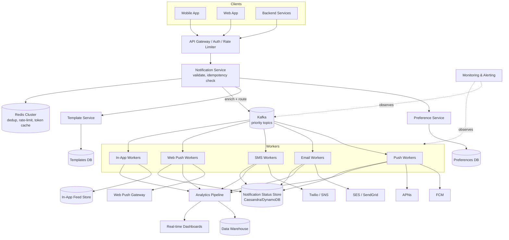
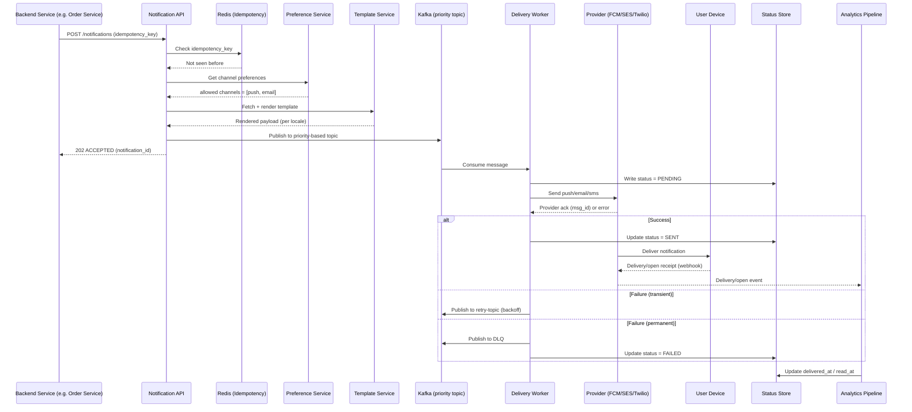
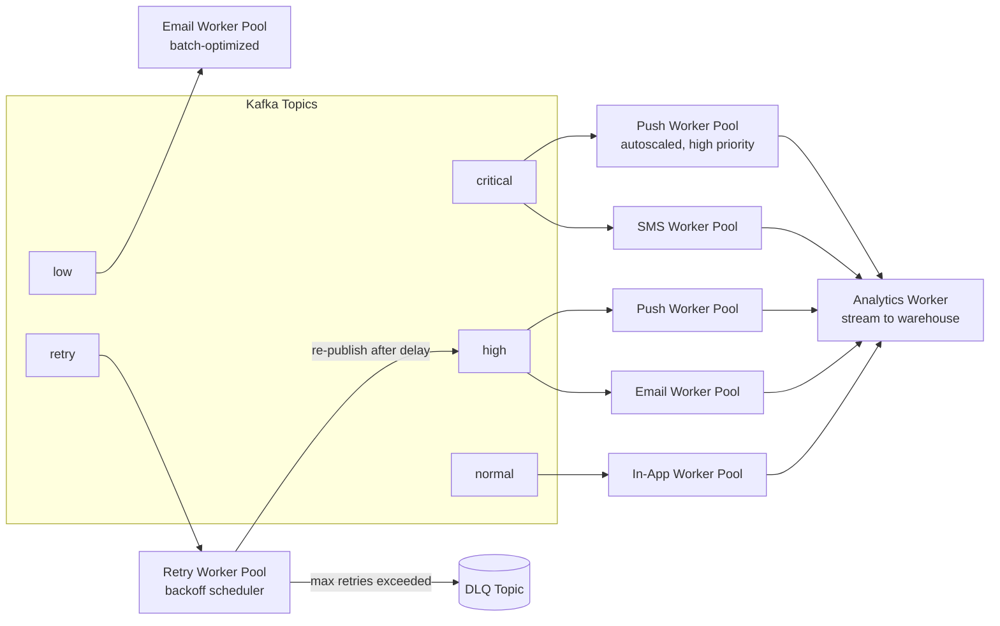
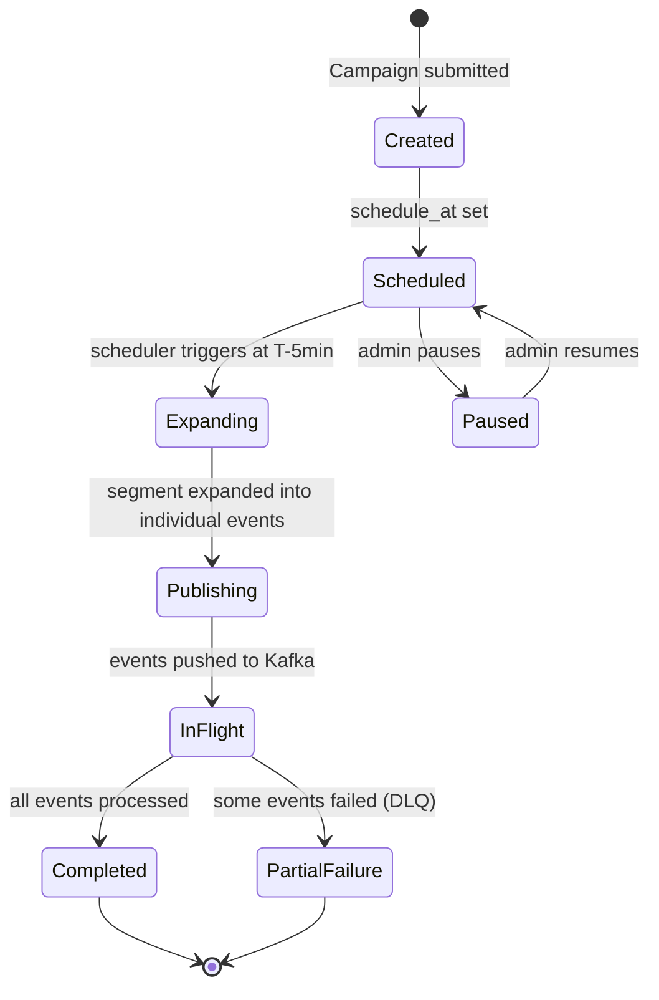
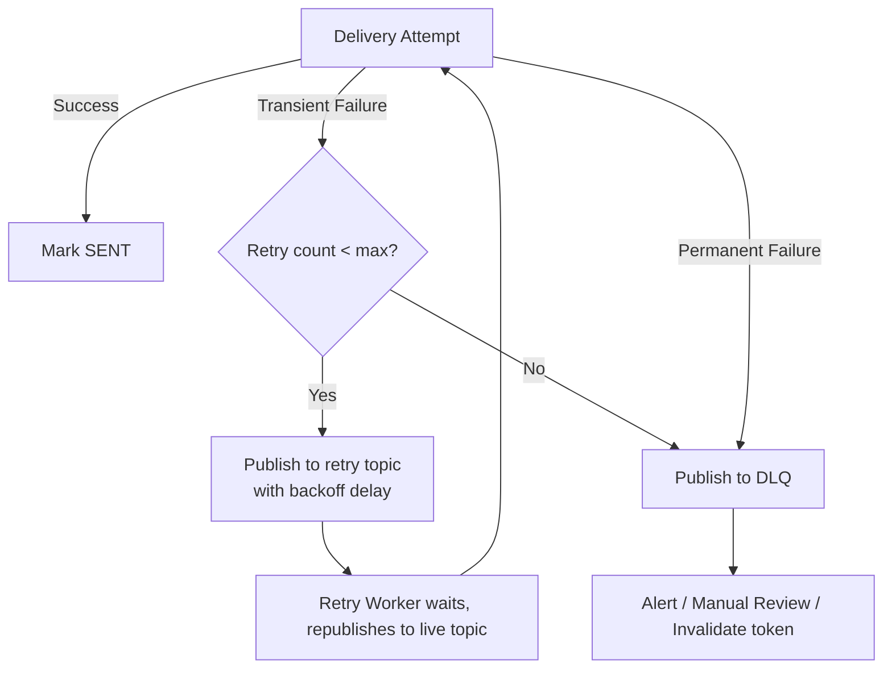
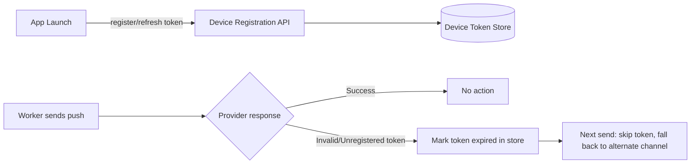

# Designing a Global Notification System
### Staff-Level Interview Preparation Guide

---

## 1. Problem Statement

A **Global Notification System** is a platform-level service that lets any product team at a company (rides, payments, social, commerce) send a message to a user through the channel that fits the context — without every product team reinventing delivery, retries, provider integration, and compliance.

Real examples that map to this exact system:

| Company | Use Case | Channel(s) | Latency Requirement |
|---|---|---|---|
| Uber | "Your driver has arrived" | Push, SMS | Seconds (real-time) |
| Amazon | "Your order has shipped" | Email, Push | Minutes acceptable |
| Slack | New message in channel | Push, In-App, Web Push | Sub-second |
| LinkedIn | "X wants to connect" | Push, Email digest | Minutes |
| GitHub | PR review requested | Email, In-App | Minutes |
| Banks | OTP for login | SMS, Push | **< 5 seconds, critical** |
| Payment apps | "Payment successful" | Push, SMS | Seconds |
| Marketing | "50% off sale" | Email, Push | Best-effort, batched |

**Core insight for interviews:** this is not "one system" — it is a **fan-out and delivery orchestration platform** sitting in front of many heterogeneous, unreliable third-party providers, each with different latency, cost, and reliability characteristics. The hard parts are not "how do I call FCM" — they are queueing, retries, prioritization, deduplication, preferences, and scaling to billions of events/day.

### Notification Channels Overview

| Channel | Transport | Delivery Guarantee (Provider Side) | Typical Use |
|---|---|---|---|
| Push (Mobile) | FCM (Android) / APNs (iOS) | Best-effort | Real-time alerts |
| SMS | Twilio / SNS / carrier gateways | High reliability, costly | OTP, critical alerts |
| Email | SES / SendGrid / Postmark | High reliability, slower | Receipts, digests, marketing |
| Web Push | Browser push (VAPID) | Best-effort | Web app alerts |
| In-App | WebSocket / long-poll / DB-backed feed | Reliable if user online, else stored | Notification center/bell icon |

> **Interviewer's Expectation:** They want you to *immediately* say "this is a fan-out + multi-provider delivery problem with heterogeneous SLAs," not "I'll build a queue and workers." Naming the actual hard problem early signals seniority.

---

## 2. Functional Requirements

**Core (P0):**
- Send notifications via Push, Email, SMS, In-App, Web Push
- Real-time and scheduled/delayed delivery
- Retry on failure with backoff
- Bulk / broadcast notifications (millions of recipients)
- Personalized, templated content with variable substitution
- User preference management (opt-in/out, channel choice, mute)
- Multi-language / localized templates
- Rich media (images, action buttons, deep links)
- Notification history + read/unread state
- Delivery and click tracking

**Extended (P1 — mention, don't over-build):**
- A/B testing on templates/campaigns
- Geo-targeting and segmentation
- Priority queues (OTP > transactional > marketing)
- Quiet hours / Do Not Disturb
- Digest notifications (batch low-priority events)
- Campaign management UI/API for marketing teams

> **Common Follow-up:** "Should OTP and marketing emails use the same pipeline?" — Answer: same *platform*, different **priority queues and isolation boundaries** so a marketing blast never delays an OTP. This single answer is one of the highest-signal things you can say in this interview.

---

## 3. Non-Functional Requirements

| Requirement | Target / Notes |
|---|---|
| Availability | 99.99% for the ingestion API; provider-dependent for actual delivery |
| Durability | No notification request lost once **accepted** (ack after Kafka persist) |
| Scalability | Horizontally scalable to 1M+ notifications/sec at peak |
| Reliability | At-least-once delivery with idempotency at consumer side |
| Fault tolerance | No single provider/queue/DB failure takes down ingestion |
| Latency | OTP/critical: < 5s p99. Transactional: < 30s p99. Marketing: minutes-hours acceptable |
| Throughput | Sustain sustained peak load (New Year's Eve, Black Friday) |
| Global deployment | Multi-region active-active for ingestion, regional providers for delivery |
| Consistency | Eventually consistent (notification status, read receipts) |
| Deliverability | Maximize inbox placement, avoid spam flags, respect provider rate limits |
| Observability | Per-channel, per-provider, per-priority delivery metrics |
| Cost | SMS is ~100-1000x cost of push; must be default-avoided unless critical |

> **Interviewer's Expectation:** They are listening for you to explicitly say "eventual consistency is fine, this is not a payments ledger" — showing you know when *not* to over-engineer for strong consistency.

---

## 4. Capacity Estimation

**Assumptions:**
- 500M Daily Active Users (DAU)
- Average notifications per user per day: 10 (mix of transactional + marketing + social)
- Peak-to-average ratio: 3x (product launches, sales events, incident bursts)

### Daily Volume

```
Total notifications/day = 500M users × 10 notifications/user
                         = 5,000,000,000 (5 Billion) notifications/day
```

### Average QPS

```
Average QPS = 5B / 86,400 seconds
            ≈ 57,870 notifications/sec
```

### Peak QPS

```
Peak QPS = Average QPS × 3 (peak multiplier)
         ≈ 173,000 notifications/sec

Round up for headroom → design for ~200,000 notifications/sec sustained peak,
with burst capacity to 1,000,000/sec for flash events (interview target per prompt).
```

### Channel Split (assumed realistic mix)

| Channel | % of Volume | Notifications/day | Notes |
|---|---|---|---|
| Push | 60% | 3.0B | Cheapest, fastest |
| In-App | 20% | 1.0B | Stored, no external cost |
| Email | 15% | 0.75B | Digest-heavy |
| SMS | 3% | 150M | Expensive — reserved for OTP/critical |
| Web Push | 2% | 100M | Smaller surface area |

### Storage Estimation

Assume each notification record (metadata, not payload) is **~1 KB** (user_id, channel, template_id, status, timestamps, provider response).

```
Daily storage = 5B × 1 KB = 5 TB/day
Yearly storage = 5 TB × 365 ≈ 1.8 PB/year
```

With a **90-day hot retention** policy (older data moved to cold storage / archived to S3-Glacier equivalent):

```
Hot storage = 5 TB × 90 = 450 TB
```

This confirms: **do not keep full notification history in a hot relational DB** — use a wide-column store (Cassandra/DynamoDB) with TTL, and archive to object storage.

### Kafka Throughput

```
Peak message size ≈ 2 KB (payload + metadata)
Peak throughput = 200,000 msg/sec × 2 KB = 400 MB/sec

With 3x replication (durability):
Effective write throughput = 1.2 GB/sec across the cluster
```

This requires a Kafka cluster sized with enough partitions and brokers to sustain **400 MB/s produce throughput**, e.g., ~50-100 partitions per topic across a multi-broker cluster, scaling by adding brokers/partitions linearly.

### Redis Memory (for dedup, rate limiting, device token cache)

```
Assume caching 500M device tokens, ~200 bytes each:
500M × 200 bytes = 100 GB

Add dedup keys (idempotency), rate-limit counters (~50 GB)
Total Redis footprint ≈ 150-200 GB → use Redis Cluster, sharded
```

### Database (Preferences + Device Tokens — Source of Truth)

```
500M users × (preferences ~1KB + avg 2 device tokens × 0.5KB) ≈ 1 TB
```

Small enough to live in a sharded relational or key-value store (DynamoDB/Cassandra), partitioned by `user_id`.

> **Interview Tip:** Always **show the math live**, even if rough. Interviewers care more about your ability to reason ("SMS is 3% of volume but disproportionately drives cost — 150M/day at ~$0.005-0.01 each is $750K-1.5M/day if unthrottled") than about getting an exact number.

---

## 5. API Design

### 5.1 Send Notification (single or templated)

```http
POST /v1/notifications
Authorization: Bearer <service-token>
Content-Type: application/json

{
  "recipient_id": "user_12345",
  "channel": ["push", "email"],
  "priority": "high",
  "template_id": "order_shipped_v3",
  "locale": "en-US",
  "variables": {
    "order_id": "ORD-98213",
    "eta": "Aug 5"
  },
  "idempotency_key": "order_shipped-ORD-98213-user_12345",
  "schedule_at": null
}
```

**Response:**
```json
{
  "notification_id": "ntf_9f8a7b6c",
  "status": "ACCEPTED",
  "accepted_channels": ["push", "email"],
  "created_at": "2026-08-02T10:00:00Z"
}
```

### 5.2 Bulk / Broadcast

```http
POST /v1/notifications/bulk

{
  "segment_id": "seg_active_riders_west_coast",
  "template_id": "weekend_promo",
  "channel": ["push"],
  "priority": "low",
  "schedule_at": "2026-08-03T09:00:00-08:00"
}
```
Bulk requests don't return per-user IDs synchronously — they return a **campaign_id** and are processed asynchronously by the fan-out service.

### 5.3 Fetch Notification History

```http
GET /v1/notifications?user_id=user_12345&status=unread&limit=20&cursor=xyz
```

### 5.4 Mark as Read

```http
PATCH /v1/notifications/{notification_id}/read
```

### 5.5 Preferences

```http
POST /v1/preferences
{
  "user_id": "user_12345",
  "channel_prefs": {
    "marketing": ["email"],
    "transactional": ["push", "sms"],
    "social": ["push", "in_app"]
  },
  "quiet_hours": {"start": "22:00", "end": "07:00", "timezone": "America/Los_Angeles"}
}
```

### 5.6 Templates (Admin API)

```http
POST /v1/templates
{
  "template_id": "order_shipped_v3",
  "channel": "email",
  "subject": "Your order has shipped!",
  "body_html": "<p>Hi {{first_name}}, your order {{order_id}} is on its way.</p>",
  "locale": "en-US"
}
```

### 5.7 Campaign Management

```http
POST /v1/campaigns
GET  /v1/campaigns/{id}/status
POST /v1/campaigns/{id}/pause
```

### Design Notes
- `idempotency_key` is **mandatory** for transactional sends — prevents duplicate delivery on client retries.
- `priority` field drives which Kafka topic/partition the message lands on.
- Bulk/broadcast is **decoupled** from single-send: different service, different scaling profile (fan-out heavy vs. low-latency heavy).

> **Common Follow-up:** "Why is bulk send async but single send sync-accepted?" — Single send needs to ack quickly for good UX (e.g., "OTP sent" confirmation); bulk send needs a fan-out pipeline to expand a segment of millions of users into individual events, which cannot happen synchronously in an HTTP request.

---

## 6. Database Design

### 6.1 Users / Device Tokens (Key-Value / Wide-Column — Cassandra/DynamoDB)

```
Table: device_tokens
Partition Key: user_id
Clustering Key: device_id

| Column        | Type      |
|---------------|-----------|
| user_id       | UUID (PK) |
| device_id     | UUID (CK) |
| platform      | ENUM(android, ios, web) |
| token         | STRING    |
| app_version   | STRING    |
| updated_at    | TIMESTAMP |
| status        | ENUM(active, expired, invalid) |
```
- TTL: tokens not refreshed in 60 days marked `expired` and pruned by background job.
- Indexed by `user_id` for lookup during send; separate table `token_to_user` for reverse lookup (needed when a provider tells us a token is invalid).

### 6.2 Notification Record (Write-heavy, wide-column store)

```
Table: notifications
Partition Key: user_id
Clustering Key: created_at DESC, notification_id

| Column           | Type      |
|------------------|-----------|
| notification_id  | UUID      |
| user_id          | UUID      |
| channel          | STRING    |
| template_id      | STRING    |
| status           | ENUM(pending, sent, delivered, failed, read) |
| priority         | ENUM(critical, high, normal, low) |
| created_at       | TIMESTAMP |
| delivered_at     | TIMESTAMP |
| read_at          | TIMESTAMP |
| provider_msg_id  | STRING    |
| ttl              | 90 days   |
```
- Partitioning by `user_id` gives fast "get my notifications" queries (the dominant read pattern) and even write distribution across millions of users.
- TTL set at write time — old records auto-expire, avoiding manual cleanup jobs.

### 6.3 Templates (Relational — Postgres/MySQL, low write volume, needs versioning + validation)

```sql
CREATE TABLE templates (
  template_id   VARCHAR PRIMARY KEY,
  version       INT,
  channel       VARCHAR,
  locale        VARCHAR,
  subject       TEXT,
  body          TEXT,
  variables     JSONB,
  created_at    TIMESTAMP,
  is_active     BOOLEAN
);
```

### 6.4 Preferences (Key-Value, read-heavy on every send — must be cached)

```
Table: preferences
Partition Key: user_id

| category_prefs | JSON  (marketing: [email], transactional: [push, sms]) |
| quiet_hours     | JSON  |
| language        | STRING |
| global_opt_out  | BOOLEAN |
```

### 6.5 Campaigns (Relational, low volume, high consistency needs)

```sql
CREATE TABLE campaigns (
  campaign_id   UUID PRIMARY KEY,
  segment_id    VARCHAR,
  template_id   VARCHAR,
  status        ENUM(draft, scheduled, running, paused, completed),
  scheduled_at  TIMESTAMP,
  created_by    VARCHAR
);
```

### Indexing & Partitioning Summary

| Data | Store | Partition Key | Why |
|---|---|---|---|
| Notification history | Cassandra/DynamoDB | user_id | Read pattern is per-user, write-heavy |
| Device tokens | Cassandra/DynamoDB | user_id | Fast lookup at send time |
| Preferences | Redis + DynamoDB (cache-aside) | user_id | Read on **every** send — must be sub-ms |
| Templates | PostgreSQL | template_id | Low volume, needs joins/versioning/admin tooling |
| Campaigns | PostgreSQL | campaign_id | Low volume, strong consistency for status transitions |

> **Interviewer's Expectation:** They want to see you **match storage engine to access pattern** — not "I'll put everything in Postgres" or "I'll put everything in Cassandra." Justify each choice by read/write ratio and query shape.

---

## 7. High-Level Architecture



### Component Responsibilities

| Component | Responsibility |
|---|---|
| API Gateway | AuthN/AuthZ, rate limiting, request validation |
| Notification Service | Idempotency check, enrichment, priority routing to Kafka |
| Preference Service | Resolve what channels a user allows, quiet hours, opt-out |
| Template Service | Fetch + render localized templates |
| Kafka | Durable, ordered (per-key), buffered transport between ingestion and delivery |
| Worker Pools | Channel-specific delivery logic, provider API calls, retries |
| Redis Cluster | Idempotency keys, rate limiting counters, hot device-token cache |
| Status Store | Durable record of notification lifecycle (Cassandra/DynamoDB) |
| Analytics Pipeline | Stream processing for delivery/open/click rates |
| Monitoring | Metrics, tracing, alerting, provider health checks |

> **Common Follow-up:** "Why put Kafka between the Notification Service and the Workers instead of calling providers directly?" — Decoupling gives you: (1) buffering during traffic spikes, (2) independent scaling of ingestion vs delivery, (3) replayability for debugging/backfill, (4) natural place to implement priority and backpressure.

---

## 8. Notification Flow (End-to-End Lifecycle)



**Key lifecycle stages:**
1. **Ingestion** — validate, dedupe, check preferences, render template.
2. **Queueing** — priority-routed to Kafka, decoupling producer from consumer speed.
3. **Delivery** — channel-specific worker calls the provider API.
4. **Acknowledgement** — provider returns a message ID (async) or delivery webhook (later).
5. **Status tracking** — every state transition persisted for querying/history/analytics.
6. **Analytics** — delivery, open, click events streamed into a warehouse for campaign reporting.

> **Interviewer's Expectation:** Be explicit that **"sent" ≠ "delivered."** The system only guarantees delivery *to the provider*; actual device delivery is best-effort and provider-dependent (especially push). This distinction is a strong signal of production experience.

---

## 9. Channel Design

### 9.1 Push Notifications (FCM / APNs)

- **Advantages:** Fast (seconds), free (no per-message provider cost beyond infra), rich (images, actions, deep links).
- **Disadvantages:** Best-effort only — no delivery guarantee if device is offline/OS throttles background delivery; token churn (tokens expire, app reinstalls).
- **Latency:** Sub-second to a few seconds typical.
- **Reliability:** Best-effort; OS-level battery optimization can delay/drop.
- **Delivery guarantee:** None from provider — must track via client-side "delivered" ping or app-open correlation.
- **Cost:** Effectively free at scale (FCM/APNs don't charge per message).

### 9.2 SMS

- **Advantages:** Reaches feature phones, no app required, near-universal reach, high open rate.
- **Disadvantages:** Expensive, rate-limited by carriers, can be blocked/filtered as spam, no rich content.
- **Latency:** 1-10 seconds typical, can spike during carrier congestion.
- **Reliability:** High relative to push, but carrier-dependent.
- **Delivery guarantee:** Provider gives delivery receipts (DLR) — closest to a real guarantee among all channels.
- **Cost:** $0.005–$0.05+ per message depending on country — **the most expensive channel by far**.

### 9.3 Email

- **Advantages:** Rich content, cheap at scale, good for digests/marketing, persistent record in inbox.
- **Disadvantages:** Slower engagement, spam filtering risk, requires domain reputation management (SPF/DKIM/DMARC).
- **Latency:** Seconds to minutes.
- **Reliability:** High for delivery to mail server; "read" is unreliable (tracking pixels blocked by many clients).
- **Delivery guarantee:** Provider confirms handoff to mail server; bounce/complaint webhooks give feedback loop.
- **Cost:** Very cheap (~$0.0001–$0.001/email at scale via SES).

### 9.4 Web Push

- **Advantages:** No app install required, works while browser is open/backgrounded (per browser support).
- **Disadvantages:** Browser-dependent support, users must opt in via a native browser prompt (low opt-in rates), tokens tied to browser instance.
- **Latency:** Seconds.
- **Reliability:** Best-effort, similar to mobile push.
- **Cost:** Free.

### 9.5 In-App Notifications

- **Advantages:** No external dependency, instant if user is active (WebSocket), full control over UX, no per-message cost.
- **Disadvantages:** Useless if user isn't in the app — must pair with push to "wake" the user.
- **Latency:** Real-time if connected; otherwise stored for next app open.
- **Reliability:** Fully reliable (first-party store) once persisted.
- **Cost:** Infra-only (DB writes + optional WebSocket fan-out).

### Channel Comparison Matrix

| Channel | Latency | Reliability | Cost | Rich Content | Requires App/Opt-in |
|---|---|---|---|---|---|
| Push | Low | Best-effort | Free | Yes | App install |
| SMS | Low-Med | High | **High** | No | Phone number |
| Email | Med | High (to server) | Very Low | Yes | Email address |
| Web Push | Low | Best-effort | Free | Limited | Browser opt-in |
| In-App | Instant (if online) | Full | Free | Yes | App must be open |

> **Interviewer's Expectation:** Know **which channel to pick for a given scenario** — e.g., "OTP → SMS + Push in parallel, first to succeed wins" or "marketing campaign → Email primary, Push secondary, never SMS due to cost."

---

## 10. Queue Design

### Why Kafka (Primary Choice)

| Requirement | Kafka Fit |
|---|---|
| High throughput (100K-1M msg/sec) | Yes — log-based, sequential I/O, scales via partitions |
| Durability | Yes — replicated, disk-persisted log |
| Multiple independent consumers (workers, analytics) | Yes — consumer groups read independently, no message deletion on read |
| Replay for debugging/backfill | Yes — log retention allows replay |
| Ordering | Yes, per-partition (order by partition key, e.g. user_id) |

### Kafka vs Alternatives

| Feature | Kafka | RabbitMQ | SQS | Redis Streams |
|---|---|---|---|---|
| Throughput | Very High | Medium | High (with batching) | High (single node bound) |
| Durability | Strong (replicated log) | Good (with mirroring) | Strong (managed) | Weaker (memory-first) |
| Ordering | Per-partition | Per-queue (with caveats) | FIFO queues only (lower throughput) | Per-stream |
| Replay | Yes (log retention) | No (message removed after ack) | No | Limited |
| Multi-consumer fan-out | Native (consumer groups) | Needs multiple queues/exchanges | Needs multiple queues | Native (consumer groups) |
| Operational complexity | High | Medium | Low (managed) | Medium |
| Best for | High-throughput event streaming | Complex routing, lower volume | Simple decoupled queues, managed | Low-latency, smaller scale |

**Decision: Kafka** for the core ingestion→delivery pipeline because of throughput, replay, and native multi-consumer fan-out (delivery workers + analytics both read the same stream independently). SQS/RabbitMQ are reasonable for smaller internal task queues (e.g., retry scheduling) but don't fit the "billions/day, multiple downstream consumers" requirement as cleanly.

### Topic Design

```
notifications.critical    (OTP, security alerts)   — few partitions, low latency, over-provisioned consumers
notifications.high        (transactional: order, payment)
notifications.normal      (social, in-app)
notifications.low         (marketing, digests)
notifications.retry       (failed, scheduled backoff)
notifications.dlq         (permanently failed)
```

- Separate topics per priority — **not** a single topic with a priority field — because Kafka does not support in-topic priority reordering. Physical isolation is the only way to guarantee marketing traffic never head-of-line-blocks OTP traffic.
- Partition key = `user_id` → guarantees per-user ordering (important: don't deliver "order cancelled" before "order placed").

### Delayed / Scheduled Delivery

Kafka has no native delay mechanism. Options:
1. **Delay queue pattern:** dedicated "scheduled" topic + a scheduler service that polls a time-indexed store (Redis sorted set or DB) and republishes to the live topic when due.
2. **Redis sorted set** keyed by `deliver_at` timestamp — a scheduler worker pops due items every few seconds and pushes to Kafka.

### Backpressure

- Kafka consumer lag is monitored; if lag crosses a threshold, autoscale worker pool (HPA on consumer lag metric).
- Producers apply **rate limiting at ingestion** for low-priority traffic (marketing) during high load, protecting critical traffic's share of infra.

### Delivery Semantics

| Semantics | Approach |
|---|---|
| At-most-once | Not used — risks silent notification loss |
| **At-least-once** | **Chosen** — Kafka default with manual offset commit after successful provider call |
| Exactly-once | Not pursued end-to-end (provider side can't participate in a transaction) — instead achieve **effectively-once** via idempotency keys at the worker/provider layer |

---

## 11. Worker Architecture



### Worker Types

| Worker Type | Responsibility | Scaling Driver |
|---|---|---|
| Delivery Workers (per channel) | Call provider API, handle response | Kafka consumer lag |
| Retry Workers | Consume retry topic, apply backoff, republish | Retry topic depth |
| Template Workers | Pre-render templates for bulk campaigns | Campaign fan-out rate |
| Analytics Workers | Consume delivery/open/click events, aggregate | Event volume |
| Campaign Workers | Expand a segment into individual user events | Segment size / campaign schedule |

### Horizontal Scaling Approach

- Each worker pool is a **stateless consumer group** — scale by adding pods/instances; Kafka rebalances partitions automatically.
- **Priority isolation:** critical/high priority pools run on dedicated infra (never share a node pool with low-priority/marketing workers) to avoid noisy-neighbor resource contention.
- Autoscaling driven by **consumer lag**, not just CPU — lag is the true signal of whether the pool is keeping up.

> **Common Follow-up:** "What happens if the Email worker pool goes down but Push is fine?" — Because each channel has its own consumer group and topic, this is fully isolated. Push notifications continue unaffected; only email messages accumulate in Kafka (bounded by retention) until the pool recovers.

---

## 12. Scheduling

### Supported Modes

| Mode | Mechanism |
|---|---|
| Immediate | Direct publish to live priority topic |
| Delayed (minutes-hours) | Redis sorted set (score = deliver_at epoch) + scheduler poller |
| Recurring | Cron-defined campaign definitions stored in Campaigns DB, triggered by a scheduler service (e.g., Airflow/Temporal-style orchestrator) |
| Time zone-aware | `deliver_at` computed server-side from user's stored timezone at enqueue time, not at read time |
| Quiet hours | Preference Service checks quiet-hours window before allowing non-critical sends; if inside window, message is deferred to next allowed slot (never suppressed for critical priority) |

### Scheduling Flow



- A dedicated **Scheduler Service** owns polling the delayed-queue store and materializing due jobs — decoupled from the ingestion API so a burst of scheduled sends doesn't compete with real-time traffic.
- For **recurring campaigns**, the definition (cron expression + segment + template) lives in the Campaigns table; the scheduler expands it into a one-off run at each trigger time.

---

## 13. Retry Strategy

| Failure Type | Example | Strategy |
|---|---|---|
| Transient | Provider 5xx, timeout, rate-limited | Exponential backoff retry (e.g., 1s, 5s, 30s, 2m, 10m), capped attempts |
| Permanent | Invalid token, bad email format, unsubscribed number | No retry — straight to DLQ + mark token/address invalid |

### Retry Flow



- **Exponential backoff with jitter** prevents thundering-herd retries from synchronized failures (e.g., a provider blip affecting thousands of in-flight messages simultaneously).
- **Circuit breaker** per provider: if error rate exceeds a threshold (e.g., 50% over 1 minute), trip the breaker, stop sending to that provider, and either queue for later or **failover to a secondary provider** (e.g., switch from SendGrid to SES) if configured.
- **Dead Letter Queue (DLQ):** captures permanently failed or max-retries-exceeded messages for offline analysis/alerting — never silently dropped.

### Idempotency & Duplicate Detection

- Every inbound request carries a client-supplied `idempotency_key`.
- On ingestion, the Notification Service checks Redis (`SETNX` with TTL) for that key — if present, return the existing `notification_id` instead of re-processing.
- At the **worker level**, before calling the provider, a second idempotency check happens (using `notification_id` + channel) to guard against duplicate delivery caused by consumer rebalances or at-least-once redelivery from Kafka.

> **Interviewer's Expectation:** They will almost always probe "what if the worker crashes right after calling the provider but before committing the Kafka offset?" — Correct answer: **at-least-once delivery means the message will be reprocessed; the idempotency key at the worker/provider layer (many providers accept a client dedup key) is what prevents the user from seeing a duplicate.** This is the single most-asked follow-up in this entire system design.

---

## 14. User Preferences

| Preference Dimension | Example |
|---|---|
| Opt-in / Opt-out | Global unsubscribe (marketing only, transactional cannot be opted out of by law in many jurisdictions) |
| Category preferences | "I want order updates via SMS but promotions only via email" |
| Mute | Temporarily silence a specific thread/topic |
| Do Not Disturb / Quiet Hours | No non-critical notifications between 10pm-7am local time |
| Language | Drives template locale selection |
| Timezone | Drives scheduling and quiet-hours calculation |
| Frequency limits (frequency capping) | "Max 3 marketing pushes per week per user" |

### Enforcement Point

Preferences are checked **at ingestion time** (Notification Service, before Kafka publish) — not at the worker. This avoids wasting queue/worker capacity on messages that will be dropped, and keeps the enforcement logic in one place.

Preferences are **cached in Redis** (cache-aside from the Preferences DB) because this lookup happens on every single send — it cannot be a cold DB read at that volume.

> **Common Follow-up:** "What about legally-mandated notifications (e.g., security alerts, terms-of-service changes)?" — These are tagged `category: critical` and bypass opt-out/mute/quiet-hours checks entirely, but **never** bypass hard channel validity (e.g., can't SMS a user with no phone on file).

---

## 15. Template Engine

**Capabilities required:**
- Variable substitution (`{{first_name}}`, `{{order_id}}`)
- Localization — one `template_id` maps to N locale variants, resolved by user's `locale` preference at render time
- Markdown → rendered HTML for email
- Rich push payload construction (image URL, deep link, action buttons) — platform-specific formatting (FCM vs APNs payload shape differs)
- **Versioning** — templates are versioned; a campaign pins to a specific version so in-flight campaigns aren't affected by a template edit
- **Validation** — at template creation/update time: required variables present, HTML sanitized (prevent injection), size limits per channel (SMS 160 chars/segment, push payload size limits)

### Rendering Flow

```
Template + Variables + Locale → Template Service (in-process cache of hot templates)
→ Rendered Payload (per channel format)
→ Attached to Kafka message
```

Rendering happens **at ingestion time**, not at delivery time, so the worker doesn't need template-store access — reduces coupling and keeps workers simple/fast.

---

## 16. Device Management

| Token Type | Provider | Lifecycle Concern |
|---|---|---|
| FCM Token | Android | Refreshes on app reinstall, OS update, token rotation by Google |
| APNs Token | iOS | Refreshes similarly; revoked if app uninstalled |
| Web Push Subscription | Browser (VAPID) | Tied to browser profile; invalidated on cache clear |

### Flow



- **Expired token cleanup:** providers return explicit error codes (e.g., FCM `UNREGISTERED`) — workers write these back to the Device Token Store asynchronously so we stop wasting sends on dead tokens.
- **Token refresh:** client-driven — app re-registers on every cold start/token-refresh callback; server never tries to "guess" a stale token is still valid.
- Multiple devices per user supported natively (device_id as clustering key) — a notification can fan out to all active devices for a user.

---

## 17. Scaling

| Layer | Scaling Strategy |
|---|---|
| API Gateway / Ingestion | Stateless, horizontally scaled behind a load balancer; scale on request rate |
| Kafka | Add partitions (increase parallelism) and brokers; partition count set with 5-10x headroom over current peak consumer count |
| Consumer Groups (Workers) | Add consumer instances up to partition count; beyond that, add more partitions |
| Redis | Redis Cluster with hash-slot sharding; read replicas for hot preference/token lookups |
| Database (Status/Tokens) | Cassandra/DynamoDB — partition by `user_id`, scales linearly by adding nodes; consistent hashing distributes load evenly |
| Regional Deployment | Active-active regional clusters; users routed to nearest region by geo-DNS; each region has its own Kafka + workers + provider integrations where possible (e.g., regional SMS gateways for lower latency/cost) |

### Multi-Region Considerations

- **Data locality:** EU user data may need to stay in EU (GDPR) — preferences/status stores are regionally partitioned, not globally replicated by default.
- **Cross-region failover:** if a region's provider integration fails, route traffic to a backup region's provider connection (added latency but maintains availability) — configured per-channel since not all providers support this cleanly (e.g., SMS carrier routing is often region-specific for cost/compliance reasons).
- **Consistent hashing** used for shard assignment in the status/token stores so that adding/removing nodes causes minimal data reshuffling.

> **Common Follow-up:** "How do you scale Kafka partitions without downtime?" — Kafka supports adding partitions to an existing topic online; however, since ordering is per-partition and keyed by `user_id`, adding partitions changes the key→partition mapping going forward (new messages for a user may land on a different partition than earlier ones). Acceptable here because ordering only matters *within a short in-flight window*, not across all history — call this tradeoff out explicitly if asked.

---

## 18. Failure Scenarios

| Failure | Impact | Recovery |
|---|---|---|
| Kafka broker/cluster degraded | Producer backpressure, possible ingestion slowdown | Multi-broker replication; producer retries with backoff; if fully down, API returns 503 and clients retry (idempotency key ensures safety) |
| Redis failure | Idempotency/dedup checks unavailable, preference cache miss | Redis Cluster with replicas + automatic failover; fallback to DB read (slower but correct) if cache fully down |
| Database (status store) failure | Can't record notification status | Writes buffered/retried; delivery still proceeds (status tracking is best-effort/eventually consistent by design) |
| Email provider outage (e.g., SES down) | Email channel delivery halts | Circuit breaker trips; failover to secondary provider (SendGrid) if configured; else queue and retry with backoff |
| SMS gateway failure | SMS delivery halts | Same circuit breaker + failover pattern; for OTP, consider parallel dual-provider send for critical priority |
| Push provider outage (FCM/APNs) | Push delivery halts | No good failover (single provider per platform) — queue and retry; degrade gracefully to in-app/email for that window |
| Worker crash | In-flight messages not acked, will be redelivered | Kafka consumer group rebalances partitions to healthy workers; at-least-once + idempotency prevents duplicate user-facing delivery |
| Duplicate delivery | User sees the same notification twice | Idempotency key checked at ingestion AND at worker/provider layer |
| Message loss | Notification never sent | Prevented by: ack-after-persist at ingestion, Kafka replication, DLQ instead of silent drop |
| Region outage | Entire region's users can't be reached | Active-active — traffic reroutes to healthy region via geo-DNS/load balancer; regional data stores need cross-region backup/replication strategy for DR |

> **Interviewer's Expectation:** For each failure, they want **detection mechanism → immediate mitigation → recovery** stated explicitly, not just "we retry." Also expect them to specifically probe push provider outages since there's genuinely no failover — a good answer acknowledges the limitation rather than inventing a fake solution.

---

## 19. Delivery Guarantees

| Guarantee | Definition | Used Where |
|---|---|---|
| At-most-once | Message delivered 0 or 1 times, may be lost | Not used — unacceptable loss risk |
| **At-least-once** | Message delivered 1+ times, never lost | **Used end-to-end** — Kafka + manual offset commit after successful provider handoff |
| Exactly-once | Message delivered exactly 1 time | Not achievable end-to-end (provider is outside our transaction boundary); **approximated via idempotency** ("effectively-once") |

**How idempotency achieves effectively-once on top of at-least-once:**
1. Ingestion-level idempotency key (client-supplied) → dedupes retried API calls.
2. Worker-level check against Status Store (`notification_id` + channel) before calling provider → dedupes Kafka redelivery.
3. Provider-level dedup key (many providers like FCM/SES accept a client message ID) → last line of defense if our own check races.

**Ordering guarantees:**
- Per-user ordering preserved via `user_id` as the Kafka partition key — all messages for one user go to the same partition, processed in order by a single consumer at a time.
- **No global ordering** across users — not needed, and enforcing it would kill throughput.

---

## 20. Analytics

| Metric | Definition | Computed From |
|---|---|---|
| Delivery Rate | delivered / sent | Provider delivery webhooks |
| Open Rate | opened / delivered | Push receipt / email tracking pixel |
| Click Rate | clicked / opened | Deep link / tracked URL redirects |
| Bounce Rate | bounced / sent (email) | Provider bounce webhook |
| Failure Rate | failed / sent | Status store aggregation |
| Latency | delivered_at - created_at | Status store timestamps |
| Campaign Performance | above metrics grouped by campaign_id | Stream aggregation |

### Pipeline

```
Provider Webhooks (delivery/open/click/bounce)
   → Ingestion endpoint
   → Kafka (analytics-events topic)
   → Stream processor (aggregation windows: 1min/1hr/1day)
   → Real-time dashboard (hot path, Redis/OLAP store)
   → Data Warehouse (cold path, for historical/campaign reporting)
```

- Real-time dashboards use a fast OLAP-style store (e.g., pre-aggregated counters in Redis or a columnar store) for sub-second campaign monitoring during a live send.
- Historical analysis (cohort analysis, A/B test significance) runs against the data warehouse, decoupled from the hot path.

---

## 21. Monitoring

| Category | Examples |
|---|---|
| Metrics | Ingestion QPS, Kafka consumer lag per topic, delivery success rate per provider, p50/p95/p99 latency per channel |
| Logs | Structured logs per notification_id for full lifecycle tracing |
| Tracing | Distributed trace from API request → Kafka → worker → provider call (correlate via notification_id/trace_id) |
| Alerts | Consumer lag > threshold, provider error rate > threshold, DLQ depth growing, circuit breaker tripped |
| SLO/SLI | SLI: % of critical notifications delivered within 5s. SLO: 99.9% monthly |
| Error Budgets | Used to decide whether to slow down risky deploys/feature rollouts on the notification pipeline |
| Provider Health | Per-provider dashboards (FCM, APNs, SES, Twilio) with real-time error rate — feeds circuit breaker decisions |

> **Interview Tip:** Mention **per-priority SLOs** specifically — critical (OTP) needs a much tighter SLO than marketing, and your monitoring/alerting should be tiered accordingly, not one blanket SLO for the whole system.

---

## 22. Security

| Concern | Mitigation |
|---|---|
| Authentication | Service-to-service auth via mTLS/OAuth2 client credentials for internal callers of the Notification API |
| Authorization | Scoped API keys per team/service; e.g., marketing service can't send `critical` priority |
| Encryption | TLS in transit everywhere; encryption at rest for PII (email, phone) in the Preferences/Token stores |
| PII Protection | Minimize PII in Kafka payloads (reference user_id, resolve email/phone at the worker layer just before provider call); mask PII in logs |
| Spam Prevention | Rate limiting per sender/template; content validation on templates before activation; unsubscribe link enforcement on marketing email |
| Rate Limiting | Per-user frequency caps (e.g., max N marketing notifications/week), per-service ingestion rate limits |
| Template Validation | Sanitize HTML (prevent XSS in email/in-app), enforce required variables, size limits |
| Audit Logging | Every campaign creation/send and preference change logged with actor identity for compliance review |

> **Common Follow-up:** "How do you prevent a compromised internal service from spamming millions of users?" — Scoped API keys + per-service rate limits + anomaly detection on send volume (sudden spike from one service triggers an automatic throttle + alert) is the layered answer they're looking for.

---

## 23. Tradeoffs

### Kafka vs RabbitMQ

| | Kafka | RabbitMQ |
|---|---|---|
| Throughput | Very high | Medium |
| Replay | Yes | No |
| Complex routing (topic exchanges, priority queues natively) | Limited | Strong |
| Best fit here | ✅ High-volume streaming backbone | Possibly for smaller internal task queues |

### Push vs SMS

| | Push | SMS |
|---|---|---|
| Cost | Free | Expensive |
| Reach | Requires app install | Near-universal |
| Reliability | Best-effort | High |
| Use when | Default choice | Critical/OTP, or user has no app |

### Redis vs Database (for preferences/dedup)

| | Redis | Database |
|---|---|---|
| Latency | Sub-ms | ms-tens of ms |
| Durability | Weaker (in-memory, snapshotting) | Strong |
| Use when | Hot-path read on every send | Source of truth, less frequent writes |

**Approach:** Redis as cache-aside in front of the DB — best of both: speed for reads, durability for the source of truth.

### Polling vs Push (for in-app delivery)

| | Polling | WebSocket/Push |
|---|---|---|
| Simplicity | High | Medium-High |
| Real-time-ness | Delayed (poll interval) | Instant |
| Server cost at scale | Lower per-connection, but wasteful requests | Higher (persistent connections) but efficient |
| Chosen | WebSocket for active sessions, fallback to poll-on-open for stored notifications |

### Batch vs Real-time

| | Batch | Real-time |
|---|---|---|
| Use case | Marketing campaigns, digests | OTP, transactional |
| Throughput optimization | High (bulk provider APIs) | Lower per-message overhead tolerance |
| Latency | Minutes-hours acceptable | Seconds required |

### Synchronous vs Asynchronous

| | Sync | Async |
|---|---|---|
| Use case | Single-user API accept (fast ack) | Bulk fan-out, actual delivery |
| Chosen here | API layer is sync-accept (returns 202 fast); everything past ingestion is async | — |

---

## 24. Scaling to Billions

**Target profile (per prompt):** 500M users, 5B notifications/day, burst to 1M notifications/sec.

### Architectural Evolution

| Stage | Scale | Architecture |
|---|---|---|
| MVP | <1M notifications/day | Single service, single DB, synchronous provider calls, no queue |
| Growth | 1M-100M/day | Introduce message queue, separate workers per channel, basic retry |
| Scale | 100M-1B/day | Kafka backbone, priority topics, sharded DBs, Redis caching, circuit breakers |
| Hyperscale (this design) | 1B-5B+/day, 1M/sec burst | Multi-region active-active, dedicated priority infra isolation, provider failover, dedicated campaign fan-out service, consistent-hashed sharded storage, tiered SLOs |

### Key Techniques for Billion-Scale

1. **Priority isolation at every layer** (topics, worker pools, even separate node pools/clusters) so marketing traffic structurally cannot starve critical traffic.
2. **Regional deployment** — reduces cross-region latency, satisfies data residency, and bounds blast radius of a regional outage.
3. **Provider diversification** — multiple providers per channel where feasible (email, SMS) for failover and negotiating leverage/cost.
4. **Aggressive caching** of preferences and device tokens — the read-per-send volume at this scale makes a DB-only design infeasible.
5. **Backpressure and load shedding** — under extreme load, low-priority traffic is throttled or deferred first, never critical traffic.
6. **Cloud-native autoscaling** — worker pools scale on consumer lag; stateless services scale on request rate; nothing scales manually.

> **Interview Tip:** When asked "how would this change at 10x scale," the strongest answer is usually **"the architecture doesn't fundamentally change — we add partitions, shards, and regions"** — showing the design was built to scale horizontally from the start, rather than needing a rewrite.

---

## 25. Real-World Systems

| Company | Likely Approach |
|---|---|
| **Uber** | Custom notification platform on top of Kafka; heavy use of priority queues for ride-status vs promotional; regional deployment matching their ride-hailing regions |
| **Amazon** | SNS (pub/sub fan-out) + SES (email) internally, likely with a custom orchestration layer for order-lifecycle notifications |
| **LinkedIn** | Kafka (which LinkedIn originally created) as the backbone; heavy digest/batching logic for feed notifications to control volume |
| **Slack** | WebSocket-first (real-time is core to the product) with push as a secondary "wake up" channel when the app is backgrounded |
| **Discord** | Similar WebSocket-first (gateway) architecture; push notifications layered on top for mobile |
| **Meta/Google** | Massive internal pub/sub systems (e.g., Google's internal systems, Meta's) with heavy investment in ML-based send-time optimization and frequency capping |
| **Firebase Cloud Messaging (FCM)** | The actual provider many of the above use for Android push — itself a fan-out system at Google scale |
| **Amazon SNS** | Managed pub/sub — commonly used as the "Kafka alternative" for teams that don't want to operate Kafka |
| **Amazon SES** | Managed email sending — handles reputation/deliverability infrastructure |
| **Twilio** | Dominant SMS/voice provider — commonly integrated as the SMS worker's downstream provider |
| **Apple APNs** | Sole provider for iOS push — no viable failover, as noted in Section 18 |

**Design choice consistency:** across all these, the recurring pattern is: **durable log/queue backbone (Kafka or managed pub/sub) + channel-specific stateless workers + heavy reliance on managed providers for actual last-mile delivery.** Nobody builds their own SMS/push infra from scratch — the value-add is in orchestration, prioritization, and reliability on top of these providers.

---

## 26. Interview Deep Dive Questions (50+)

**Architecture & Queueing**
1. Why Kafka over RabbitMQ or SQS?
2. Why not call providers directly without a queue?
3. How do you guarantee per-user ordering?
4. Why separate topics per priority instead of a priority field in one topic?
5. How do you handle Kafka partition rebalancing during a worker deploy?
6. What happens if a Kafka broker goes down mid-burst?
7. How would you implement delayed/scheduled delivery on top of Kafka?
8. Why is bulk send asynchronous while single send is synchronous?
9. How do you prevent low-priority topics from starving high-priority ones at the infra level?
10. How do you size Kafka partitions for this workload?

**Reliability & Delivery**
11. How do you avoid duplicate notifications?
12. How do you guarantee at-least-once delivery end-to-end?
13. Why can't you achieve true exactly-once delivery here?
14. How do you handle a provider outage (e.g., FCM down)?
15. What's your retry strategy for transient vs permanent failures?
16. How does your circuit breaker decide to trip?
17. What goes into the DLQ and how is it processed?
18. How do you detect and clean up expired device tokens?
19. What happens if a worker crashes mid-delivery?
20. How do you know the difference between "sent" and "delivered"?

**Scale**
21. How do you support billions of notifications/day?
22. How do you scale the worker pools?
23. How would this design change at 10x current scale?
24. How do you shard the notification status store?
25. How do you handle a full region outage?
26. What's your capacity plan for a flash sale/marketing blast?
27. How do you prevent a bulk campaign from overwhelming the system?
28. How do you estimate Kafka throughput requirements?

**Prioritization**
29. How do you prioritize OTP over marketing notifications?
30. How would you implement quiet hours without dropping critical alerts?
31. How do you frequency-cap marketing without affecting transactional sends?

**Data & Preferences**
32. How do you store and query notification history efficiently at scale?
33. Why did you choose a wide-column store over a relational DB for notifications?
34. How do you handle GDPR-style data residency requirements?
35. How are user preferences kept fast to read given they're checked on every send?
36. How do you version templates safely for in-flight campaigns?

**Channels**
37. Why is push notification delivery not guaranteed?
38. When would you choose SMS over push despite the cost?
39. How does email deliverability differ from push/SMS reliability?
40. How do you implement in-app notifications for offline users?

**Analytics & Monitoring**
41. How do you compute delivery/open/click rates in real time?
42. What SLOs would you set per priority tier?
43. How do you detect a provider degrading before it fully fails?

**Security**
44. How do you prevent a compromised service from spamming users?
45. How do you protect PII flowing through the Kafka pipeline?
46. How do you prevent template injection attacks?

**System Design Judgment**
47. What would you cut if you had to ship an MVP in 2 weeks?
48. What's the single biggest scalability bottleneck in this design?
49. How would you support a new channel (e.g., WhatsApp) with minimal rework?
50. How would you support AI-based send-time optimization?
51. What's your rollback plan if a bad template goes out to millions of users?
52. How do you test this system's failure modes before they hit production?

---

## 27. Follow-up Scenarios

**"Support scheduled campaigns."**
> Already covered by the Scheduler Service (Section 12) — a campaign with `schedule_at` is expanded by the Campaign Worker at trigger time and fanned into the priority topics like any other send.

**"Support user preferences."**
> Already first-class (Section 14) — enforced at ingestion, cached in Redis, source of truth in the Preferences DB.

**"Support notification batching."**
> Add a **digest worker** that accumulates low-priority events per user over a window (e.g., hourly) and renders a single "digest" template instead of N separate sends — reduces both cost and notification fatigue.

**"Support silent push notifications."**
> Add a `silent: true` flag on the push payload — FCM/APNs support content-available/background pushes that don't alert the user but trigger a background app refresh. Route through the same pipeline; just skip the "delivered/opened" UX tracking since there's no visible alert.

**"Support notification digests."**
> Same mechanism as batching above — a scheduled aggregation job groups pending low-priority notifications per user and sends one combined message.

**"Support multi-region failover."**
> Already addressed structurally (Section 17) via active-active regions + geo-DNS; the deep-dive answer should cover **data replication strategy** for the status/preference stores (e.g., async cross-region replication with conflict resolution favoring most-recent-write, since notification status is not strongly consistency-sensitive).

**"Support tenant isolation" (e.g., this platform is now used by multiple internal teams/products).**
> Introduce a `tenant_id` on every request; enforce per-tenant rate limits and quotas at the API Gateway; consider separate Kafka topics or at minimum separate consumer group scaling per large tenant to avoid noisy-neighbor effects, similar to priority isolation.

**"Support AI-powered prioritization" (e.g., send-time optimization, channel selection by predicted engagement).**
> Add an **ML scoring service** consulted at ingestion time (or as an async enrichment step before scheduling) that predicts the best channel/time for a given user based on historical engagement — output feeds into the existing scheduling and channel-selection logic rather than replacing the pipeline. Keep this as an **optional enrichment step**, not a hard dependency, so a model outage never blocks core delivery (fail open to default rules).

> **Interview Tip:** For every follow-up, the strongest pattern is: **"here's how the existing design already accommodates this" → "here's the specific new component we'd add" → "here's what we'd explicitly NOT change."** This shows the base architecture was designed with extensibility in mind.

---

## 28. Common Mistakes

| Mistake | Why It's Wrong |
|---|---|
| Sending notifications synchronously from the API request | Blocks the caller on slow/unreliable third-party providers; kills throughput and creates cascading latency for upstream services |
| No retry mechanism | Transient provider failures (very common — 5xx, timeouts, rate limits) silently drop notifications |
| No Dead Letter Queue | Permanently failed messages vanish with no visibility — undebuggable production incidents |
| Ignoring idempotency | At-least-once delivery + client retries → users see duplicate notifications, especially painful for payment/OTP messages |
| No user preferences | Violates user trust and often legal requirements (CAN-SPAM, GDPR); leads to high unsubscribe/complaint rates hurting deliverability |
| No observability | Can't answer "did notification X get delivered?" during an incident — critical for a system whose entire job is reliable delivery |
| No prioritization | A marketing blast can delay or drop OTP messages during peak load — a correctness and trust failure, not just a UX one |
| No rate limiting | A buggy or malicious caller can spam millions of users or blow through provider rate limits, getting the whole platform's IP/domain reputation blacklisted |
| Treating all channels identically | Push, SMS, and email have wildly different cost, latency, and reliability profiles — a one-size-fits-all worker design misses obvious optimizations (e.g., batching email, isolating expensive SMS) |
| Storing full notification history in a single relational DB indefinitely | Doesn't scale to billions of rows/day; no TTL strategy leads to runaway storage costs |
| Conflating "sent" with "delivered" | Overstates reliability guarantees to product teams and misleads on-call engineers during incidents |
| No circuit breaker on provider calls | A degrading provider causes cascading retries/timeouts that can take down the whole worker pool via resource exhaustion |

---

## 29. Final Interview Walkthrough

*The following is roughly what a strong SDE-2/Staff candidate would say, narrated as a 45-minute whiteboard flow.*

**[0-5 min] Requirement Clarification**
> "Before I design, let me clarify: are we supporting all five channels — push, SMS, email, in-app, web push? Do we need to support both transactional (OTP, order updates) and marketing/broadcast traffic? What scale are we targeting — I'll assume ~500M DAU and ~5B notifications/day unless told otherwise. I'll also assume eventual consistency is fine for delivery status, since this isn't a financial ledger."

**[5-10 min] Capacity Estimation**
> Walk through the math from Section 4 out loud: DAU → notifications/day → average QPS → peak QPS (with a 3x multiplier) → rough Kafka throughput and storage numbers. *"This tells me I need a system that can sustain roughly 200K/sec average with burst capacity well beyond that — that rules out a naive synchronous request-response design immediately."*

**[10-20 min] High-Level Architecture**
> Draw the flow: Client → API Gateway → Notification Service (idempotency + preferences + template render) → Kafka (priority topics) → channel-specific Worker pools → Providers → Device. Call out Redis for hot-path caching and a wide-column Status Store for history. *"I'm putting Kafka in the middle deliberately — it decouples ingestion speed from delivery speed and lets me buffer during spikes."*

**[20-27 min] Queue & Worker Design**
> Explain priority topic isolation, partition-by-user_id for ordering, and why separate worker pools per channel. *Expect interruption:* **"Why not just RabbitMQ, it's simpler?"** → Answer with the tradeoff table: Kafka wins on throughput, replay, and multi-consumer fan-out (workers + analytics reading the same stream), which matters at this scale.

**[27-33 min] Reliability: Retries, Idempotency, DLQ**
> Walk through the retry flowchart, exponential backoff with jitter, circuit breakers, and the two-layer idempotency check (ingestion + worker). *Expect interruption:* **"What if the worker crashes after calling the provider but before committing the offset?"** → At-least-once + idempotency key at the provider call layer prevents user-visible duplicates.

**[33-38 min] Scaling & Failure Handling**
> Cover horizontal scaling of workers via consumer lag-based autoscaling, database sharding by user_id, multi-region active-active. *Expect interruption:* **"What if an entire region goes down?"** → Geo-DNS reroutes to a healthy region; call out that regional data stores need a replication/DR strategy, and be honest that push-provider outages (FCM/APNs) have no failover.

**[38-42 min] Monitoring & Tradeoffs**
> Mention consumer lag, per-provider error rates, tiered SLOs (critical vs marketing), and DLQ depth alerts. Summarize 2-3 key tradeoffs made (Kafka vs RabbitMQ, at-least-once + idempotency vs true exactly-once, Redis cache-aside vs DB-only).

**[42-45 min] Wrap-up**
> *"To summarize: the core insight is that this is a fan-out/orchestration problem in front of unreliable third-party providers, so the design centers on priority-isolated queueing, idempotent at-least-once delivery, and per-channel worker isolation, all scaled horizontally by partition/shard count. If I had more time I'd dig deeper into the ML-based send-time optimization or the campaign fan-out service's own scaling characteristics."*

---

## 30. Cheat Sheet (One-Page Revision)

### Architecture (one-liner)
Client → API Gateway → Notification Service (idempotency, preferences, template render) → Kafka (priority topics, partitioned by user_id) → Channel Worker Pools → Providers (FCM/APNs/SES/Twilio/Web Push) → Device. Status Store + Analytics Pipeline run alongside.

### Core Components
- **Notification Service:** validation, idempotency check, enrichment, routing
- **Preference Service + Redis cache:** channel/quiet-hours/opt-out resolution on every send
- **Template Service:** render + localize before publish
- **Kafka:** priority-isolated topics (critical/high/normal/low/retry/dlq), partitioned by user_id
- **Worker Pools:** one per channel, stateless, autoscale on consumer lag
- **Status Store (Cassandra/DynamoDB):** partitioned by user_id, TTL for retention

### Kafka Flow
`Producer (Notification Service) → priority topic (partitioned by user_id) → Consumer Group (channel workers) → provider call → offset commit on success`

### Retry Strategy
Transient → exponential backoff + jitter → retry topic → re-publish. Permanent → straight to DLQ. Circuit breaker trips on high error rate → failover provider if available.

### Delivery Guarantee
At-least-once (Kafka) + idempotency key at ingestion AND worker layer = effectively-once. No true exactly-once (provider outside transaction boundary).

### Scaling Strategy
Add Kafka partitions/brokers → add worker consumer instances → shard DB by user_id (consistent hashing) → Redis Cluster for hot cache → multi-region active-active with geo-DNS routing.

### Database Design (quick map)
| Data | Store | Key |
|---|---|---|
| Notifications | Cassandra/DynamoDB | user_id |
| Device tokens | Cassandra/DynamoDB | user_id |
| Preferences | Redis + DynamoDB | user_id |
| Templates | Postgres | template_id |
| Campaigns | Postgres | campaign_id |

### Tradeoffs (memorize these 3)
1. **Kafka > RabbitMQ/SQS** here for throughput + replay + multi-consumer fan-out.
2. **At-least-once + idempotency > exactly-once** because providers can't join our transaction.
3. **Priority isolation via separate topics/worker pools/infra**, not a priority field — physical isolation is the only real guarantee.

### Failure Recovery (quick reference)
- Kafka down → producer backpressure, client retries (idempotent)
- Redis down → fallback to DB read, degraded but correct
- Provider down → circuit breaker → failover provider (if available) or queue+retry
- Worker crash → Kafka rebalances, at-least-once reprocessing, idempotency prevents dupes
- Region down → geo-DNS reroute to healthy region

### Monitoring Essentials
Consumer lag per topic • per-provider error rate • DLQ depth • p99 latency per priority tier • tiered SLOs (critical: seconds, marketing: best-effort)

### Interview Tips
1. Open by naming the real problem: **"multi-provider delivery orchestration with heterogeneous SLAs,"** not "I'll build a queue."
2. Always distinguish **"sent" vs "delivered."**
3. Lead every tradeoff with the **table**, not just a verdict.
4. Expect the idempotency/duplicate-delivery question — it's the single most common follow-up.
5. Be honest about the push-provider single point of failure (no failover exists for FCM/APNs) — this is a mark of real experience, not a gap.
6. Always show capacity math live, even approximate.
7. Close by naming what you'd cut for an MVP and what you'd add next — shows judgment about prioritization, the meta-skill this interview is really testing.

---

*End of document.*
