# System Design: URL Shortener (Bit.ly / TinyURL)
### A Staff-Level Interview Prep Document

> **Audience:** SDE-2 / Senior / Staff engineers preparing for system design interviews.
> **Goal:** After studying this document, you should be able to lead a 45-minute system design interview end-to-end, defend every decision, and handle follow-up curveballs.

---

## Table of Contents

1. Problem Statement
2. Functional Requirements
3. Non-Functional Requirements
4. Capacity Estimation
5. API Design
6. Database Design
7. High-Level Design
8. URL Generation Strategies
9. Base62 Encoding Deep Dive
10. Read Flow
11. Write Flow
12. Cache Design
13. Database Scaling
14. Handling Hot URLs
15. Analytics Design
16. Background Workers
17. Failure Scenarios
18. Security
19. Bottlenecks
20. Tradeoffs
21. Monitoring
22. Scaling to Billions
23. Alternative Designs
24. Interview Deep-Dive Questions (40+)
25. Follow-up Scenarios
26. Common Mistakes
27. Final Interview Answer (Verbatim Script)
28. Summary / One-Page Revision Sheet

---

# 1. Problem Statement

A URL shortener is a service that converts a long URL into a short, unique alias (a "short code"). When a user visits the short URL, the service looks up the original ("long") URL and issues an HTTP redirect to it.

**Core loop:**

```
Long URL  →  [Shorten Service]  →  Short URL (e.g., bit.ly/3xK9pQ)
Short URL →  [Redirect Service] →  302/301 redirect to Long URL
```

Real-world products that solve this problem:

| Product | Notable characteristics |
|---|---|
| **Bit.ly** | Analytics-heavy, branded domains, enterprise link management |
| **TinyURL** | Simple, no-login shortening, long-lived service |
| **Firebase Dynamic Links** | Deep-linking into mobile apps, deprecated in 2025 in favor of alternatives |
| **AWS/GCP short link services** | Internal, tied to cloud ecosystem, IAM-integrated |
| **t.co (Twitter/X)** | Every link auto-shortened, security scanning built in |

> **Interviewer's Expectation:** They want to see you scope the problem before designing. Don't jump straight to Base62 — first nail down what "shorten a URL" *actually* means: Is it globally unique? User-owned? Permanent? Rate-limited? This framing signals seniority.

**Why this problem is a favorite in interviews:**
- It looks simple on the surface (a hash map), which filters out candidates who don't probe deeper.
- It naturally forces discussion of ID generation, caching, database scaling, and read-heavy system design — a broad surface area in 45 minutes.
- It has genuine subtlety: collision handling, hot-key problems, and consistency tradeoffs all show up quickly.

---

# 2. Functional Requirements

### Core (Must-Have)

| Requirement | Description |
|---|---|
| **Create short URL** | Given a long URL, return a unique short URL |
| **Redirect** | Given a short URL, redirect (HTTP 301/302) to the original long URL |
| **Custom alias** | User can optionally request a custom short code (e.g., `bit.ly/my-brand`) |
| **URL expiration** | Short URLs can have a TTL after which they stop resolving |
| **Analytics** | Track click counts, timestamps, geography, device, referrer |
| **Delete URL** | Owner can deactivate/delete a short URL |
| **Update destination** | Owner can repoint a short code to a new long URL |

### Optional / Extended (call these out explicitly as "nice-to-have")

| Requirement | Description |
|---|---|
| QR code generation | Auto-generate a scannable QR code for each short URL |
| Link preview | Show destination metadata (title, favicon) before redirect |
| Public API | Programmatic access with API keys, rate limits |
| Password-protected links | Require a password before redirect |
| Bulk shortening | Upload a CSV of URLs, get back short codes |

> **Common Follow-up:** *"Do we need user accounts?"* — Say yes, but keep it lightweight: anonymous shortening is allowed (like TinyURL), but login unlocks custom aliases, analytics dashboards, and link management. This shows you can scope MVP vs. V2 without being asked.

---

# 3. Non-Functional Requirements

| NFR | Target / Reasoning |
|---|---|
| **Latency** | Redirect (read path) should be **< 100ms p99**, ideally single-digit ms via cache. Shortening (write path) can tolerate ~200-500ms. |
| **Availability** | **99.99%** — redirects are on the critical path for marketing campaigns, emails, ads. Downtime = broken links everywhere. Favor availability over strict consistency (AP over CP in CAP terms). |
| **Durability** | Once a short URL is created, the mapping must **never be lost** (unless explicitly deleted/expired). Users bake these links into printed material, ads, etc. |
| **Scalability** | Must scale horizontally to handle spiky, unpredictable write bursts (viral campaigns) and sustained heavy read traffic. |
| **Consistency** | **Eventual consistency is acceptable** for analytics and even for cross-region redirect propagation (a few seconds of lag is fine). Must be **strongly consistent** for code generation itself (no two users get the same code). |
| **Storage** | Needs to comfortably hold billions of mappings for years, cheaply (this is cold, rarely-changing data — cost-optimize). |
| **Fault tolerance** | No single point of failure. Redis down should degrade gracefully to DB reads, not total outage. |
| **Security** | Prevent abuse: phishing links, malware distribution, spam floods, open redirects. |
| **Rate limiting** | Per-IP and per-API-key limits on URL creation to prevent abuse/DoS. |
| **Reliability** | Redirects must be idempotent and side-effect-free on the hot path (analytics logging is async, not blocking the redirect). |

> **Interviewer's Expectation:** State clearly that **reads vastly outnumber writes** (~100:1 or more) — this single fact drives almost every downstream decision: aggressive caching, read replicas, CDN edge caching, and choosing an eventually-consistent architecture for propagation.

---

# 4. Capacity Estimation

> **Rule for interviews:** Show your math. Approximate is fine — precision theater is not the point, *reasoning* is.

### Assumptions

- New URLs created per day: **100 million writes/day** (aggressive but realistic for a large-scale global service like Bit.ly)
- Read:Write ratio: **100:1** (redirects vastly outnumber creations)
- URLs retained for: **5 years** (default; some expire sooner)

### Write QPS

```
100,000,000 writes / day
÷ 86,400 seconds/day
≈ 1,157 writes/sec (average)

Peak QPS (assume 3x average during peak hours/campaigns):
≈ 3,500 writes/sec (peak)
```

### Read QPS

```
Read:Write = 100:1
Reads/day = 100,000,000 × 100 = 10,000,000,000 (10B) reads/day

10,000,000,000 / 86,400 ≈ 115,740 reads/sec (average)

Peak (3x): ≈ 350,000 reads/sec (peak)
```

> This read volume is why **cache + CDN** isn't optional — it's the entire architecture.

### Storage Estimation

Assume each record (short code, long URL, metadata) averages **~500 bytes** (long URL up to 2KB in worst case, but average ~100-300 bytes + short code + timestamps + owner ID + flags).

```
Per year: 100M/day × 365 days = 36.5 Billion new URLs/year
Storage/year = 36.5B × 500 bytes ≈ 18.25 TB/year

Over 5 years ≈ 91 TB (raw, before replication/indexes)

With 3x replication + indexes overhead (~1.5x): ≈ 91TB × 3 × 1.5 ≈ 410 TB
```

> This is large but very manageable for modern distributed storage (sharded MySQL/Cassandra/DynamoDB) — the *real* challenge is QPS, not raw bytes.

### Bandwidth Estimation

```
Write bandwidth: 3,500 writes/sec × 500 bytes ≈ 1.75 MB/sec (peak) — trivial

Read bandwidth: 350,000 reads/sec × ~500 bytes (response + headers)
≈ 175 MB/sec (peak) — needs a proper CDN/edge layer, but not extreme
```

### Cache Sizing (Memory Estimation)

Using the **80/20 rule** (20% of URLs generate 80% of traffic — actually often more skewed, closer to 90/10 for hot content):

```
Assume we want to cache the "hot" working set = last 7 days of URLs + perennially popular ones
New URLs/week ≈ 700M
Cache entry size ≈ 500 bytes (short code + long URL + minimal metadata)

Cache size ≈ 700M × 500 bytes ≈ 350 GB
```

That's too large for a single Redis node, so this immediately motivates a **sharded/clustered Redis** setup (e.g., Redis Cluster with consistent hashing across ~10-20 nodes of 32-64GB each).

> **Interviewer's Expectation:** They want you to explicitly connect "read-heavy + skewed access pattern" → "cache is mandatory, and it must be clustered because the hot set alone exceeds single-node memory."

---

# 5. API Design

### 5.1 Create Short URL

```http
POST /api/v1/shorten
Content-Type: application/json
Authorization: Bearer <api_key>   (optional for anonymous)

{
  "long_url": "https://example.com/some/very/long/path?query=params",
  "custom_alias": "my-brand",       // optional
  "expires_at": "2026-12-31T23:59:59Z",  // optional
  "password": "optional-password"    // optional
}
```

**Response — 201 Created**
```json
{
  "short_url": "https://short.ly/aZ3kP9",
  "short_code": "aZ3kP9",
  "long_url": "https://example.com/some/very/long/path?query=params",
  "created_at": "2026-07-31T10:00:00Z",
  "expires_at": "2026-12-31T23:59:59Z"
}
```

**Error codes**

| Code | Meaning |
|---|---|
| 400 | Malformed URL / invalid alias format |
| 409 | Custom alias already taken |
| 422 | URL fails validation/security scan (e.g., known malware domain) |
| 429 | Rate limit exceeded |
| 500 | Internal error (ID generator failure, DB write failure) |

### 5.2 Redirect

```http
GET /{shortCode}
```

**Response — 301 or 302**
```
Location: https://example.com/some/very/long/path?query=params
```

> **Interview Insight:** 301 (permanent) is cacheable by browsers, reducing server load but making analytics tracking harder (browser won't re-hit your server on repeat visits) and makes it impossible to later change the destination for that client. **302 (temporary)** is preferred by most production URL shorteners so every click *always* hits your server — enabling accurate analytics and mutable destinations, at the cost of higher server load (offset by CDN caching of the redirect response itself with short TTLs).

### 5.3 Delete URL

```http
DELETE /api/v1/urls/{shortCode}
Authorization: Bearer <api_key>
```
**204 No Content** on success, **403** if not owner, **404** if not found.

### 5.4 Update Destination

```http
PUT /api/v1/urls/{shortCode}
Authorization: Bearer <api_key>

{ "long_url": "https://example.com/new-destination" }
```
**200 OK** with updated object.

### 5.5 Analytics API

```http
GET /api/v1/urls/{shortCode}/analytics?from=2026-07-01&to=2026-07-31
```
```json
{
  "short_code": "aZ3kP9",
  "total_clicks": 148213,
  "unique_visitors": 91022,
  "by_country": {"US": 60123, "IN": 30211, "...": "..."},
  "by_device": {"mobile": 88000, "desktop": 60213},
  "by_referrer": {"twitter.com": 40000, "direct": 30000},
  "clicks_over_time": [{"date": "2026-07-01", "clicks": 4213}, "..."]
}
```

> **Common Follow-up:** *"Should the analytics API hit the same DB as the redirect path?"* — Absolutely not. Analytics reads go to a separate OLAP store (e.g., ClickHouse/Redshift) fed asynchronously via Kafka, completely isolated from the hot redirect path.

---

# 6. Database Design

### 6.1 URL Table (primary mapping — OLTP, high read QPS)

| Column | Type | Notes |
|---|---|---|
| `short_code` (PK) | VARCHAR(10) | Base62 string, indexed, partition key |
| `long_url` | TEXT | Up to ~2048 chars |
| `user_id` | BIGINT (nullable) | Null for anonymous URLs |
| `created_at` | TIMESTAMP | For sorting/auditing |
| `expires_at` | TIMESTAMP (nullable) | Used for TTL cleanup jobs |
| `is_active` | BOOLEAN | Soft-delete flag |
| `is_custom_alias` | BOOLEAN | Distinguishes generated vs user-chosen codes |
| `password_hash` | VARCHAR (nullable) | For password-protected links |
| `click_count` | BIGINT (denormalized, eventually consistent) | Fast approximate counter, real numbers come from analytics store |

**Why each field exists:**
- `short_code` as **primary key** (not an auto-increment `id`) because the read path looks up *by short code* — this must be the fastest possible lookup, so it should BE the key, not a secondary index.
- `expires_at` is nullable and indexed separately (or in a sparse index) so a background job can efficiently sweep expired rows without scanning the whole table.
- `click_count` is a **denormalized, best-effort counter** updated async (via cache/queue) purely so the redirect path or a quick UI check doesn't need to hit the analytics warehouse. The authoritative number lives in the analytics store.

### 6.2 User Table

| Column | Type | Notes |
|---|---|---|
| `user_id` (PK) | BIGINT | |
| `email` | VARCHAR | Unique index |
| `api_key_hash` | VARCHAR | For programmatic auth |
| `plan` | ENUM | free/pro/enterprise — drives rate limits |
| `created_at` | TIMESTAMP | |

### 6.3 Analytics/Clicks Table (OLAP — append-only, partitioned by time)

| Column | Type | Notes |
|---|---|---|
| `click_id` (PK) | UUID | |
| `short_code` | VARCHAR | Foreign key (logical, not enforced — different store) |
| `clicked_at` | TIMESTAMP | Partition key (daily/hourly partitions) |
| `ip_hash` | VARCHAR | Hashed for privacy, used for unique-visitor estimation |
| `country` | VARCHAR(2) | Derived from GeoIP |
| `device_type` | ENUM | mobile/desktop/tablet |
| `os` | VARCHAR | |
| `browser` | VARCHAR | |
| `referrer` | VARCHAR | |

**Why a separate table/store:** Analytics writes are extremely high-volume (10B+/day at scale) and append-only — a columnar OLAP store (ClickHouse, BigQuery, Redshift) partitioned by `clicked_at` handles this far better than a row-oriented OLTP database, and keeps this write load from ever touching the latency-critical redirect path.

### 6.4 Indexes & Partitioning

| Table | Partition Key | Secondary Indexes |
|---|---|---|
| URL table | `short_code` (hash-partitioned across shards) | `user_id` (for "my links" listing), `expires_at` (sparse, for TTL sweeps) |
| Analytics table | `clicked_at` (time-partitioned, e.g., daily) | `short_code` (for per-link analytics queries) |
| User table | `user_id` | `email` (unique) |

> **Interviewer's Expectation:** They'll ask "SQL or NoSQL?" — answer: **Either works, but NoSQL (DynamoDB/Cassandra) is often preferred** because the access pattern is pure key-value (`short_code → long_url`), there are no complex joins, and it scales horizontally more naturally. SQL (sharded MySQL/Postgres) is equally valid if you want strong transactional guarantees for things like custom-alias uniqueness checks. State this as a **tradeoff**, not a fact.

---

# 7. High-Level Design

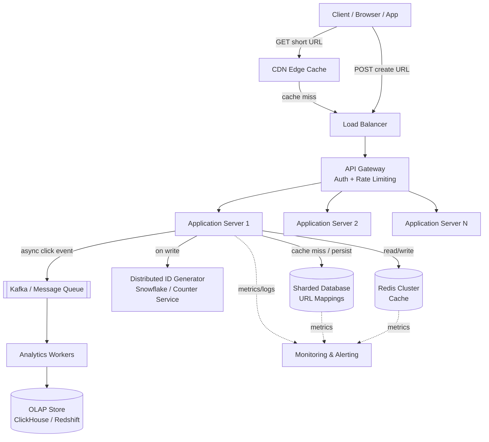

### Component Responsibilities

| Component | Responsibility |
|---|---|
| **CDN** | Caches redirect responses at the edge for very hot, long-TTL links; absorbs the bulk of read traffic globally |
| **Load Balancer** | Distributes traffic across app servers (L7, e.g., ALB/NGINX) |
| **API Gateway** | AuthN/AuthZ, rate limiting, request validation |
| **Application Servers** | Stateless; handle shorten/redirect/CRUD logic |
| **Redis Cluster** | Cache-aside for `short_code → long_url`; also used for distributed rate limiting counters |
| **ID Generator** | Produces globally unique IDs/codes without central bottleneck (Snowflake-style or pre-allocated counter ranges) |
| **Sharded Database** | Durable source of truth for URL mappings |
| **Kafka** | Decouples click-event ingestion from the redirect hot path |
| **Analytics Workers** | Consume click events, aggregate, write to OLAP store |
| **Monitoring** | Metrics, logs, tracing, alerting across every component |

> **Common Follow-up:** *"Why put a CDN in front of a dynamic redirect service?"* — Because a huge fraction of short URLs are effectively **static once created** (the mapping rarely changes), so caching the 301/302 response at the edge with a short-to-medium TTL is safe and dramatically cuts origin load — especially for viral links hit millions of times from the same geography in a short window.

---

# 8. URL Generation Strategies

This is the heart of the design. Walk through **every** approach and its tradeoffs.

### 8.1 Auto-Increment / Counter-Based ID → Base62

- A central (or sharded) counter produces a monotonically increasing integer ID.
- Encode that integer to Base62 to get the short code.

**Pros:** No collisions by construction; simple; short codes grow predictably.
**Cons:** Central counter is a single point of contention/failure unless sharded; sequential IDs are guessable (`bit.ly/1`, `bit.ly/2`...) which is a minor security/privacy leak (competitors can estimate your traffic volume).

**Mitigation:** Use **pre-allocated ID ranges** per app server (each server requests a batch of, say, 10,000 IDs from a central service and hands them out locally) — removes the per-request bottleneck.

### 8.2 Base62 Encoding of Hash (MD5/SHA-256)

- Hash the long URL (+ salt/timestamp to allow same URL to be shortened differently by different users) with MD5 or SHA-256.
- Take the first N characters/bits of the hash, encode to Base62.

**Pros:** No central coordination needed — fully stateless, embarrassingly parallel.
**Cons:** **Collisions are possible** (birthday paradox) — must check DB for existing code and retry/rehash on collision. Truncating a cryptographic hash for shortness increases collision probability significantly.

### 8.3 Pure Random String Generation

- Generate a random 6-8 character alphanumeric string directly.

**Pros:** Simple, no coordination, no predictability (good for security — can't enumerate URLs).
**Cons:** Non-trivial collision probability at scale, requires a **uniqueness check** (DB lookup or bloom filter) before committing — adds write latency.

### 8.4 UUID

**Pros:** Virtually zero collision probability, no coordination.
**Cons:** Way too long (36 chars) for a "short" URL — defeats the purpose unless truncated (which reintroduces collision risk).

### 8.5 Snowflake-style Distributed ID Generator

- Each ID encodes: timestamp bits + datacenter/worker ID bits + sequence number bits.
- Produces a 64-bit unique integer with no central coordination and no DB round-trip.

**Pros:** No collisions, no central bottleneck, roughly time-sortable, scales horizontally trivially (each worker only needs a unique worker ID, assigned once at boot via config/Zookeeper).
**Cons:** Slightly more infrastructure to stand up (worker ID assignment/coordination service); resulting Base62-encoded IDs are longer than a pure random 6-char string (a 64-bit int → ~11 Base62 chars) unless you allocate fewer bits.

### Comparison Table

| Strategy | Collision Risk | Coordination Needed | Predictable? | Length | Verdict |
|---|---|---|---|---|---|
| Counter + Base62 | None | Yes (or range-based) | Yes (bad) | Short, grows over time | Good with range pre-allocation |
| Hash (MD5/SHA-256) truncated | Medium-High | No | No | Fixed, short | Needs collision retry logic |
| Random string | Low-Medium at scale | No (but needs uniqueness check) | No | Fixed, short | Simple, widely used in practice |
| UUID | ~None | No | No | Too long | Not suitable as-is |
| Snowflake (distributed counter) | None | Minimal (one-time worker ID) | Semi (time-ordered) | Slightly longer | **Best for large scale** |

> **Recommended answer to give in an interview:** *"I'd use a distributed Snowflake-style ID generator producing 64-bit unique integers, then Base62-encode them. This avoids both central bottlenecks and collision-retry overhead, and is the pattern used by Twitter/Instagram at scale. For smaller/simpler systems, random-string-with-uniqueness-check is a perfectly reasonable and simpler alternative — I'd mention both and justify based on expected scale."*

### Collision Handling (for hash/random approaches)

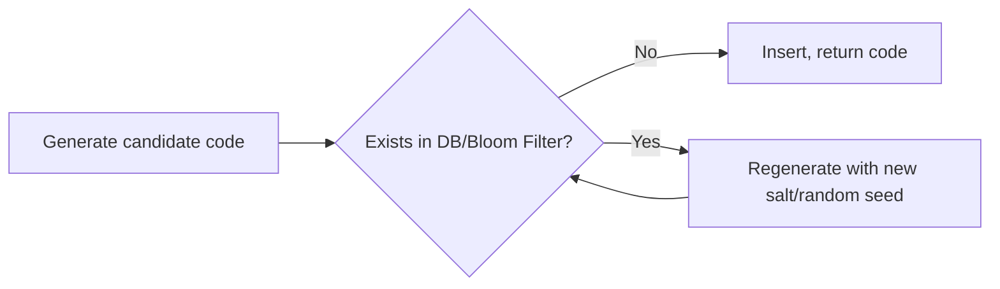

Use a **Bloom filter** in front of the DB to cheaply and quickly rule out "definitely not present" before doing an expensive DB existence check — cuts collision-check latency dramatically at scale.

---

# 9. Base62 Encoding Deep Dive

Base62 uses the character set: `[0-9][a-z][A-Z]` → 62 symbols. Chosen over Base64 because Base64 includes `+` and `/`, which are **not URL-safe** without escaping.

### Character Set Mapping

```
0-9   → 0-9   (values 0-9)
a-z   → 10-35 (values 10-35)
A-Z   → 36-61 (values 36-61)
```

### Why Base62 over alternatives?

| Encoding | Alphabet size | URL-safe? | Chars needed for 1B values |
|---|---|---|---|
| Base10 | 10 | Yes | 10 |
| Base16 (hex) | 16 | Yes | 8 |
| Base36 | 36 | Yes | 6 |
| **Base62** | 62 | Yes | **~6** |
| Base64 | 64 | No (needs escaping) | ~5-6 |

Base62 hits the sweet spot: URL-safe (no encoding needed) and dense enough that even huge numbers stay short. With 6 Base62 characters you can represent `62^6 ≈ 56.8 billion` unique values — comfortably enough for the lifetime of most services (recall our capacity estimate needed ~36.5B/year — so 6 chars might need to grow to 7 within ~1.5 years at that scale; production systems often just design for 7-8 chars from the start).

### Worked Example: Encoding

Encode integer `125` to Base62:

```
125 ÷ 62 = 2 remainder 1
  2 ÷ 62 = 0 remainder 2

Read remainders bottom-to-top: [2, 1]
Map: 2 → 'c' (since a=10...  wait, let's use digit map directly)

Using map: 0-9 → '0'-'9', 10-35 → 'a'-'z', 36-61 → 'A'-'Z'
  1 → '1'
  2 → '2'

So 125 → "21" using pure digit encoding.
```

*(Note: The exact character your encoding produces depends on which characters you assign to which value ranges — many implementations map differently, e.g., value 12 → 'c'. The example "125 → cb" from certain references uses a specific custom alphabet ordering. The important thing to communicate in an interview is the **algorithm**, not memorizing one specific mapping.)*

### General Algorithm

**Encoding (integer → Base62 string):**
```python
ALPHABET = "0123456789abcdefghijklmnopqrstuvwxyzABCDEFGHIJKLMNOPQRSTUVWXYZ"

def encode(num):
    if num == 0:
        return ALPHABET[0]
    chars = []
    base = len(ALPHABET)  # 62
    while num > 0:
        num, rem = divmod(num, base)
        chars.append(ALPHABET[rem])
    return ''.join(reversed(chars))
```

**Decoding (Base62 string → integer):**
```python
def decode(short_code):
    base = len(ALPHABET)
    num = 0
    for char in short_code:
        num = num * base + ALPHABET.index(char)
    return num
```

**Walkthrough — encode 12345:**
```
12345 ÷ 62 = 199 remainder 7   → char at index 7 = '7'
  199 ÷ 62 = 3   remainder 13  → char at index 13 = 'd'
    3 ÷ 62 = 0   remainder 3   → char at index 3 = '3'

Remainders bottom-up: [3, 13, 7] → "3d7"
Decode check: 3×62² + 13×62¹ + 7×62⁰ = 3×3844 + 13×62 + 7 = 11532+806+7 = 12345 ✓
```

> **Interview Insight:** Be ready to code this live — it's a common whiteboard exercise attached to this problem. Know it cold, including the decode direction.

---

# 10. Read Flow (Redirect Path)

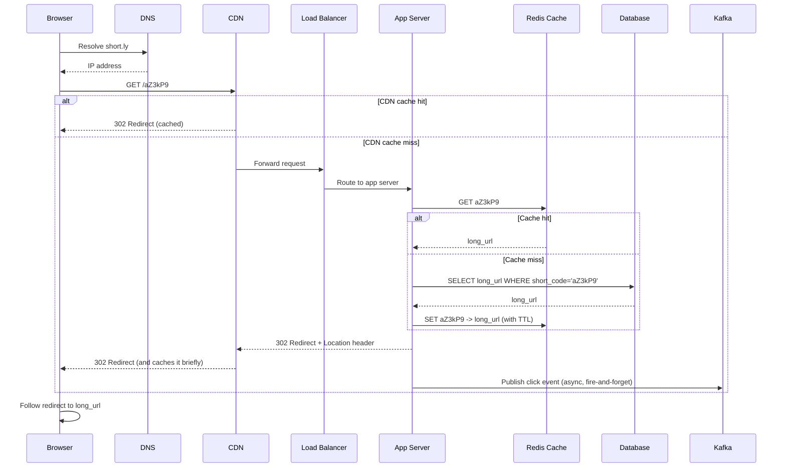

### Step-by-Step

1. **DNS resolution** — browser resolves `short.ly` to an edge IP (often via GeoDNS/Anycast for lowest latency).
2. **CDN edge check** — if this exact short code was recently served and is cacheable, CDN returns the redirect directly, never touching origin.
3. **Load Balancer** routes to a healthy app server (round robin / least connections).
4. **App server checks Redis cache** — this is the fast path for the vast majority (~95%+) of requests.
5. **On cache miss**, query the database (via sharding logic — hash the short code to find the right shard), then **populate the cache** for next time (cache-aside pattern).
6. **Return the redirect response** (302 in most designs) immediately — this is on the critical latency path.
7. **Click event is published asynchronously** to Kafka — this must **not** block or delay the redirect response.
8. Browser follows the `Location` header to the actual destination.

> **Interviewer's Expectation:** They're listening for you to explicitly say the click-tracking/analytics step is **decoupled and asynchronous**. A common candidate mistake is writing analytics synchronously in the request path, which adds unnecessary latency to every single redirect.

---

# 11. Write Flow (Shorten Path)

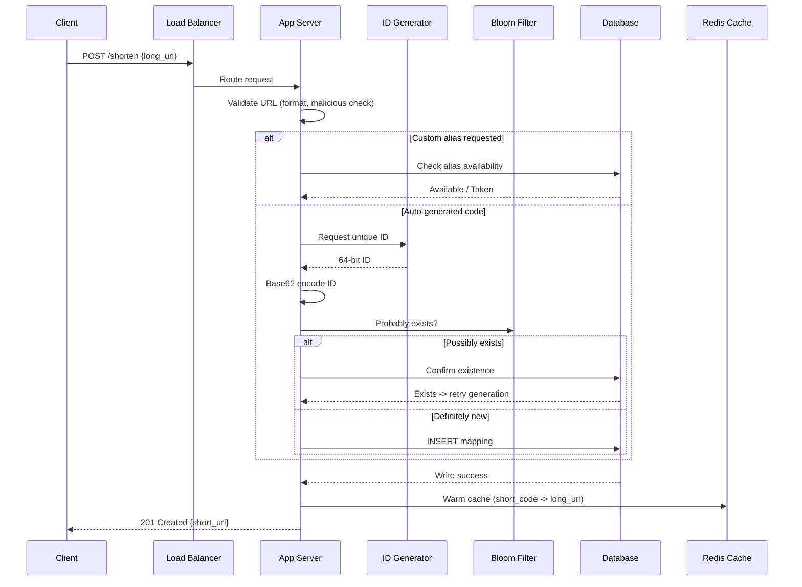

### Step-by-Step

1. **Validate the input URL** — format check, length limit, and a security check (blocklist / reputation API for known-malicious domains).
2. **Determine code generation path:**
   - Custom alias → check uniqueness directly against the DB (this needs a **strongly consistent** check — use a unique constraint on `short_code` and let the DB reject duplicates atomically, rather than a check-then-insert race).
   - Auto-generated → request an ID from the distributed ID generator, Base62-encode it.
3. **Collision check** (for hash/random strategies) — use a Bloom filter for a fast probabilistic pre-check, fall back to DB for certainty, retry generation on real collision.
4. **Persist the mapping** in the database (this is the durable write — source of truth).
5. **Proactively warm the cache** so the very first redirect request doesn't suffer a cache-miss penalty.
6. **Return the short URL** to the client.

> **Common Follow-up:** *"What if two requests race to claim the same custom alias at the same time?"* — Rely on a **database-level unique constraint** on `short_code`. Let both INSERTs race; the DB guarantees only one succeeds, and the loser gets a clean `409 Conflict` to handle gracefully (rather than an application-level check-then-act, which is inherently racy under concurrency).

---

# 12. Cache Design

### Strategy: Cache-Aside (Lazy Loading)

- On read: check cache → on miss, read DB → populate cache.
- On write: update DB → then either update or invalidate the cache entry.

**Why cache-aside over write-through?** Because most URLs are **written once and read many times, with modifications rare** (only via explicit "update destination"). Cache-aside avoids the overhead of writing to cache on every DB write when many entries may never even be read.

### TTL Strategy

| Data | TTL | Reasoning |
|---|---|---|
| Hot/popular short codes | Long (hours-days), refreshed on access | Minimize DB load for viral links |
| Cold/rarely accessed codes | Short or not cached at all | Don't waste memory on long-tail entries |
| Custom aliases | Same as regular, but invalidate immediately on update/delete | Correctness matters more for branded links |

### Cache Invalidation

- **On update (destination change) or delete:** actively invalidate/delete the cache key immediately (don't wait for TTL expiry) — this is a case where correctness beats laziness, since a stale redirect after an explicit user action is a bad user experience.
- Use a short **negative cache** (cache the "not found" result briefly) to avoid repeated DB hits for invalid/expired codes being hammered by bots.

### Hot URLs / Cache Stampede

**Problem:** A viral link gets millions of hits in seconds; if it expires from cache, thousands of requests simultaneously hit the DB to refetch it ("thundering herd" / cache stampede).

**Solutions:**
- **Never expire hot keys** based on pure TTL — use access-frequency-aware refresh (extend TTL on access, or don't expire top-N hottest keys at all, refresh them via a background job instead).
- **Request coalescing / locking** — first request that misses acquires a short lock and fetches from DB; concurrent requests for the same key wait briefly for that result instead of all hitting the DB.
- **Randomized TTL jitter** — instead of all cache entries expiring at exactly the same time (e.g., all set with TTL=3600 at the same moment during a warm-up), add ±10% random jitter so expirations spread out.

### Cache Warming

- On deploy or Redis node restart, proactively pre-load the **top N most-accessed short codes** (queryable from the analytics store) rather than starting cold and taking the stampede hit organically.

### Eviction Policy: LRU vs LFU

| Policy | Behavior | Fit for this system |
|---|---|---|
| **LRU** (Least Recently Used) | Evicts oldest-accessed items | Good default; simple, works well for typical access patterns |
| **LFU** (Least Frequently Used) | Evicts least-accessed-count items | **Better fit here** — URL popularity is highly skewed (Zipfian); LFU protects genuinely hot links from being evicted by a burst of one-time cold accesses, which LRU is vulnerable to |

> **Recommendation:** Redis supports `allkeys-lfu` — use it for this workload given the access pattern is closer to Zipfian/Pareto than uniform-recency.

### Redis vs Memcached (preview — full table in Section 20)

Redis is generally preferred here because it supports richer data structures (useful for rate-limiting counters, sorted sets for "top links" leaderboards) and built-in clustering/replication, whereas Memcached is purely a simple key-value cache with multi-threaded performance advantages but fewer features.

---

# 13. Database Scaling

### Replication (Leader-Follower)

- **One leader** handles all writes; **multiple followers/replicas** serve reads.
- Redirect reads (after cache miss) can go to **read replicas**, keeping the leader free for writes.
- Replication lag (typically milliseconds) is acceptable here — a brand-new URL being briefly unavailable on a replica right after creation is a rare edge case, mitigated by "read-your-own-writes" routing to the leader immediately after a user's own create action if needed.

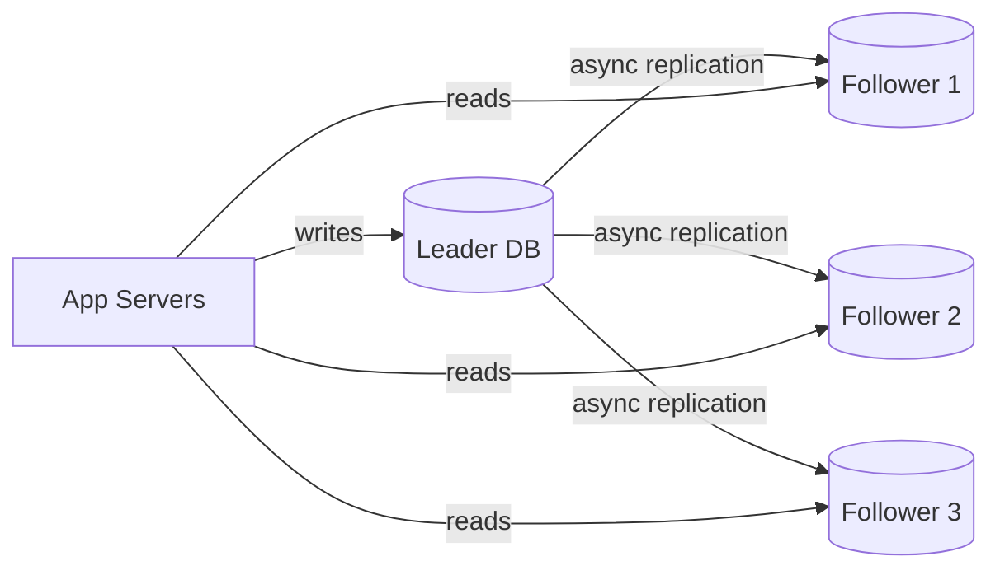

### Sharding / Partitioning

At billions of rows, a single DB instance (even with replicas) can't hold or serve the data. **Shard by hash of `short_code`.**

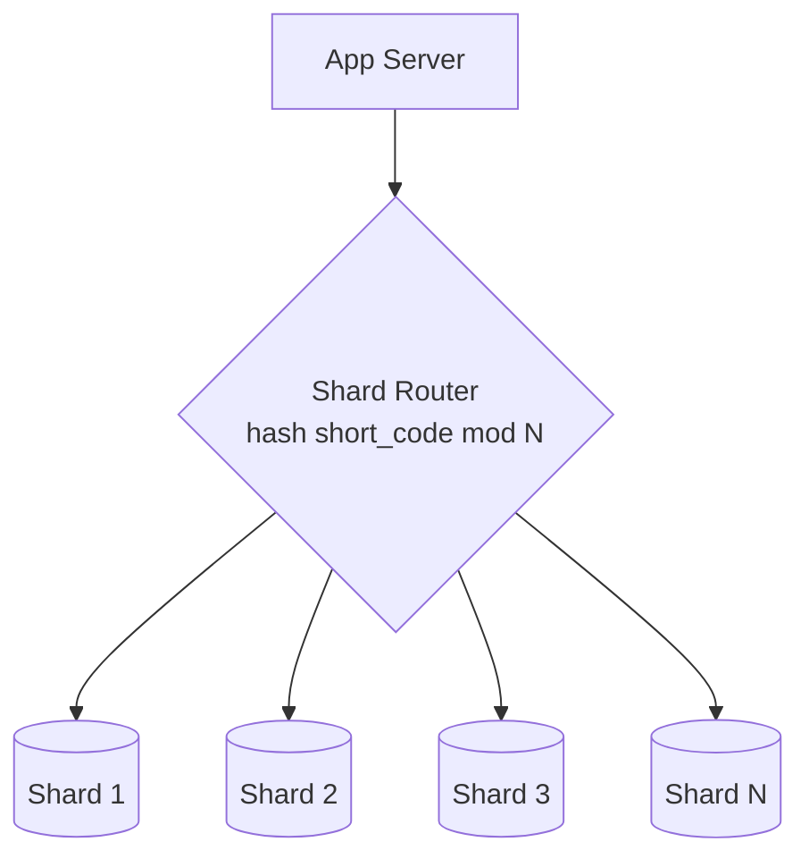

**Why hash-based sharding on `short_code` (not on `user_id` or `created_at`)?**
- The dominant access pattern is "look up by short_code" — sharding on that key means every read is a single-shard lookup (no scatter-gather).
- Sharding by `created_at` would create hot shards (all recent traffic hits the newest shard) — bad.
- Sharding by `user_id` would help "list my links" queries but hurt the far more common redirect-lookup path — wrong tradeoff for a read-heavy-by-code system.

### Consistent Hashing

Used both for **DB shard routing** and **Redis cluster key distribution**. Solves the classic problem of "adding/removing a node reshuffles almost all keys" — with consistent hashing (and virtual nodes for even distribution), only `~1/N` of keys need to move when a node is added or removed.

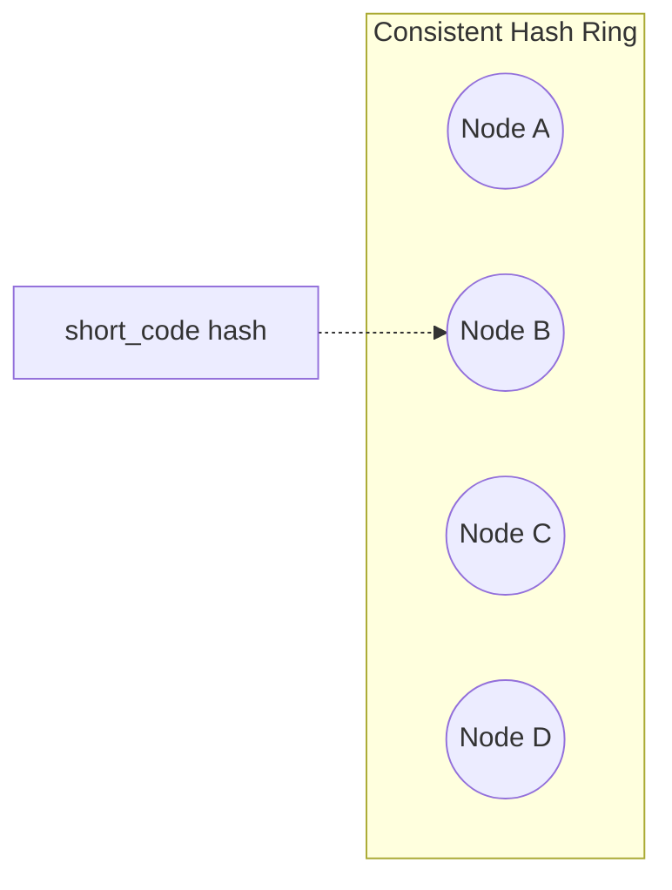

### When Each Technique Is Needed

| Technique | Needed when... |
|---|---|
| Read replicas | Read QPS exceeds what a single DB instance can serve, but total data still fits on one machine's writer |
| Sharding | Total data volume or write QPS exceeds single-machine capacity |
| Consistent hashing | You have multiple shards/cache nodes and need to add/remove nodes without massive data reshuffling |
| Multi-leader / multi-region writes | You need low-latency writes from multiple geographic regions (adds conflict-resolution complexity — usually overkill for this system since writes are relatively low volume) |

---

# 14. Handling Hot URLs

**Scenario:** A single short URL goes viral — millions of redirect requests in minutes, all for the same key.

### Layered Solutions

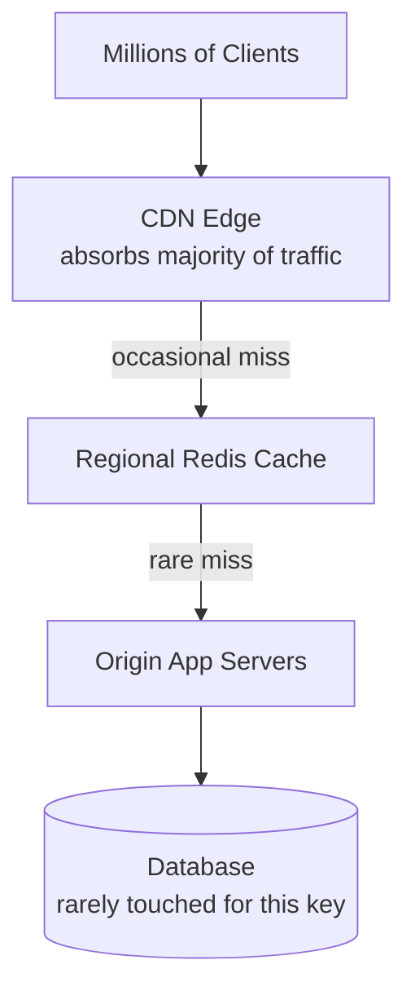

1. **CDN edge caching** — the first and most effective layer; a hot redirect is essentially static content and can be cached at edge PoPs close to users globally, absorbing 90%+ of the traffic before it ever reaches your infrastructure.
2. **Redis replication** — read the hot key from **local read replicas of the cache** in each region rather than a single Redis primary, so no single cache node becomes a bottleneck.
3. **Regional caches** — deploy cache clusters per region so cross-continent latency isn't incurred for every hit, and regional failures are isolated.
4. **Application-level in-memory micro-cache** — for extremely hot keys, app servers can even hold a tiny local (per-instance) in-memory cache with a very short TTL (seconds) to shave off network round-trips to Redis for the absolute hottest keys.

> **Interview Insight:** This is a great place to mention that this is fundamentally the same "hot partition / hot key" problem seen in any large-scale key-value system (e.g., a celebrity's data in a social graph) — the solution pattern (CDN → replicated cache → sharded origin) generalizes.

---

# 15. Analytics Design

### What We Track

Clicks, geography (via GeoIP), browser, OS, device type, referrer, timestamp.

### Pipeline

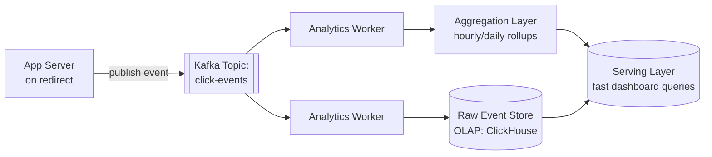

### Why Kafka in the Middle?

- **Decoupling:** the redirect path just needs to fire-and-forget an event; it doesn't need to know or care how analytics are computed.
- **Buffering:** absorbs bursty click traffic without backpressure hitting the redirect service.
- **Multiple consumers:** the same click-event stream can feed real-time dashboards, batch aggregation jobs, fraud/bot detection, and data warehouse exports independently.

### OLTP vs OLAP

| | OLTP (URL mapping DB) | OLAP (Analytics store) |
|---|---|---|
| Access pattern | Point lookups by key | Aggregations/scans over time ranges |
| Write pattern | Low-moderate volume, transactional | Extremely high volume, append-only |
| Optimized for | Low-latency single-row reads | Fast aggregate queries over millions of rows |
| Example tech | Sharded MySQL/DynamoDB | ClickHouse, BigQuery, Redshift |
| Consistency needs | Strong (for uniqueness) | Eventual is fine |

> **Common Follow-up:** *"How would you compute 'unique visitors' cheaply at this scale?"* — Use a **HyperLogLog** (probabilistic cardinality estimator) instead of exact distinct-counting — trades a small, bounded error (~1-2%) for massive memory/compute savings when counting uniques across billions of events.

---

# 16. Background Workers

| Worker | Job |
|---|---|
| **Analytics aggregator** | Consumes Kafka click events, rolls up into hourly/daily summaries |
| **Expired URL cleanup** | Periodically scans `expires_at` index, marks/deletes expired rows, evicts them from cache |
| **Cache warmer** | Pre-loads top-N hot URLs into cache after deploys/restarts |
| **Retry processor** | Re-attempts failed async operations (e.g., a click event that failed to write to OLAP store) with exponential backoff |
| **Dead Letter Queue (DLQ) handler** | Events that fail repeatedly get routed to a DLQ for manual inspection/replay rather than being silently dropped or retried forever |

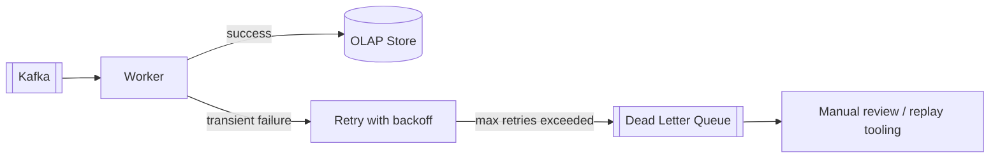

> **Interviewer's Expectation:** Mentioning a DLQ unprompted is a strong signal of production experience — it shows you think about the "what happens when even the fallback fails" case, not just the happy path.

---

# 17. Failure Scenarios

| Failure | Impact | Mitigation |
|---|---|---|
| **Database (leader) down** | Writes fail | Automatic failover to a promoted replica (via orchestration like Patroni/Orchestrator); reads continue via other replicas; writes queue briefly or fail fast with retry-friendly errors |
| **Redis down** | Increased latency, DB load spike | Degrade gracefully: fall through to DB reads directly; circuit breaker to avoid hammering a dead cache node; Redis Cluster/Sentinel for automatic failover |
| **Region failure** | Regional users can't reach service | Multi-region deployment with GeoDNS/Anycast failover to healthy region; async cross-region replication of DB |
| **Cache miss storm** | DB overloaded | Request coalescing, negative caching, rate limiting, circuit breakers |
| **ID generator failure** | Can't create new short URLs | Run ID generator as a **redundant, stateless-ish service** (Snowflake workers need no shared state beyond a one-time worker-ID assignment) so any healthy instance can serve requests; fall back to a pre-allocated local ID range buffer per app server as a buffer against transient failures |
| **Kafka failure** | Analytics events delayed/lost | App servers buffer events locally briefly and retry; acceptable to lose a small number of analytics events (not correctness-critical) rather than block redirects |
| **Duplicate short code generated** | Data integrity risk | DB unique constraint rejects the second insert; app retries generation |

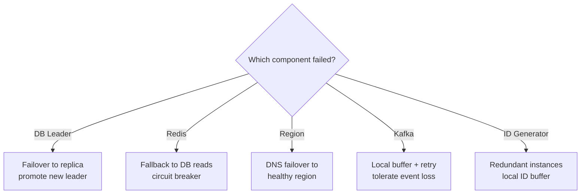

> **Common Follow-up:** *"What's your RTO/RPO for this system?"* — For the core URL mapping data: **RPO near-zero** (durability matters, mappings must survive), **RTO in seconds-to-low-minutes** (via automated failover). For analytics: both RPO and RTO can be much looser — losing a few minutes of click data during an incident is acceptable.

---

# 18. Security

| Threat | Mitigation |
|---|---|
| **Malicious/phishing URLs** | Check submitted URLs against threat-intelligence blocklists (e.g., Google Safe Browsing API) at creation time and periodically re-scan existing links |
| **Spam / mass abuse** | Rate limiting per IP/API key/account; CAPTCHA for anonymous high-volume creation |
| **Open redirect abuse** | Ensure the service is not (mis)used as a generic open-redirect vector for unrelated exploits — validate destination URLs, consider warning interstitials for suspicious destinations |
| **Rate limiting** | Token bucket / sliding window counters in Redis, per-IP and per-API-key |
| **Authentication** | API keys for programmatic access; OAuth/session-based for the web dashboard |
| **Authorization** | Only the owning user can update/delete/view analytics for their links |
| **Encryption** | TLS/HTTPS everywhere in transit; encryption at rest for the database (especially for any PII like stored emails); hash IPs before storing in analytics for privacy |
| **Input validation** | Strict URL format validation, length caps, protocol allowlist (only `http(s)://`, reject `javascript:`, `data:`, etc. to prevent XSS-via-redirect vectors) |
| **Custom alias validation** | Prevent alias squatting on reserved/brand-sensitive words; reject offensive content via a filter |

> **Interviewer's Expectation:** They may specifically probe: *"What stops someone from shortening `javascript:alert(1)`?"* — Answer: **strict protocol allowlisting** at validation time (only allow `http://` and `https://` schemes), which is a well-known real vulnerability class in naive URL shorteners.

---

# 19. Bottlenecks

| Bottleneck | Why it happens | Mitigation |
|---|---|---|
| **Redirect read path DB load** | Cache misses under high traffic | Aggressive caching, CDN, read replicas |
| **Central ID generator** | Every write needs a unique ID | Distributed generation (Snowflake) or pre-allocated ID ranges per server |
| **Hot key contention in cache** | Viral URLs | CDN + regional caches + request coalescing |
| **Analytics write volume** | 10B+ events/day | Kafka buffering + horizontally scaled consumers + OLAP store built for high ingest |
| **Single-region latency for global users** | Physical distance to origin | Multi-region deployment + CDN edge presence |
| **Database shard hotspotting** | Poor shard key choice or viral content concentrated on one shard | Hash-based sharding on `short_code`, consider a secondary cache layer that absorbs shard-level hot spots |


# 20. Tradeoffs

### Redis vs Memcached

| | Redis | Memcached |
|---|---|---|
| Data structures | Rich (strings, sets, sorted sets, hashes) | Simple key-value only |
| Persistence | Optional (RDB/AOF) | None (pure in-memory) |
| Clustering | Native (Redis Cluster) | Client-side sharding needed |
| Threading | Mostly single-threaded (fast for simple ops) | Multi-threaded (better raw throughput for pure GET/SET) |
| **Fit here** | **Preferred** — sorted sets for "top links", built-in clustering, can double as rate-limit store | Viable if you only need dead-simple caching and want max raw throughput |

### SQL vs NoSQL

| | SQL (sharded MySQL/Postgres) | NoSQL (DynamoDB/Cassandra) |
|---|---|---|
| Schema flexibility | Rigid | Flexible |
| Horizontal scaling | Requires manual sharding setup | Built-in |
| Transactions | Strong (ACID) | Limited/eventual (varies by system) |
| Best for | Custom-alias uniqueness, relational queries (user's links list, joins) | Pure key-value at massive scale, low ops overhead |
| **Fit here** | Good if strong consistency for aliases matters more, and team has SQL expertise | Good if raw scale/simplicity of horizontal scaling matters most |

### Random String vs Base62-Encoded Counter

| | Random String | Base62(Counter/Snowflake ID) |
|---|---|---|
| Coordination | None | Some (ID generator) |
| Collision handling | Needed | Not needed (IDs are unique by construction) |
| Predictability | Not guessable | Sequential counter = guessable (Snowflake mostly avoids this) |
| **Verdict** | Simpler for small-medium scale | Better for large scale / production systems |

### Hash-based vs Counter-based Generation

| | Hash-based | Counter-based |
|---|---|---|
| Determinism | Same input can map to same output (need salting for variety) | Always unique |
| Collision risk | Real, needs handling | None |
| Coordination | Stateless | Needs a generator/allocator |
| **Verdict** | Good for stateless simplicity | Better for guaranteed uniqueness at scale |

### Leader-Follower vs Multi-Leader Replication

| | Leader-Follower | Multi-Leader |
|---|---|---|
| Write path | Single leader, simple consistency | Multiple regions can write independently |
| Conflict resolution | Not needed | Required (last-write-wins, vector clocks, etc.) |
| Latency for global writes | Higher (all writes go to one region) | Lower (write to nearest region) |
| **Fit here** | **Preferred** — write volume is low relative to reads, so a single leader isn't a bottleneck, and it avoids conflict-resolution complexity entirely | Only justified if write latency from distant regions becomes a real, measured problem |

---

# 21. Monitoring

| Category | What to track |
|---|---|
| **Metrics** | Redirect latency (p50/p95/p99), cache hit ratio, write QPS, error rates (4xx/5xx), DB replication lag, queue depth (Kafka consumer lag) |
| **Logs** | Structured request logs (short_code, latency, status), error logs with stack traces, audit logs for delete/update actions |
| **Tracing** | Distributed tracing (e.g., OpenTelemetry) across LB → App → Cache → DB to pinpoint latency sources in the redirect path |
| **Alerts** | Cache hit ratio drop below threshold, p99 latency breach, DB replica lag exceeding X seconds, error rate spike, Kafka consumer lag growing unbounded |
| **Dashboards** | Real-time QPS (read/write), cache hit rate, top-N hottest URLs, geographic traffic distribution, error budget burn rate (SLO tracking) |

> **Interview Insight:** Mention **cache hit ratio** specifically as your single most important health metric for this system — since the entire latency/scalability story depends on the cache absorbing the vast majority of reads, a dropping hit ratio is often the earliest warning sign of either a cache sizing problem or a traffic pattern shift (e.g., sudden long-tail spike from a bot/scraper).

---

# 22. Scaling to Billions

**Target: 100M DAU, 1B+ URLs stored, 100K+ QPS, global traffic.**

| Change | Why |
|---|---|
| **Multi-region active-active deployment** | Serve users from the nearest region; reduces latency and provides regional fault isolation |
| **Global CDN with aggressive edge caching** | Absorbs the vast majority of the 100K+ QPS read load before it reaches origin infrastructure at all |
| **Database sharding across many shards, per-region replicas** | No single DB instance can handle 1B+ rows or the associated write throughput alone |
| **Distributed ID generation with region-aware worker IDs** | Avoids cross-region coordination on every write; each region's Snowflake workers generate globally-unique IDs independently |
| **Async cross-region replication for URL mappings** | New URLs created in one region eventually propagate globally; acceptable given the tolerance for eventual consistency on this data |
| **Kafka as a globally distributed event backbone (or regional clusters with aggregation)** | Analytics ingest at 100K+ QPS needs serious horizontal partitioning |
| **Dedicated OLAP cluster scaled independently from OLTP** | Analytics query/ingest load must never be able to affect redirect-path latency |
| **Chaos engineering / regular failover drills** | At this scale, some component is *always* degraded somewhere — the system must be designed to be boring under partial failure |

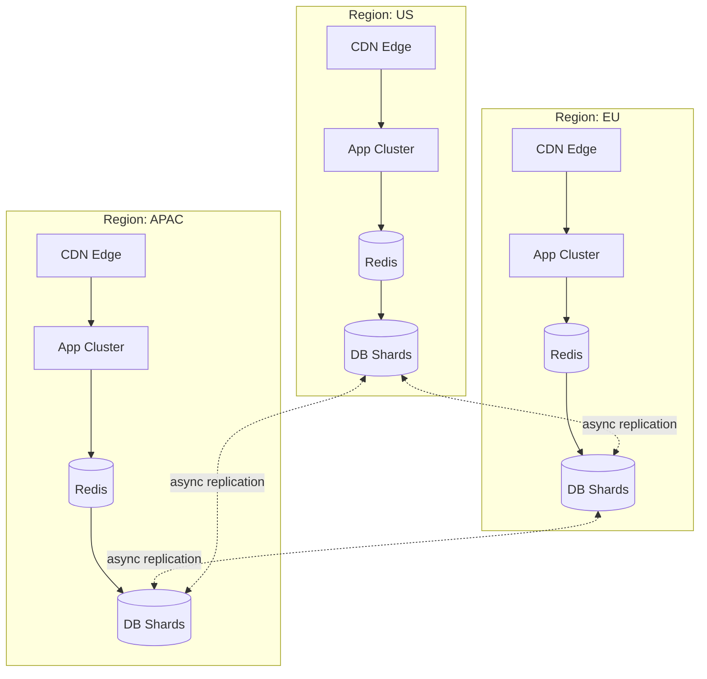

> **Interviewer's Expectation:** At this stage they want to see you reason about **cost and complexity tradeoffs**, not just "add more of everything." E.g., explicitly say: *"Multi-region active-active adds real operational complexity (conflict resolution, cross-region monitoring) — I'd only justify it once single-region + CDN can no longer meet latency SLOs for a meaningful fraction of global users."*

---

# 23. Alternative Designs

| Product | Approach | Notable difference |
|---|---|---|
| **TinyURL** | Long-running, simple architecture; no mandatory login | Historically simpler feature set, prioritizes longevity/reliability of existing links over feature richness |
| **Bit.ly** | Rich analytics platform, branded/custom domains, enterprise link management | Treats links as a marketing analytics product, not just a redirect utility — analytics pipeline is a first-class part of the architecture, not an afterthought |
| **Firebase Dynamic Links** | Deep-linking focus — same link opens the app if installed, falls back to app store/web otherwise | Built for mobile deep-linking use cases, not generic URL shortening; involved additional platform-detection logic |
| **AWS/GCP internal short links** | Tightly integrated with cloud IAM/org structure | Optimized for internal enterprise use (e.g., shortening console URLs) rather than public-facing high-volume traffic |

> **Common Follow-up:** *"Why might Bit.ly's architecture look different from TinyURL's even though the core problem is the same?"* — Because their **non-functional priorities differ**: Bit.ly optimizes heavily for analytics fidelity and enterprise features (implying a much heavier OLAP/analytics investment), while a service like TinyURL historically optimized for simplicity and pure uptime/longevity of links with a leaner feature set.

---

# 24. Interview Deep-Dive Questions (40+)

**Design Fundamentals**
1. Why Base62 instead of Base64 or Base36?
2. Why not just use UUIDs as short codes?
3. How long should a short code be, and how did you arrive at that number?
4. Why did you choose Snowflake-style IDs over a simple auto-increment counter?
5. What happens if two requests generate the same short code simultaneously?
6. How do you handle custom alias collisions differently from auto-generated ones?
7. Walk me through Base62 encoding and decoding by hand.

**Caching**
8. Why Redis specifically? Why not just rely on the database?
9. What happens if Redis crashes entirely?
10. How do you avoid a cache stampede on a viral link?
11. How do you decide what TTL to use for cache entries?
12. LRU or LFU — which and why for this workload?
13. How do you invalidate the cache when a URL's destination is updated?
14. Why cache the redirect at the CDN layer at all?

**Database**
15. SQL or NoSQL for the primary mapping table — justify your choice.
16. How would you shard the database, and why that shard key?
17. How do you handle a database migration to a new storage engine with zero downtime?
18. Why is `short_code` the primary key instead of an auto-increment `id`?
19. How do read replicas help here, and what's the risk of using them?
20. How would you handle a "hot shard" if one particular range of codes gets disproportionate traffic?

**Consistency & Availability**
21. Why is eventual consistency acceptable for this system?
22. Where in this design do you need strong consistency, and why?
23. CAP theorem — where does this system sit, and why?
24. How would analytics ingestion affect the latency of the redirect path if designed poorly, and how do you prevent that?

**API & Product**
25. How would you support custom aliases end-to-end?
26. Why 302 instead of 301 for the redirect (or vice versa) — what's the tradeoff?
27. How would you rate-limit URL creation per user?
28. How would you support link expiration cleanly?

**Scale & Failure**
29. Walk me through what happens end-to-end if the ID generator service goes down.
30. How would you detect and handle a sudden 10x traffic spike (viral event)?
31. What's your strategy for scaling from 1M to 1B URLs?
32. How would you design for multi-region availability?
33. What single points of failure exist in your design, and how do you eliminate them?

**Analytics**
34. Why route click events through Kafka instead of writing directly to the analytics DB?
35. How would you compute unique visitors cheaply at billions-of-events scale?
36. OLTP vs OLAP — why split these into separate stores?

**Security**
37. How do you prevent someone from shortening a `javascript:` URL?
38. How would you detect and block phishing links being created through your service?
39. How do you prevent short-code enumeration/scraping attacks?

**Meta / Tradeoff Reasoning**
40. If you had to cut this design down to an MVP shippable in 2 weeks, what would you cut first and why?
41. What would you change if writes, not reads, were the dominant traffic pattern?
42. How would your design change if URLs needed to be permanently undeletable (regulatory/legal requirement) vs freely deletable?

---

# 25. Follow-up Scenarios

> The interviewer will often pivot mid-interview with "now imagine we also need to support X." Practice answering each of these fluently and quickly.

**"Support custom aliases."**
Add an `is_custom_alias` flag and rely on the DB's unique constraint on `short_code` to atomically reject collisions (rather than check-then-insert). Validate against a reserved-word/profanity list before accepting.

**"Support expiration."**
Add nullable `expires_at`. Redirect path checks this field (or the cache entry carries the same TTL) and returns 410 Gone if expired. Background sweeper job cleans up expired rows and evicts them from cache periodically.

**"Support editing the destination URL."**
`PUT` endpoint updates `long_url` in the DB, then **immediately invalidates** (not just relies on TTL) the corresponding cache key and any CDN edge cache for that path, to avoid serving a stale destination.

**"Support QR codes."**
Generate a QR code image (e.g., via a QR encoding library) representing the short URL at creation time or on-demand; store/cache the generated image (this is a stateless, easily cacheable computation — good candidate for edge/CDN caching too).

**"Support an analytics dashboard."**
Serve dashboard queries entirely from the OLAP store / pre-aggregated rollups — never from the OLTP redirect-path database — to keep the two workloads fully isolated.

**"Support geo-based redirect (different destination per country)."**
Extend the schema to support a `destination_rules` structure (e.g., a JSON map of country-code → URL, with a default fallback). Redirect logic uses GeoIP lookup on the incoming request to pick the right destination. This is a good moment to note it adds real complexity to the caching layer — you can no longer cache one universal answer per short code; caching now needs to be keyed by `(short_code, country)` or resolved dynamically.

**"Support A/B testing (split traffic between two destinations)."**
Store a set of destination URLs with weights per short code; on redirect, do weighted random selection. Note the tradeoff: this makes the redirect response no longer purely cacheable by CDN in the traditional sense (since the same short code must return different destinations to different requests) — you'd need to either push the split logic to the edge (if your CDN supports edge compute) or accept more origin traffic for A/B-tested links specifically.

**"Support multi-region."**
Covered in depth in Section 22 — active-active regional deployments, async replication, region-aware ID generation, GeoDNS routing.

---

# 26. Common Mistakes

| Mistake | Why it's wrong |
|---|---|
| **Jumping straight to "I'll use a hash map" without discussing requirements** | Skips the scoping conversation the interviewer actually wants to evaluate |
| **Treating this as a pure CRUD problem and ignoring scale** | Misses the entire point of the exercise — capacity estimation and caching strategy are the core of the interview |
| **Making the redirect path synchronously write analytics** | Adds unnecessary latency to the most latency-sensitive path in the whole system |
| **Choosing UUIDs "because they're unique" without discussing length tradeoffs** | Ignores the core requirement that the URL be *short* |
| **Not discussing collision handling for hash/random-based generation** | A very common gap — collisions are inevitable at scale and must be handled explicitly |
| **Using 301 redirects without acknowledging the analytics/caching tradeoff** | Shows lack of awareness that permanent redirects get cached by browsers, undermining click tracking |
| **Sharding by `user_id` or `created_at` instead of `short_code`** | Creates hot shards and scatter-gather reads for the dominant access pattern |
| **Forgetting cache invalidation on update/delete** | Leads to serving stale/incorrect redirects after an explicit user action — a real correctness bug |
| **Not mentioning rate limiting or abuse prevention at all** | A production-minded engineer should flag abuse vectors unprompted |
| **Over-engineering with multi-leader replication or global strong consistency "just in case"** | Adds complexity not justified by the actual requirements (low write volume, eventual consistency being acceptable) — a red flag for over-engineering rather than a green flag for thoroughness |

---

# 27. Final Interview Answer (Verbatim Script)

> Use this as a rehearsal script — not to memorize word-for-word, but to internalize the *structure and pacing* of a strong 45-minute answer.

**[0:00–3:00] Clarify Requirements**
*"Before I dive in, let me confirm scope. We need: users submit a long URL and get back a short one; visiting the short URL redirects to the original. I'll assume we also need custom aliases, expiration, and basic analytics as core features, with things like QR codes and password-protection as optional extensions I can bolt on later if we have time. Does that match what you're expecting?"*
> *(Pause here for interviewer confirmation/adjustment.)*

**[3:00–8:00] Non-Functional Requirements & Capacity Estimation**
*"This is a read-heavy system — I'd expect reads to outnumber writes by roughly 100:1, since one shortening action typically leads to many redirects over the link's lifetime. Given that, availability and read latency matter far more than write latency, and I'm comfortable with eventual consistency for things like analytics and even cross-region propagation."*

*"Let me size this: assuming 100M new URLs a day and a 100:1 read:write ratio, that's about 1,150 writes/sec average, and roughly 115K reads/sec average — call it 3-3.5x that at peak. Storage-wise, at ~500 bytes per record, we're looking at around 18TB/year, so multi-terabyte scale over a few years — not enormous, but it tells me we need a proper distributed database, not a single instance."*

> **[Whiteboard cue: write down the QPS numbers and storage estimate visibly — interviewers want to see the math, not just hear a number.]**

**[8:00–12:00] API Design**
*"I'd expose a REST API: `POST /shorten` to create, `GET /{code}` for the redirect, plus `PUT`/`DELETE` for management and a separate analytics endpoint. I'll keep the analytics API strictly read-only against a separate data store — I'll get to why in a minute."*

**[12:00–20:00] High-Level Architecture**
*"Let me sketch the architecture."*
> **[Whiteboard cue: draw client → CDN → LB → app servers → cache → DB, plus a side branch for Kafka → analytics workers → OLAP store.]**

*"Client requests hit a CDN first — since most redirects are effectively static once a link is created, edge caching absorbs the majority of traffic before it even reaches our servers. Cache misses go through a load balancer to stateless app servers, which check a Redis cache before falling back to the database. On the write path, app servers request a unique ID from a distributed ID generator, Base62-encode it, and persist the mapping."*

**[20:00–28:00] Deep Dive: ID Generation**
*"For ID generation, I'd lean toward a Snowflake-style distributed generator over a naive auto-increment counter or random strings, because it avoids both a central bottleneck and collision-retry overhead at scale. I'll walk through Base62 encoding quickly since it's a common follow-up..."*
> *(Walk through the encode/decode algorithm on the whiteboard — this is expected.)*

**[28:00–35:00] Deep Dive: Caching & Database Scaling**
*"Given the read-heavy pattern, caching strategy is really the crux of this design. I'd use cache-aside with Redis, LFU eviction since URL popularity is highly skewed, and I'd specifically call out the cache stampede risk for viral links — mitigated with request coalescing and jittered TTLs."*

*"For the database, I'd shard by hash of `short_code` — since that's the dominant access pattern — with read replicas per shard to absorb cache-miss read traffic."*

**[35:00–40:00] Failure Modes & Analytics**
*"Quickly on resilience: if Redis goes down, we degrade gracefully to direct DB reads with a circuit breaker rather than cascading failure. For analytics, I deliberately decouple click tracking from the redirect path via Kafka — the redirect response should never wait on an analytics write."*

**[40:00–45:00] Wrap-Up & Tradeoffs**
*"To summarize the key tradeoffs I made: I chose 302 over 301 redirects to prioritize accurate analytics and mutable destinations over browser-side caching; I chose eventual consistency almost everywhere except custom-alias uniqueness; and I sharded by short_code rather than user_id to optimize for the dominant read pattern. Happy to go deeper on any piece — caching, sharding, or the analytics pipeline."*

> **Interview Insight:** Notice the pacing — roughly 20% requirements/estimation, 15% API, 20% architecture sketch, 30% deep dives (the interviewer will usually redirect you into whichever area they care about most), 15% wrap-up. Always end by proactively naming your own tradeoffs — it shows self-awareness rather than making the interviewer extract it from you.

---

# 28. Summary / One-Page Revision Sheet

### Architecture (one line)
`Client → CDN → LB → Stateless App Servers → Redis Cache (cache-aside, LFU) → Sharded DB (by short_code hash)`, with an async `Kafka → Analytics Workers → OLAP Store` side pipeline for clicks.

### Key Formulas
```
Write QPS      = daily_writes / 86,400
Read QPS       = Write QPS × read:write_ratio
Peak QPS       = avg QPS × ~3 (traffic burst factor)
Storage/year   = daily_writes × 365 × avg_record_size
Cache size     = hot_working_set_count × avg_record_size
Base62 space   = 62^N unique values for N-character codes
```

### Core Tradeoffs to Remember

| Decision | Choice | Reason |
|---|---|---|
| ID generation | Snowflake-style distributed ID + Base62 | No central bottleneck, no collisions |
| Redirect status code | 302 (temporary) | Accurate analytics + mutable destinations |
| Consistency model | Eventual (mostly), strong only for alias uniqueness | Read-heavy, availability-first system |
| Cache eviction | LFU over LRU | Zipfian/skewed popularity distribution |
| DB shard key | `short_code` hash | Matches dominant read access pattern |
| Analytics store | Separate OLAP, fed via Kafka | Isolates high-volume writes from redirect latency |
| Replication | Leader-follower (not multi-leader) | Write volume is low; avoids conflict resolution complexity |

### Caching Strategy
Cache-aside + LFU eviction + CDN edge layer for hot links + jittered TTLs + request coalescing to prevent stampedes + immediate invalidation on explicit update/delete.

### Database Strategy
Hash-sharded by `short_code`, leader-follower replication per shard, separate OLAP store for analytics, DB-level unique constraints for alias collision safety.

### Scaling Path
Single region → add CDN + cache → add read replicas → shard the DB → go multi-region active-active with async cross-region replication, once single-region + CDN can no longer meet latency SLOs.

### Interview Tips
- Lead with requirements and capacity estimation — show your math.
- State the read:write skew early — it justifies almost every later decision.
- Always name the tradeoff, not just the choice ("I chose X over Y because...").
- Decouple the hot path (redirect) from everything non-essential (analytics, logging) — mention this explicitly.
- Expect and prepare for the "now support X" pivot — practice the follow-up scenarios in Section 25.
- End by proactively summarizing your own tradeoffs before the interviewer has to ask.

---

*End of document.*
